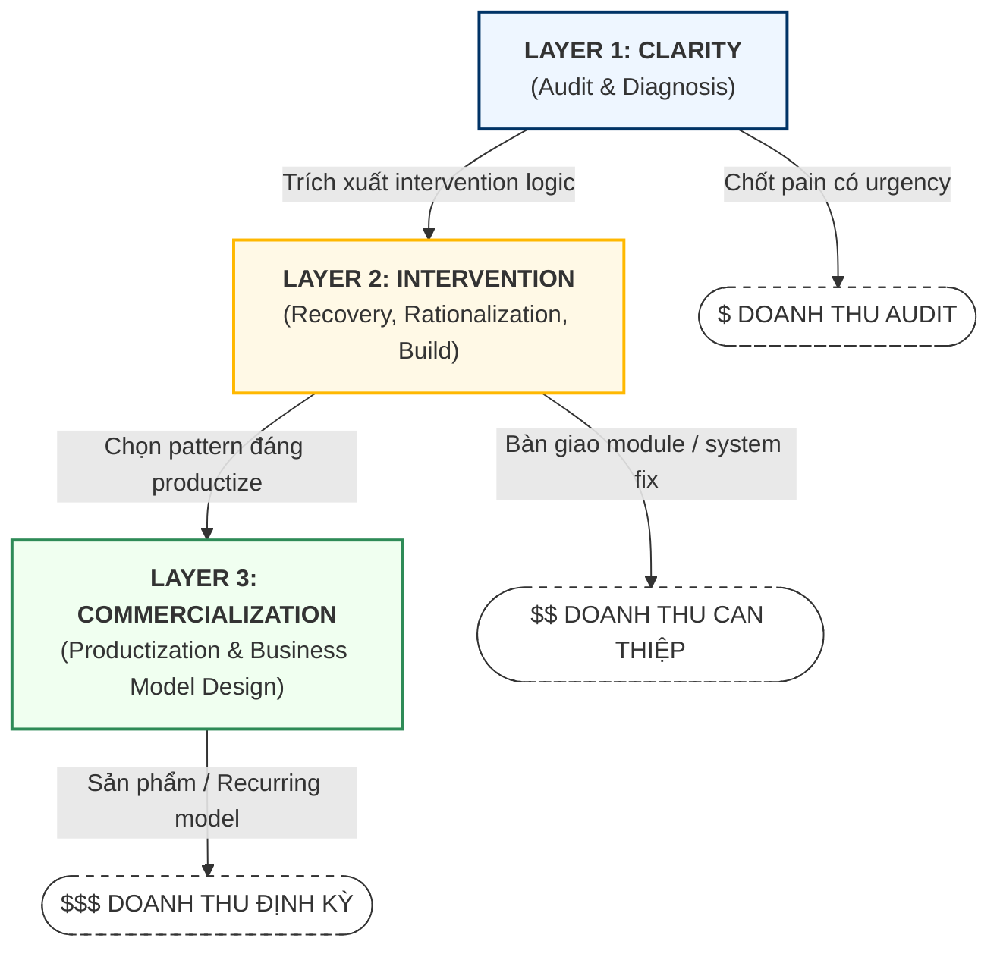

# MASTER BUSINESS BLUEPRINT

## LINK STRATEGY: OPERATING SYSTEM FOR SYSTEMS

Link Strategy vận hành như một **Auditor-led Intervention Studio**. Đây là sự hợp nhất của tư duy kiểm toán kinh doanh, triển khai hệ thống, và cỗ máy sản xuất module/SaaS.

Chiến lược lõi của chúng tôi là giải quyết **"Nghĩa địa phần mềm" (Software Graveyard)**: các phần mềm đã mua, đã triển khai, nhưng không đi vào vận hành, không tạo ra giá trị kiểm chứng được, và tiếp tục làm rò rỉ tiền, thời gian, dữ liệu, và năng lực quản trị.

Chúng tôi đi từ **cashflow thực tế** bằng các dịch vụ audit, recovery, rationalization, và intervention; sau đó tích lũy tri thức thành **module, playbook, agent logic, và SaaS layer**.

### 1. Bằng chứng thị trường (Market Evidence)

Chiến lược của Link Strategy được xây dựng trên các tín hiệu thị trường nhất quán:

- **ERP Failure (Gartner)**: Dự báo đến năm 2027, hơn **70%** dự án ERP sẽ không đạt mục tiêu kinh doanh ban đầu do thất bại trong hấp thụ.
- **VN SME Drop-off (World Bank)**: Tại Việt Nam, tỷ lệ sử dụng ERP của SMEs giảm từ gần **80%** ngay sau training xuống còn khoảng **35%** sau 18 tháng. Nguyên nhân chính không phải lỗi phần mềm, mà là thiếu champion nội bộ, thiếu ownership, và đứt gãy workflow thực tế.
- **Visibility Gap (WalkMe)**: **70%** doanh nghiệp không có đủ khả năng nhìn thấy mức độ hấp thụ phần mềm.
- **Shadow IT & Waste (Productiv/Zylo)**: Danh mục ứng dụng bị phân mảnh, shadow IT cao, license bị lãng phí, và chi phí thực bỏ ra không tương xứng với giá trị dùng thật.

### 2. Bối cảnh quốc gia (National Strategic Tailwinds)

Link Strategy đón đầu lộ trình chuyển đổi số Việt Nam giai đoạn 2026-2030:

- **Chương trình chuyển đổi số SMEs**: Nhà nước đặt mục tiêu hỗ trợ **500,000 SMEs**, trong đó **300,000** doanh nghiệp áp dụng nền tảng số và AI.
- **Mạng lưới chuyên gia**: Cần ít nhất **500** chuyên gia có năng lực đánh giá readiness, đồng hành chuyển đổi, và đảm bảo doanh nghiệp hấp thụ được hệ thống.

---

## I. ĐỊNH DANH CHIẾN LƯỢC (STRATEGIC IDENTITY)

### 1.1. Bản chất mô hình

Link Strategy không tự định vị là agency, BA shop, hay software house thuần túy. Link Strategy là đơn vị xây dựng **Operating Systems cho SME** bằng cách đi từ chẩn đoán thất thoát vận hành đến can thiệp hệ thống, rồi chuẩn hóa thành tài sản có thể lặp lại.

Boundary của mô hình này phải được hiểu rõ:

- **LS không bán manpower delivery**; LS bán khả năng phát hiện đúng vấn đề và thiết kế đúng intervention.
- **LS không bắt đầu từ yêu cầu phần mềm**; LS bắt đầu từ nơi giá trị đang bị rò rỉ trong doanh nghiệp.
- **LS không dừng ở triển khai**; mọi intervention phải đi đến kiểm chứng kết quả và tích lũy thành tài sản.

Vì vậy, năng lực lõi của LS không nằm ở số người triển khai, mà nằm ở **logic chẩn đoán, logic can thiệp, và năng lực chuẩn hóa**.

### 1.2. Tầng vận hành của Layer 1

Layer 1 là lớp **Clarity và Market Access**. Đây là nơi LS tìm đúng khách hàng, đọc đúng doanh nghiệp, và khóa đúng bài toán trước khi chạm vào giải pháp.

**Vai trò cốt lõi** của Layer 1 là mở cửa thị trường bằng pain thật, rồi chuyển tín hiệu thị trường thành chẩn đoán kinh doanh có thể bán được.

**Yêu cầu chiến lược**:

- **Market Access**: tìm kiếm và tiếp cận đúng nhóm khách hàng đang có pain thật, có urgency, và có khả năng chuyển hóa thành engagement.
- **Pain Discovery**: xác định nơi doanh nghiệp đang mất tiền, mất kiểm soát, hoặc mất giá trị từ các hệ thống đã mua.
- **Commercial Qualification**: sàng lọc cơ hội thương mại, xác định account nào đáng vào sâu và account nào không đáng theo đuổi.
- **Business Diagnosis**: bóc tách pain point đến mức nhìn rõ nguyên nhân gốc: adoption failure, workflow bypass, app chồng chéo, governance yếu, vendor lock-in, hay product không còn phù hợp.
- **Pain-led Marketing**: dùng ngôn ngữ thất thoát, rủi ro, auditability, và value leakage để mở cửa thị trường.
- **Intervention Thesis**: kết thúc bằng một luận đề can thiệp rõ ràng, lượng hóa được bằng chi phí, rủi ro, năng suất, auditability, evidence gap, và KPI thành công.

Boundary của Layer 1 là: **không đi thẳng vào build** khi chưa khóa được đúng bài toán và đúng loại can thiệp.

### 1.3. Tầng vận hành của Layer 2

Layer 2 là lớp **Intervention**. Đây là nơi intervention thesis được chuyển thành hệ thống thực thi được, kiểm chứng được, và có thể tái sử dụng.

**Vai trò cốt lõi** của Layer 2 là chuyển chẩn đoán thành kết quả vận hành có thể xác minh, đồng thời biến delivery thành tài sản lặp lại cho LS.

**Yêu cầu chiến lược**:

- **Spec-first**: mọi can thiệp phải bắt đầu bằng spec rõ về context, logic, data, contract, và definition of done.
- **Module-based**: delivery phải chia thành module nhỏ, coupling thấp, dễ kiểm soát và dễ thay thế.
- **Verification-first**: completion chỉ được công nhận khi có artifact kiểm chứng thực tế như test, review, demo, documentation, và audit trail.
- **Hardening**: logic lặp lại không được chết trong dự án, mà phải được bóc tách thành module, playbook, rule, hoặc asset dùng lại.
- **Intervention Discipline**: Layer 2 phải thực thi đúng loại intervention đã được xác định từ Layer 1: recovery, rationalization, replace, hoặc build new.

Boundary của Layer 2 là: **không biến mọi pain thành dự án build mới**, và không chấp nhận delivery kiểu bespoke không tạo leverage.

### 1.4. Tầng vận hành của Layer 3

Layer 3 là lớp **Commercialization**. Đây là nơi LS quay lại nhìn thị trường bằng lăng kính của Auditor, nhưng không còn để chẩn đoán từng ca riêng lẻ mà để chọn ra những pattern đã được chứng minh đủ mạnh để đóng gói thành sản phẩm.

**Vai trò cốt lõi** của Layer 3 là sàng lọc các intervention đã thắng ở Layer 2, chọn đúng pain đủ lớn và đủ lặp lại, rồi chuyển chúng thành sản phẩm, offer, và mô hình kinh doanh có thể scale.

**Yêu cầu chiến lược**:

- **Pattern Selection**: chỉ chọn những pain và intervention đã được chứng minh đủ mạnh, đủ lặp lại, và có thị trường đủ rộng để productize.
- **Feature Selection**: không bê nguyên dự án dịch vụ thành sản phẩm; chỉ giữ lại những tính năng cốt lõi trực tiếp tạo ra outcome.
- **Accessible Packaging**: đóng gói thành sản phẩm, offer, hoặc service layer dễ hiểu, dễ mua, và dễ tiếp cận với thị trường đại trà hơn.
- **Go-to-Market Readiness**: mỗi sản phẩm phải có ICP, messaging, use case, và cách tiếp cận thị trường rõ ràng.
- **Business Model Design**: mỗi sản phẩm phải đi kèm pricing logic, recurring logic, và unit economics có thể vận hành được.

Boundary của Layer 3 là: **không productize mọi thứ**, và không nhầm lẫn giữa một intervention bespoke đã thành công với một sản phẩm thực sự sẵn sàng cho thị trường.

### 1.5. Triết lý tài sản và đòn bẩy

Mô hình chiến lược của LS không vận hành theo logic "bán dự án rồi làm lại từ đầu". Nó vận hành theo một vòng đời tích lũy với đích đến tài chính rõ ràng là **SaaS đại trà và thu nhập định kỳ**:

> **Pain thị trường -> Intervention thesis -> Delivery có kiểm chứng -> Hardening thành asset -> Productization -> Business model có thể scale**

Đây là nguyên lý đòn bẩy cốt lõi của LS:

- **Layer 1** tạo ra hiểu biết thị trường có giá trị: pain nào đủ lớn, đủ đau, và đủ đáng để theo đuổi.
- **Layer 2** biến hiểu biết đó thành intervention có kết quả thực, có artifact kiểm chứng, và có logic đủ rõ để bóc tách.
- **Layer 3** chọn lại những intervention đã thắng, rút gọn thành sản phẩm, đóng gói thành **SaaS dễ tiếp cận**, và xây mô hình doanh thu định kỳ có thể nhân rộng.

Vì vậy, tài sản chiến lược của LS không chỉ là mã nguồn hay phần mềm, mà là toàn bộ những gì làm cho vòng đời này ngày càng mạnh hơn:

- **Intervention pattern** đã được chứng minh ngoài thị trường
- **Module và logic** có thể tái sử dụng
- **Playbook, rule, dataset, governance artifact** giúp giảm chi phí lặp lại
- **Product package, SaaS layer, và business model** giúp biến kinh nghiệm thành doanh thu định kỳ và thu nhập thụ động

Tiêu chuẩn thành công của mô hình này là:

- Một ca làm việc không chỉ giải quyết một khách hàng, mà còn làm tăng năng lực chung của hệ thống.
- Một asset không chỉ "dùng lại được", mà còn phải giúp rút ngắn chu kỳ từ pain đến doanh thu ở vòng sau.
- Một sản phẩm chỉ đáng tồn tại khi nó là kết quả của pain đã được chứng minh, intervention đã được kiểm chứng, packaging đã được tinh lọc, và có khả năng trở thành **SaaS đại trà tạo recurring revenue**.

Nói ngắn gọn, LS chỉ tạo ra đòn bẩy thật khi mỗi vòng thị trường làm dày thêm tài sản, và mỗi tài sản mới lại giúp LS tiến gần hơn đến lớp **SaaS đại trà** có thể tạo **thu nhập thụ động** ở quy mô lớn hơn.

---

## II. THỊ TRƯỜNG & CHIẾN THUẬT TIẾP CẬN (GTM & WEDGE STRATEGY)

### 2.1. Nỗi đau là cửa ngõ (Pain as a Wedge)

SME không mua "Operating Systems". Họ mua kết quả cho một nỗi đau đang cháy:

- **Giảm thất thoát**: dòng tiền, vật tư, năng suất, sai lỗi, và rework.
- **Giảm phụ thuộc nhân sự**: khi core person nghỉ việc, hệ thống vẫn chạy.
- **Tăng tính kiểm chứng**: dữ liệu và bằng chứng đủ tốt để vay vốn, xuất khẩu, kiểm toán, hoặc làm compliance.
- **Phục hồi giá trị phần mềm đã mua**: ERP, CRM, HRM, workflow SaaS không chết trên hợp đồng mà phải sống trong vận hành.

### 2.2. 5 câu hỏi bắt buộc của Auditor

Trước mọi intervention, Auditor phải trả lời được:

1. Giá trị nào đang bị rò rỉ?
2. Workflow nào đang gãy, bị bypass, hoặc đang sống ngoài hệ thống?
3. Nguyên nhân chính là adoption failure, app chồng chéo, vendor lock-in, governance yếu, hay product không còn phù hợp?
4. Hướng can thiệp đúng là recovery, rationalization, hardening, replace, hay build mới?
5. KPI nào sẽ chứng minh intervention thắng trong 30-90 ngày?

### 2.3. ICP (Lát cắt khách hàng nóng cốt)

Ưu tiên nhóm SMEs (50 - 500 nhân sự) có vận hành thực địa hoặc quản trị chứng từ phức tạp:

- **Sản xuất & chế biến**
- **Logistics & thương mại**
- **Nông nghiệp & y tế**
- **Doanh nghiệp ESG / Compliance / Audit-heavy**

Đây là nhóm đau nhất khi phần mềm không đi vào workflow, vì thất bại không chỉ là lãng phí license mà là mất kiểm soát vận hành.

---

## III. THIẾT KẾ DOANH THU (MONETIZATION LADDER)

Mô hình doanh thu được phân tầng để đảm bảo cashflow sớm và tích lũy tri thức:

| Tầng giá trị                 | Hình thức bán (Offer)                                                                                                                | Giá chỉ định (Indicative) | Vai trò chiến lược                                                                       |
| :------------------------------ | :-------------------------------------------------------------------------------------------------------------------------------------- | :---------------------------- | :------------------------------------------------------------------------------------------- |
| **Tầng 1: Clarity**      | **Business Graveyard Audit**: pain mapping, shelfware risk mapping, governance audit, intervention thesis                         | $3k - $10k / Sprint           | **Discovery**: Auditor xác thực pain bằng tiền, workflow leakage, và evidence gap |
| **Tầng 2: Intervention** | **Recovery / Rationalization / New Build Pilot**: workflow redesign, champion system, governance hardening, module implementation | $10k - $35k / Pilot           | **Execution**: Dev và implementation team thi công theo spec của Auditor            |
| **Tầng 3: Commercialization**     | **Productized Offer / SaaS / Recurring Commercial Layer**: chọn pattern, đóng gói tính năng cốt lõi, xây mô hình kinh doanh                           | $2k - $8k / Month hoặc theo sản phẩm             | **Scaling**: thương mại hóa các intervention đã được chứng minh thành sản phẩm và recurring layer              |

---

## V. LỘ TRÌNH TIẾN HÓA (ROADMAP 3 GIAI ĐOẠN)

### Pha 1: Founder-led Practice (0 - 12 tháng)

- **Mô hình**: Auditor-led Recovery & Intervention
- **Trọng tâm**: chốt deal bằng **Business Graveyard Audit**, tích lũy diagnostic logic từ thực địa
- **KPI**: unit economics dương + 3 case studies về recovery / rationalization / build mới thành công

### Pha 2: Solution Company (12 - 24 tháng)

- **Mô tả**: khi các intervention pattern đã lặp lại đủ nhiều và được đóng gói thành productized service
- **Hành động**: chuẩn hóa delivery path của Layer 2 theo nguyên tắc `spec-first, verification-first, hardening-first`
- **KPI**: >50% doanh thu đến từ module / solution đã chuẩn hóa

### Pha 3: Tech Ecosystem (24 tháng+)

- **Mô tả**: chuyển dịch sang mô hình commercialization engine, nơi các pattern đã thắng được sàng lọc và đóng gói thành sản phẩm có thể scale
- **Hành động**: chọn các intervention đủ mạnh để productize, rút gọn feature cốt lõi, chuẩn hóa offer, và xây recurring business model
- **KPI**: recurring revenue chiếm >70% và có danh mục sản phẩm đủ rõ ICP, use case, pricing, và GTM

---

## VI. HỆ THỐNG CHỈ SỐ HẤP THỤ (ADOPTION KPI SYSTEM)

Để đảm bảo kết quả thực tế, Link Strategy đo thành công qua **Shelfware Risk Score (0-100)** ở mức workflow:

| Chỉ số (KPI)                   | Ngưỡng báo động  | 90-day Success     | 12-month Target | Vai trò                                      |
| :------------------------------- | :-------------------- | :----------------- | :-------------- | :-------------------------------------------- |
| **Workflow Completion**    | < 60% task in-system  | > 80%              | > 90%           | Thay thế Excel / Chat / thủ công           |
| **Manual Workaround Rate** | > 20% data outside    | < 10%              | < 5%            | Loại bỏ bypass và tăng trust              |
| **Time to First Value**    | > 21 ngày            | < 14 ngày         | < 7 ngày       | Chặn abandonment                             |
| **Champion Ownership**     | 0 champion            | 1 champ / workflow | Embedded in BAU | Duy trì liên tục                           |
| **Audit Retrieval Time**   | > 30 phút / evidence | < 10 phút         | < 5 phút       | Chứng minh giá trị với chủ doanh nghiệp |
| **License Utilization**    | < 50% active seats    | > 70%              | > 80%           | Tối ưu chi phí phần mềm                  |
