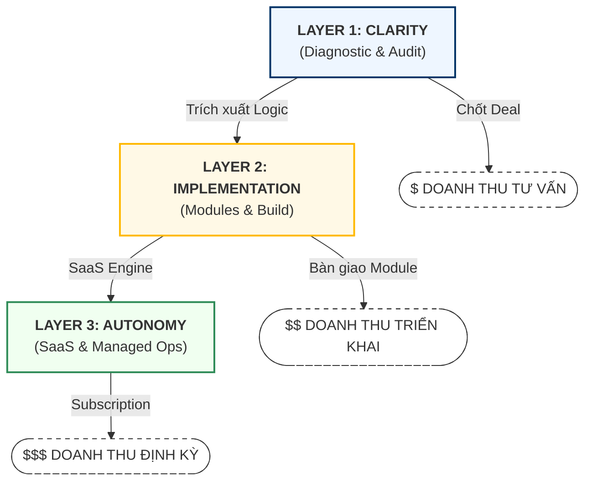

  <!-- Khối Metadata -->
  

    
Business Strategy Master Blueprint

    

      

        Document:Link Strategy Vision 2026
      

      

        Classification:Founder Confidential
      

      

        Author/Owner:Link Strategy Founder Team
      

    

  
<!-- QUAN TRỌNG: KHÔNG ĐỂ KHOẢNG TRẮNG Ở ĐÂY -->

    <!-- Khối Branding Badge -->
    

      
      

        

          LINK STRATEGY
        

        
SYSTEMS IMPLEMENTATION LAB

      

    

  

# MASTER BUSINESS BLUEPRINT

## LINK STRATEGY: OPERATING SYSTEM FOR SYSTEMS

Link Strategy vận hành như một **Systems-driven Venture Studio**. Đây là sự hợp nhất của Consulting cao cấp, Triển khai hệ thống và Cỗ máy sản xuất SaaS. Chiến lược là đi từ **Cashflow thực tế (nguồn từ dịch vụ)** để nuôi dưỡng **Tài sản công nghệ (SaaS layer)**, biến những bài toán vận hành phức tạp thành các module có thể scale.

---

## I. ĐỊNH DANH CHIẾN LƯỢC (STRATEGIC IDENTITY)

### 1.1. Bản chất mô hình lai (Hybrid Model)

Link Strategy không tự định vị là agency hay phần mềm thuần túy, mà là đơn vị xây dựng **Hệ điều hành (Operating Systems)** cho SME.

- **Bên trong (Internal)**: Tư duy Platform, xây dựng các Module chuẩn hóa.
- **Bên ngoài (External)**: Cung cấp giải pháp có kết quả rõ ràng (Outcome-focused).

### 1.2. Triết lý "Hardened Assets" & Đòn bẩy (Leverage)

Mọi chu kỳ kinh doanh phải tạo ra **Leverage (Đòn bẩy)** qua việc tích lũy tài sản trí tuệ:

- **Output không chỉ là doanh thu**, mà phải là: Playbook, Checklist, Module lặp lại, Dataset, hoặc Agent Logic.
- **Tiêu chuẩn thành công**: Nếu một dự án kết thúc mà không rút trích được "SOP chuẩn", dự án đó bị coi là thất bại về mặt chiến lược.
- **Vận hành Hardened**: Ưu tiên Log-based (Dữ liệu bất biến), Verification-first (Có thể kiểm chứng/Audit) và Human-in-control (AI thực thi, con người phê duyệt).

---

## II. THỊ TRƯỜNG & CHIẾN THUẬT TIẾP CẬN (GTM & WEDGE STRATEGY)

### 2.1. Nỗi đau là cửa ngõ (Pain as a Wedge)

SME không mua "Operating Systems". Họ mua kết quả cụ thể cho các nỗi đau cấp bách:

- **Giảm thất thoát** (Dòng tiền, nhiên liệu, vật tư).
- **Giảm phụ thuộc nhân sự** (Khi core person nghỉ việc, hệ thống vẫn chạy).
- **Tăng tính kiểm chứng** (Minh bạch dữ liệu để vay vốn hoặc xuất khẩu).
- **Hệ thống hóa AI** (Tránh sự hỗn loạn khi áp dụng AI rời rạc).

### 2.2. ICP (Lát cắt khách hàng nòng cốt)

Ưu tiên nhóm doanh nghiệp có vận hành thực địa (Physical Operations) hoặc quản trị chứng từ phức tạp:

- SME Logistics / Vận tải công nghệ cao.
- SME Sản xuất / Nhà máy quy mô vừa.
- Doanh nghiệp có quy trình SCM/Compliance dày đặc (Thuế, Carbon, Audit).

---

## III. THIẾT KẾ DOANH THU (MONETIZATION LADDER)

Mô hình kiếm tiền được phân tầng để bảo đảm tính thực dụng và dòng tiền sớm:

| Tầng giá trị                   | Hình thức bán (Offer)                                                                       | Đơn vị tính | Vai trò chiến lược                                               |
| :-------------------------------- | :--------------------------------------------------------------------------------------------- | :-------------- | :------------------------------------------------------------------- |
| **Tầng 1: Clarity**        | **Diagnostic-led Consulting**:  Audit, Blueprint, Risk Mapping.                     | Dự án         | **Discovery**: Xác thực Pain  bằng tiền.              |
| **Tầng 2: Implementation** | **Standardized Module**:  Workflow design, T-Box setup, Checklist & Training.       | Dự án         | **Hardening**: Module hóa  tri thức nội bộ.           |
| **Tầng 3: Autonomy**       | **Managed Ops / SaaS Subscription**:  AI Agent monitoring, Continuous optimization. | Hàng tháng    | **Scaling**: Thương mại hóa  thành SaaS phổ thông. |

---

## IV. QUY TẮC VẬN HÀNH "BRAIN & HANDS" (OPERATING DISCIPLINE)

### 4.1. Cấu trúc thực thi

- **Brain Layer (Link Strategy)**: Founder sở hữu Framework, Architecture, Acceptance Criteria và Playbook Core.
- **Hands Layer (Partners/Freelance)**: Thực thi (Design, Dev, Marketing) theo Spec của Brain.
- **Rule**: Không để năng lực cốt lõi (System Logic) nằm ở Vendor. Tuyệt đối tránh bẫy "Bespoke forever".

### 4.2. Kỷ luật "Module vs. SaaS"

- **Module (Internal)**: Là ngôn ngữ kiến trúc để chuẩn hóa năng lực (Playbook, Agent logic, Data model).
- **SaaS (External)**: Là sản phẩm hoàn chỉnh, tập trung vào User Outcome và dễ onboarding.
  Pattern lặp lại >80% phải được ép vào Module nội bộ trước khi đóng gói thành SaaS. Link Strategy chỉ thắng nếu đi theo công thức:

> **Pain cụ thể → Module chuẩn hóa → Case study kiểm chứng → Playbook lặp lại → SaaS phổ thông.**

---

## V. LỘ TRÌNH TIẾN HÓA (ROADMAP 3 GIAI ĐOẠN)

### 🟢 Pha 1: Founder-led Practice (0 - 12 tháng)

- **Mô hình**: Consulting & Implementation.
- **Trọng tâm**: Chốt deal bằng High-trust, tích lũy framework từ hiện trường (Pain Research).
- **KPI**: Unit Economics dương + 3 Case studies sạch.

### 🟡 Pha 2: Solution Company (12 - 24 tháng)

- **Mô tả**: Khi các module đã lặp lại đủ nhiều và được đóng gói thành **Productized Service**.
- **Hành động**: Chuẩn hóa Delivery Path "Brain dẫn Hands", bóc tách module thành sản phẩm độc lập.
- **KPI**: >50% doanh thu đến từ các Module/Sản phẩm có sẵn.

### 🟠 Pha 3: Tech Ecosystem (24 tháng+)

- **Mô tả**: Chuyển dịch hoàn toàn sang mô hình **SaaS Engine**.
- **Hành động**: Vận hành các SaaS độc lập (Semi-independent) trên nền tảng tri thức chung.
- **KPI**: Recurring Revenue chiếm tỷ trọng >70%.

---

## VI. KẾT LUẬN CHIẾN LƯỢC

Link Strategy không đi từ "Tầm nhìn lớn" để bắt khách hàng tự hiểu. Link Strategy đi từ **Nỗi đau nhỏ nhưng cháy bỏng**, giải quyết bằng **Hệ thống cứng cáp**, để sau cùng mới trở thành lớp kiến trúc vận hành bao trùm.

> **Business này đáng làm vì nó đi từ Cashflow trước, Abstraction sau.**

---

  

    © 2026 <b style="color: #003366 !important;">Link Strategy</b>. All rights reserved. 
    <b>Strategic Blueprint</b> | <b>Status:</b> Draft
  
<!-- QUAN TRỌNG: KHÔNG ĐỂ KHOẢNG TRẮNG Ở ĐÂY -->

    

      

        
LINK STRATEGY

        
SYSTEMS IMPLEMENTATION

      

      
    

  

