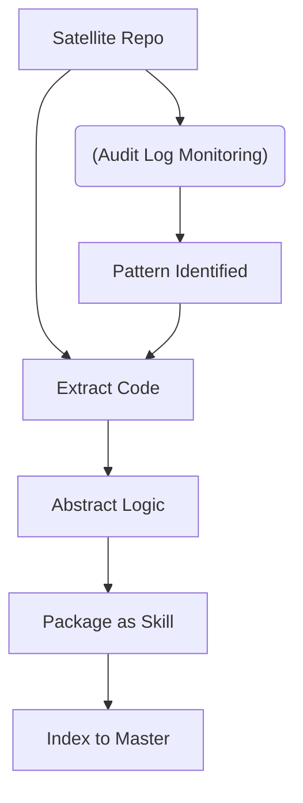

# LINK STRATEGY PRODUCTION ENGINE: MASTER CONFIGURATION & GOVERNANCE

Tài liệu này là bản đặc tả kiến trúc tối cao, xác lập cơ chế điều phối và giám sát để biến Link Strategy thành một hệ thống sản xuất phần mềm tự động hóa, bền vững và tự tiến hóa.

---

## I. MỤC TIÊU (OBJECTIVE)

Tài liệu này đóng vai trò là "Bản đồ kỹ thuật" (Technical Blueprint), định nghĩa cách các thành phần AI, mã nguồn và nhân sự (Freelancer) tương tác với nhau trong hệ sinh thái Link Strategy. Mọi thiết lập hạ tầng phải tuân thủ tuyệt đối các phân lớp dưới đây.

---

## II. CHIẾN LƯỢC QUẢN TRỊ MÃ NGUỒN (REPOSITORY STRATEGY)

Hệ thống sử dụng mô hình **Lai (Hybrid)** để tối ưu bảo mật và tích lũy tri thức:

### 1. Master Monorepo (The Brain's Sovereignty)

Nơi lưu trữ toàn bộ "linh hồn" và tài sản của Link Strategy. Chỉ có Brain mới có quyền truy cập tổng thể.

- **Cấu trúc thư mục:**

```text
/link-strategy-engine
├── .agents/ (AI Assets: rules, skills, workflows, scripts)
├── .LinkStrategy/ (Hidden: Constitution, Contracts, Certificates)
│   ├── 04_SOP_LINK_STRATEGY.md
│   ├── 05_FULL_SYSTEM_CONFIGURATION.md
│   └── 06_HANDOVER_SPEC.md
├── scripts/ (Common Infrastructure)
├── components/
│   └── /ui (Shared Components)
├── projects/ (Client Projects)
├── GEMINI.md (Project Rules)
├── .gitignore
└── README.md
```

### 2. Satellite Repos (The Hands' Workspace)

Các repo riêng biệt được sinh ra hoặc đồng bộ từ thư mục con của Master Monorepo dành cho freelancer.

- **Cấu trúc chuẩn:**

```text
/ls-satellite-repo
├── /src (Phần việc được giao)
├── /tests (Unit tests bắt buộc - Pass 100%, Coverage > 80%)
├── /docs
│   ├── /blueprints (01_TASK_SPEC.md, 02_QA_LOGS.md)
│   └── LOGS.md (Nhật ký bàn giao khẩn cấp: Done/Block/Next)
├── .cursorrules (Bản thực thi từ Master)
└── README.md
```

### 3. Quy tắc đặt tên và Quản trị (Naming & Governance)

Để cỗ máy vận hành không sai sót, mọi thành phần phải tuân thủ naming chuẩn:

- **Dự án tại Master:** `[CLIENT_ID]-[PROJECT_NAME]` (Ví dụ: `LTR-DOC-APP`).
- **Satellite Repos:** `ls-[CLIENT_ID]-[MODULE_NAME]`.
- **Nhánh (Branches):** `feat/` (tính năng), `fix/` (sửa lỗi), `harden/` (bóc tách tài sản).
- **Commit Message:** Tuân thủ `Conventional Commits` (ví dụ: `feat:`, `fix:`, `docs:`).
- **Tài sản nòng cốt (Assets):**
  - Rules: `ls-rule-[name]`
  - Skills: `ls-skill-[name]`
  - Tools: `ls-tool-[name]`

### 4. Cơ chế Đồng bộ (Sync Linkage Logic)

- **Push-to-Satellite:** Brain cập nhật Blueprint/Rules tại Monorepo -> CI/CD tự động "đè" các file này xuống các Satellite Repos. Các file trong `.agents/` tại Satellite được thiết lập Read-Only.
- **Pull-to-Master:** Sau khi Brain phê duyệt kết quả qua Pull Request, CI/CD tự động kéo mã nguồn từ Satellite về đúng thư mục dự án trong Master.

---

## III. MÔ HÌNH KIẾN TRÚC 4 LỚP (THE 4-PLANE ARCHITECTURE)

Hệ thống vận hành thông qua sự hợp tác giữa 4 lớp thực thi:

### 1. Lớp Điều khiển (Control Plane) - Rules & Workflows

- **Vai trò:** Bản thiết kế và Luật pháp (`.agents/rules/` và `.agents/workflows/`).
- **Bootstrap Protocol:** AI Agent khi khởi tạo bắt buộc phải đọc `.cursorrules`. Rule này dẫn hướng AI tới `ASSET_INDEX.md` để "nạp vũ khí" đầu phiên làm việc.

### 2. Lớp Giao tiếp (Communication Plane) - Context-Rich

- **Giao thức:** Tuyệt đối không chat ngoài. Mọi thảo luận nằm trong `02_QA_LOGS.md`.
- **Spec-First Enforcement:** Mọi Task phải có Spec theo chuẩn 5 Trụ cột (Strategic Context, Mermaid Diagram, Data Schema, Technical Contract, DoD).

### 3. Lớp Thực thi (Execution Plane) - Skills & Tools

- **Vai trò:** Cung cấp "Vũ khí" (Capabilities) thông qua các Skills đóng gói.
- **Action vs. Inquiry Lane:** Các Tools có quyền ghi dữ liệu (Action) phải nằm trong lane kiểm soát riêng, yêu cầu xác nhận từ Brain, tách biệt hoàn toàn với tools chỉ đọc (Inquiry).
- **Mandatory UI Kit:** Mọi dự án Frontend phải sử dụng 100% tài sản từ `ls-skill-ui-kit` để đảm bảo tính nhất quán của hệ sinh thái Micro Frontend.

### 4. Lớp Đối soát (Audit Plane) - The Integrity Ledger

- **Bằng chứng:** Nhật ký làm việc được đồng bộ thời gian thực qua **Custom Supabase MCP Bridge**.
- **Tính bất biến:** Mọi hành động nhạy cảm của AI/Hands phải để lại dấu vết không thể xóa nhòa trên Ledger.

---

## IV. CHI TIẾT THỰC THI (OPERATIONAL SPECS)

### 1. Cấu hình Assets & Discovery
- **Vị trí:** `.agents/` tại thư mục gốc.
- **Asset Indexing:** File `ASSET_INDEX.md` tại thư mục gốc dùng để khai báo danh mục Skills cho AI tự động tra cứu. AI phải "quét" file này trước khi bắt đầu Task.
- **Rule File:** `GEMINI.md` tại thư mục gốc là nơi chứa chỉ thị thực thi cao nhất.

### 2. Cấu hình Hạ tầng Audit (The Ledger Schema)

- **Tool:** Custom MCP Tool (Ví dụ: `ls-audit-bridge`).
- **Dữ liệu bắt buộc:** Mỗi bản ghi log phải chứa: `timestamp`, `agent_id`, `intent` (mục tiêu), `impact_area` (tập tin tác động), và `hash_verification`.

### 3. Cấu hình Giao tiếp và Bàn giao

Mọi Satellite Repo bắt buộc có thư mục `docs/blueprints/` để lưu vết: `01_TASK_SPEC.md`, `02_QA_LOGS.md` và file `LOGS.md` (cập nhật trạng thái Done/Block/Next hằng ngày).

---

## V. VÒNG LẶP TIẾN HÓA (THE HARDENING PIPELINE)

Quy trình kỹ thuật để "hóa thạch" tri thức và tích lũy tri thức công ty:



**Chi tiết quy trình 3 bước:**

1. **Identify (Nhận diện):** Brain rà soát mã nguồn dự án để tìm các Module hoặc Logic có khả năng tái sử dụng cao.
2. **Abstract (Tổng quát hóa):** Loại bỏ các tham số đặc thù của khách hàng (hard-coded), biến chúng thành interface chuẩn.
3. **Store (Lưu trữ):** Đóng gói thành Skill/Rule mới, nạp vào thư mục `/shared` của Master Monorepo và cập nhật index.

---

## VI. CHỐT CHẶN NGHIỆM THU (THE HARD GATE SCORECARD)

Giải ngân thực hiện tự động hoặc bán tự động dựa trên bảng điểm (Chuẩn Hiến pháp):

| Hạng mục | Tiêu chí đánh giá chi tiết | Trọng số |
| :--- | :--- | :---: |
| **Kỹ thuật Lõi** | **Unit Test:** Pass 100% test cases + Coverage > 80%. | 30đ |
| | **Clean Code:** Không lỗi Lint, không lỗi logic nghiêm trọng. | 20đ |
| **Tài sản (Assets)** | **Documentation:** README đầy đủ, có Video Demo rõ ràng. | 20đ |
| | **Hardening Ready:** Code được module hóa, dễ dàng bóc tách. | 10đ |
| **AI Audit** | **Security & Debt:** AI rà soát không phát hiện lỗ hổng bảo mật. | 20đ |

**Quy tắc Gate:**

- **Trên 80đ:** Giải ngân 100%.
- **70 - 79đ:** Giải ngân 70%.
- **Dưới 70đ (Hoặc có lỗi bảo mật):** REJECT (Sửa lại cho đến khi đạt mới nghiệm thu).

---

**Status:** **FINAL HARDENED CONSTITUTIONAL VERSION v3.0**
**Authorization:** Master Operating Constitution (Link Strategy)
