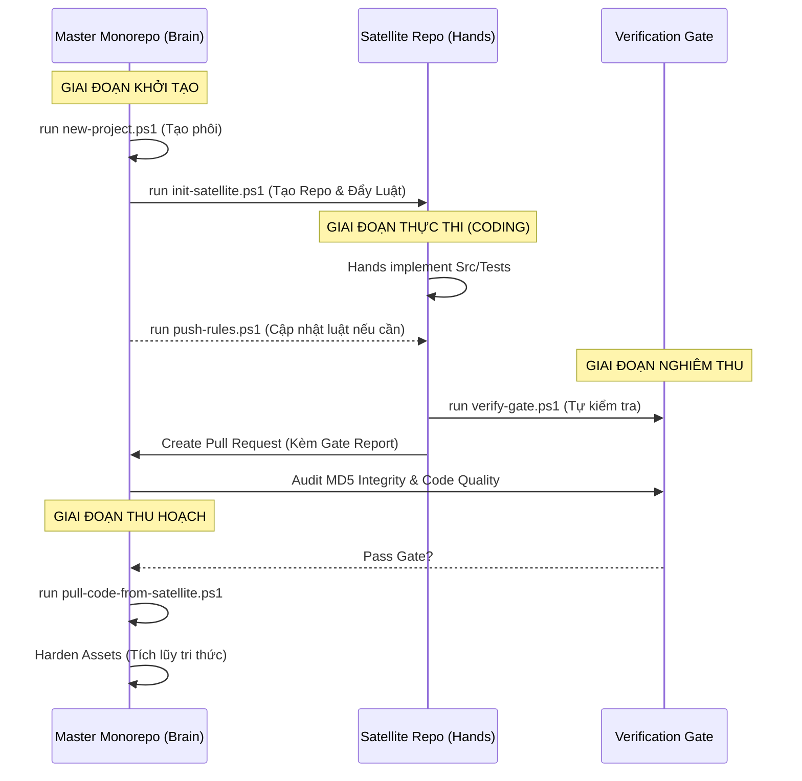

  <!-- Khối Metadata -->
  

    
Production Engine Sync Protocol

    

      

        Document:Master-Satellite Sync Protocol
      

      

        Classification:Founder Confidential
      

    

  
<!-- QUAN TRỌNG: KHÔNG ĐỂ KHOẢNG TRẮNG Ở ĐÂY -->

    <!-- Khối Branding Badge -->
    

      
      

        

          LINK STRATEGY
        

        
OPERATION SOLUTIONS DIVISION

      

    

  

# 04. MASTER-SATELLITE SYNC PROTOCOL (MSP)

Tài liệu này xác lập các tiêu chuẩn kỹ thuật để duy trì sự đồng bộ hóa dữ liệu, đảm bảo chủ quyền kiến trúc (Brain Sovereignty) và khả năng thu hoạch tài sản (Asset Harvesting) giữa Master Monorepo và các Satellite Repos.

---

## I. SƠ ĐỒ VẬN HÀNH (OPERATIONAL FLOW)

---

## II. MÔ HÌNH ĐỒNG BỘ HAI CHIỀU (B-DIRECTIONAL SYNC)

Hệ thống vận hành dựa trên sự tách biệt tuyệt đối giữa không gian **Thiết kế (Master)** và không gian **Thực thi (Satellite)**.

### 1. Chiều Xuôi: Master ➔ Satellite (Luật pháp & Đặc tả)
*   **Mục đích:** Phân phối Rules, Workflows và Blueprints xuống các Satellite để định hướng AI Agent và Hands.
*   **Tài sản đồng bộ:** Thư mục `.agents/` và tệp `.cursorrules`.
*   **Giao thức:** `FORCE PUSH`. Master Monorepo là nguồn sự thật duy nhất (Single Source of Truth). Mọi thay đổi tại Satellite đối với các tài sản này sẽ bị ghi đè không điều kiện.

### 2. Chiều Ngược: Satellite ➔ Master (Code & Tài sản tri thức)
*   **Mục đích:** Thu hoạch mã nguồn sạch và nhật ký tri thức để tích lũy vào Monorepo.
*   **Danh mục thu hoạch (Harvesting List):** Quá trình thu hoạch chỉ giới hạn trong:
    *   `/src`: Toàn bộ logic nghiệp vụ đã qua kiểm thử.
    *   `/tests`: Toàn bộ kịch bản kiểm thử đảm bảo Coverage > 80%.
    *   `/docs`: Đặc tả module, Sơ đồ và tệp `LOGS.md`.
*   **Giao thức:** `SELECTIVE HARVESTING`. Sử dụng `git checkout [remote] -- [path]` để trích xuất dữ liệu, đảm bảo không kéo theo các tệp cấu hình rác hoặc luật lệ đã bị biến đổi tại Satellite.

---

## II. CƠ CHẾ BẢO VỆ TOÀN VẸN (GOVERNANCE PROTECTION)

Hệ thống áp dụng cơ chế bảo vệ "Bất biến" (Immutability) đối với luật pháp:

1.  **Integrity Fingerprinting (MD5 Hash):** 
    *   Mọi tệp chiến lược trong `.agents/rules/` được gán một "dấu vân tay" MD5 từ Master.
    *   `verify-gate.ps1` thực hiện quét đệ quy và đối chiếu Hash từng tệp.
    *   **Violation Penalty:** Sai lệch Hash = -30đ/tệp. Xóa tệp = -40đ/tệp. Xóa thư mục luật = 0đ (Hủy bỏ tư cách PR).
2.  **Permission Block:** Tệp `rules-protection.yml` tại Satellite sẽ chặn đứng mọi PR có thay đổi trong tầng Governance từ phía Hands.
3.  **Force Overwrite:** Master luôn giữ quyền ghi đè (`--force`) để xóa bỏ mọi nỗ lực sửa luật cục bộ của Hands mỗi khi có phiên đồng bộ mới.

---

## III. XỬ LÝ XUNG ĐỘT (CONFLICT RESOLUTION)

*   **Tầng Governance:** Master Monorepo luôn thắng. Xung đột tại thư mục `.agents/` sẽ được giải quyết bằng cách Ghi đè (Overwrite) từ Master.
*   **Tầng Source Code:** 
    *   Nếu phát hiện xung đột khi thu hoạch (Harvesting) ➔ Hands bắt buộc phải thực hiện `Rebase` hoặc `Merge` phiên bản Master mới nhất vào Satellite trước khi nộp lại PR.
    *   Mọi Code không vượt qua kiểm tra tính toàn vẹn (Integrity Check) sẽ bị từ chối tích hợp.

---

## III. CÔNG CỤ DỊCH VỤ (TOOLING)

Hệ thống cung cấp bộ công cụ tự động hóa tại thư mục `scripts/`:

*   **`init-satellite.ps1`**: Khởi tạo Git context, tạo Repository GitHub (via GH CLI), thiết lập chốt chặn PR và thực hiện Bootstrap Rule lần đầu.
*   **`push-rules-to-satellite.ps1`**: Thực hiện Force Sync luật Master ➔ Satellite (Auto-Commit & Push).
*   **`pull-code-from-satellite.ps1`**: Thực hiện Harvesting tài sản Satellite ➔ Master.
*   **`verify-gate.ps1`**: Kiểm tra tính toàn vẹn (Integrity Check) và tuân thủ luật pháp trước khi nghiệm thu.

---

## IV. QUY TRÌNH VẬN HÀNH CHUẨN (STANDARD WORKFLOW)

1.  **Giai đoạn Khởi tạo (Initialization):** Brain chạy `new-project` ➔ `init-satellite`. 
    *   *Kết quả:* Một Satellite Repo sạch sẽ, có đủ "thiết chế sắt" (CODEOWNERS, PR Template) được sinh ra trên GitHub.
2.  **Giai đoạn Điều hành (Governance):** Nếu Brain cập nhật Hiến pháp tổng ➔ Chạy `push-rules -GitPush`. 
    *   *Kết quả:* Luật mới được Force Sync ngay lập tức xuống đầu Hands.
3.  **Giai đoạn Nghiệm thu (Harvesting):** Hands nộp bài ➔ Brain chạy `verify-gate` (MD5 Hash Check) ➔ Nếu Pass, chạy `pull-code` để thu hoạch code về Monorepo.

---
**Status:** **OFFICIAL PROTOCOL v1.0**
**Priority:** **LEVEL 0 (BLOCKER)**
**Owner:** Link Strategy Brain Delegate
