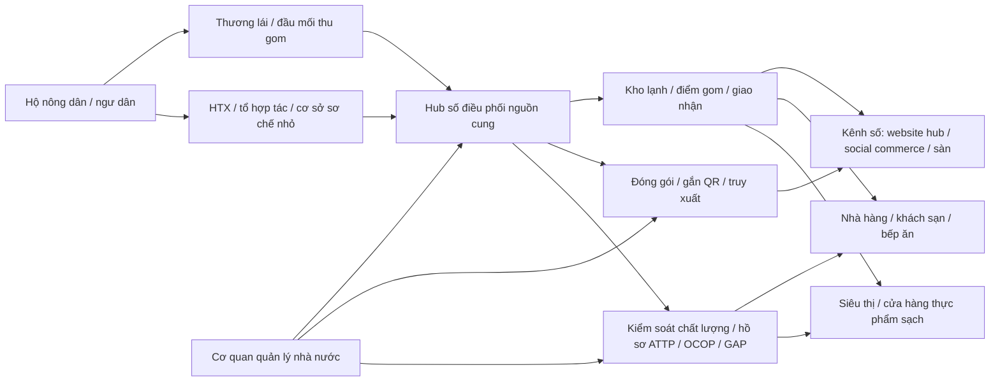
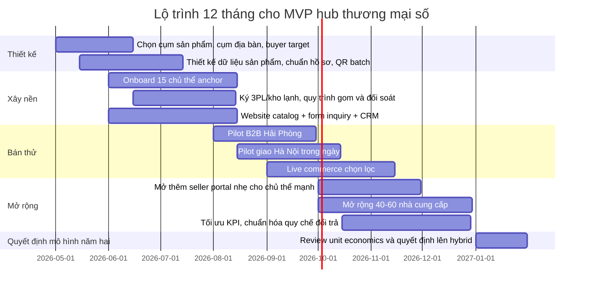

# Pain points xây dựng trung tâm thương mại số cho nông sản và thủy sản địa phương tại Hải Phòng

## Tóm tắt điều hành

Bài toán của Hải Phòng không phải là “thiếu hàng để bán”, mà là “thiếu một cơ chế số hóa đủ mạnh để gom hàng, chuẩn hóa hàng và bán hàng theo dịch vụ”. Về phía cung, thành phố hiện có 647 sản phẩm OCOP còn hiệu lực, thuộc 363 chủ thể; 106/114 xã, phường, đặc khu có sản phẩm OCOP. Chỉ riêng đợt công nhận tháng 3/2026, Hải Phòng có thêm 58 sản phẩm OCOP, trong đó 26 sản phẩm 4 sao và 32 sản phẩm 3 sao. Điều đó cho thấy nguồn hàng địa phương có bề rộng rất tốt, đặc biệt ở nhóm nông sản đặc trưng, sản phẩm chế biến, thủy sản, đặc sản ven biển và các dòng quà biếu địa phương. citeturn30search11turn24search0turn24search1

Tuy nhiên, các điểm nghẽn lớn nhất nằm ở giữa chuỗi. Hơn 15.500 ha rau, quả của thành phố sản xuất theo quy trình an toàn, nhưng chỉ khoảng 1.500 ha đã được cấp chứng nhận VietGAP/GlobalGAP, tức khoảng 9,7% diện tích an toàn có chứng nhận. Với ổi lê Đông Tạ, 80% sản lượng vẫn do thương lái thu gom trực tiếp từ hộ dân, chỉ 20% đi qua hợp tác xã. Ở tầng hạ tầng, báo cáo chính trị của thành phố nêu có 60 kho lạnh bảo quản nông sản, công suất 60–150 tấn/kho; trong khi một nhà vận hành tại Hải Phòng công bố riêng hệ thống của họ đã vượt 6.000 tấn. Điều đó gợi ý rằng năng lực kho lạnh không hẳn bằng không, nhưng rất phân mảnh, khó truy cập ở quy mô hộ/HTX, và chưa tự động chuyển hóa thành năng lực fulfillment cho thương mại số. Ở tầng năng lực số, chính kế hoạch TMĐT của thành phố năm 2026 vẫn phải đặt mục tiêu đào tạo 6.000–8.000 lượt tổ chức, cá nhân; phấn đấu 65–70% doanh nghiệp ứng dụng TMĐT; 75–80% thanh toán không dùng tiền mặt trong TMĐT. Những mục tiêu đó cho thấy khoảng cách triển khai vẫn còn đáng kể. citeturn39search1turn40search10turn15search4turn15search3turn23view0

Vì vậy, một hướng khởi động phù hợp là **mô hình aggregator theo kênh**, thay vì mở ngay một “sàn mở” nơi mỗi hộ tự làm một gian hàng riêng. Mô hình này có một đầu mối số hóa nguồn cung, chuẩn hóa thông tin sản phẩm, gom đơn hàng và điều phối chất lượng; sau đó có thể tiến hóa sang mô hình hybrid có cổng cho người bán. Lập luận này không chỉ đến từ lý thuyết mà đến từ dữ liệu địa phương: rau vụ đông 2025–2026 của thành phố đạt quy mô rất lớn, hơn 70% tiêu thụ ngoài thành phố và xuất khẩu; trong khi nhiều trường hợp vẫn xảy ra “được mùa, tắc đầu ra”, như 205 tấn thủy sản ở Nam Triệu cần tiêu thụ gấp và khoảng 300 tấn cải bắp còn tồn ở Thanh Miện khi đứt bao tiêu. citeturn29search2turn38search1turn40search1

## Phạm vi thị trường và danh mục sản phẩm

Một lưu ý phương pháp rất quan trọng là một phần số liệu 2025–2026 của cơ quan thống kê chính thức đã phản ánh thành phố Hải Phòng sau sắp xếp địa giới và có lúc tách theo “khu vực phía Đông” và “khu vực phía Tây”. Vì vậy, với đề xuất hub thương mại số cho nông, thủy sản “bản địa Hải Phòng”, báo cáo này tách hai lớp nhìn: **vùng lõi ven biển và nông nghiệp Hải Phòng cũ** để xác định mô hình vận hành thực tế; và **quy mô toàn thành phố hiện hành** để ước lượng thị trường, OCOP và dư địa mở rộng. citeturn38search3turn26view1turn32search5

### Nguồn cung chủ lực phù hợp cho hub

| Nhóm nguồn cung | Phạm vi số liệu | Quy mô / sản lượng | Mùa vụ chính | Vùng trọng điểm | Hàm ý cho hub | Nguồn |
|---|---|---:|---|---|---|---|
| Lúa xuân | Vùng lõi ven biển | 27.260 ha; 191.237,9 tấn kế hoạch 2025 | Gieo cấy đầu năm, thu hoạch khoảng tháng 5–6 | **Vĩnh Bảo**, **Tiên Lãng**, **Thủy Nguyên**, **An Lão**, **Kiến Thụy** | Phù hợp B2B, chế biến, quà biếu gạo đặc sản; không phải nhóm mở B2C tươi sống đầu tiên | [KH sản xuất vụ Xuân 2025 - Sở NN&PTNT Hải Phòng][src-vu-xuan-2025] |
| Rau xuân | Vùng lõi ven biển | 4.015 ha; 88.731,5 tấn kế hoạch 2025 | Quý I–II | Rau ăn lá, gia vị, ngô, thuốc lào, cây có củ | Tốt cho mô hình “catalog mùa vụ” và đơn gom theo ngày | [KH sản xuất vụ Xuân 2025 - Sở NN&PTNT Hải Phòng][src-vu-xuan-2025] |
| Rau màu vụ đông | Toàn thành phố hiện hành | 29.076 ha; gần 670.000 tấn; bình quân 292,8 tạ/ha | Quý IV đến hết quý I | Nhiều vùng sản xuất hàng hóa phía Tây; nhóm chủ lực gồm cải bắp, cà rốt, su hào, su lơ, hành tỏi | Đây là “volume engine” cho hub; cần ưu tiên forecast, gom đơn, B2B và xuất ngoài tỉnh | [Cục Thống kê Hải Phòng, tháng 01/2026][src-thongke-2026-01]; [Khuyến nông Hải Phòng, vụ Đông 2025-2026][src-khuyennong-vudong] |
| Rau vụ xuân 2026 | Toàn thành phố hiện hành | Gần 16.700 ha, hơn 90% kế hoạch cả vụ | Quý I | Rau ăn lá >8.000 ha; thuốc lào 1.700 ha; ngô 1.450 ha; lạc 850 ha; dưa 800 ha | Tạo dòng hàng liên tục, nhưng cần quản trị sâu bệnh và sàng lọc SKU | [Báo Hải Phòng, sản xuất trồng trọt quý I/2026][src-baohp-trongtrot-2026] |
| Vải | Toàn thành phố hiện hành | 9.350 ha; 47.000–50.000 tấn; 12 vùng GlobalGAP, 81 vùng VietGAP với 1.045 ha | Cuối tháng 5 đến tháng 6 | Khu vực Thanh Hà, Hà Đông, Hà Bắc, Hà Tây, Ninh Giang… | Phù hợp chiến dịch theo mùa, preorder, live commerce, B2B liên tỉnh và xuất khẩu có chứng nhận | [Nông nghiệp & Môi trường, vải Hải Phòng 2026][src-vai-2026]; [Nông nghiệp & Môi trường, xuất khẩu vải 2026][src-vai-xuatkhau-2026] |
| Thủy sản toàn ngành | Toàn thành phố hiện hành | 320,78 nghìn tấn năm 2025; khai thác 120,04 nghìn tấn; nuôi trồng 200,74 nghìn tấn | Quanh năm | Vùng biển, bãi triều, nuôi nước lợ, ao đầm | TAM lớn nhưng không nên mở đồng loạt; cần phân tầng theo tươi sống, đông lạnh, chế biến | Nguồn thống kê ngành thủy sản 2025 cần kiểm chứng lại từ tài liệu gốc |
| Benchmark lõi ven biển | Hải Phòng cũ / Đông Hải Phòng | 85.770,2 tấn trong 5 tháng đầu 2025; khai thác 50.299,3 tấn; nuôi trồng 35.470,9 tấn | Quanh năm | Ven biển và cửa sông | Cho thấy riêng vùng lõi đã đủ lớn để vận hành MVP mà chưa cần “ôm” toàn thành phố | Nguồn thống kê khu vực Đông Hải Phòng 5 tháng 2025 cần kiểm chứng lại từ tài liệu gốc |
| Nuôi biển chủ lực | Vùng lõi ven biển | Mục tiêu đến hết 2025: khoảng 3.000 ha; sản lượng nuôi biển trên 31.000 tấn | Quanh năm, theo đối tượng | **Cát Hải** nuôi cá lồng và nhuyễn thể giàn; Tiên Lãng nuôi bãi nhuyễn thể 1.900 ha, 25.000 tấn; **Đồ Sơn** và ven biển cho giáp xác, rong biển | Thủy sản nên chia 3 nhóm SKU: tươi nhanh, sống cao cấp, đông lạnh/chế biến | Nguồn quy hoạch/đề án nuôi biển Hải Phòng cần kiểm chứng lại từ tài liệu gốc |
| Rươi | Toàn thành phố hiện hành | Xã Chí Minh có hơn 500 ha rươi tự nhiên; năng suất 70–80 kg/sào; giá 200.000–250.000 đ/kg | Cuối năm | Vùng bãi triều nước lợ | SKU premium, biên lợi nhuận cao, hợp bán có câu chuyện nguồn gốc | [Báo Hải Phòng, vùng rươi Chí Minh][src-ruoi-chi-minh] |

### Quy mô và động học OCOP

| Chỉ dấu OCOP | Giá trị | Ý nghĩa cho hub | Nguồn |
|---|---:|---|---|
| Sản phẩm OCOP còn hiệu lực | 647 | Có đủ “catalog lõi” để mở hub bằng hàng đã được xã hội hóa chuẩn hóa bước đầu | Nguồn tổng hợp OCOP cần kiểm chứng lại từ tài liệu gốc; đối chiếu thêm [Trang đổi mới sáng tạo Hải Phòng, số liệu OCOP 2025][src-ocop-doimoisangtao] |
| Cơ cấu sao | 8 sản phẩm 5 sao; 171 sản phẩm 4 sao; 468 sản phẩm 3 sao | Có thể xây tier sản phẩm: premium, mass premium, local everyday | Nguồn tổng hợp OCOP cần kiểm chứng lại từ tài liệu gốc; đối chiếu thêm [Trang đổi mới sáng tạo Hải Phòng, số liệu OCOP 2025][src-ocop-doimoisangtao] |
| Chủ thể OCOP | 363 chủ thể, gồm 69 doanh nghiệp, 80 HTX, 201 cơ sở sản xuất, 5 ban quản lý, 8 tổ hợp tác | Hệ sinh thái đủ rộng nhưng phân mảnh; cần CRM nhà cung cấp và phân hạng năng lực | Nguồn tổng hợp OCOP cần kiểm chứng lại từ tài liệu gốc |
| Mật độ địa lý | 106/114 xã, phường, đặc khu có OCOP | Mạng lưới nguồn cung phân tán; không thể vận hành hiệu quả nếu không có cơ chế thu gom theo cụm | Nguồn tổng hợp OCOP cần kiểm chứng lại từ tài liệu gốc |
| Bổ sung mới tháng 3/2026 | 58 sản phẩm từ 20 chủ thể ở 16 xã, phường, đặc khu | Pipeline sản phẩm mới đang tăng; hub có thể dùng OCOP làm “bộ lọc đầu vào” giai đoạn đầu | [Quyết định công nhận sản phẩm OCOP Hải Phòng năm 2025][src-qd-ocop-2025] |

Ở góc độ lựa chọn SKU khởi động, những nhóm “vào trước” nên là sản phẩm đã có câu chuyện thương hiệu hoặc chuẩn hóa tương đối tốt, như ổi lê Đông Tạ, táo Bàng La, nước mắm Cát Hải, các dòng rau vụ đông có sản lượng lớn và các sản phẩm thủy sản/đặc sản mùa vụ có premium pricing. Đây là cách giảm rủi ro cho năm đầu bằng cách tránh mở quá rộng danh mục tươi sống chưa kiểm soát được dịch vụ. citeturn13search1turn13search9turn24search3turn37search4

## Chuỗi giá trị và các điểm nghẽn

Chuỗi giá trị của hub tương lai phải bắt đầu từ một thực tế: thực phẩm ở Việt Nam vẫn do các tác nhân quy mô nhỏ sản xuất và tiêu thụ, chuỗi cung ứng còn phân mảnh. Một báo cáo của World Bank ghi nhận nông hộ nhỏ sản xuất phần lớn lương thực thực phẩm và 90% thực phẩm vẫn bán qua các kênh truyền thống, phi chính thức. Ở cấp độ tổ chức sản xuất, cả nước có 20.789 HTX nông nghiệp vào năm 2023, nhưng chỉ khoảng 2.500 HTX ứng dụng công nghệ cao, chuyển đổi số; 2.169 HTX là chủ thể OCOP. Chuyển dịch từ “bán hàng hộ” sang “bán hàng chuỗi” vì vậy phải nhìn HTX, tổ hợp tác, cơ sở chế biến nhỏ và đầu mối gom hàng như các mắt xích trung gian bắt buộc, chứ không thể bỏ qua. citeturn45search8turn21search11

### Sơ đồ chuỗi giá trị gợi ý cho hub

Dữ liệu địa phương cho thấy vai trò trung gian của thương lái, HTX, cảng cá, bến cá, nhà hàng, siêu thị, nền tảng số và cơ quan công đóng vai trò rất rõ. Sơ đồ dưới đây tóm lược cấu trúc phù hợp với thực tế Hải Phòng. citeturn40search10turn36view0turn23view0turn42search10turn30search11

### Các pain point cốt lõi

| Pain point | Bằng chứng định lượng / định tính mạnh nhất | Hàm ý thiết kế hệ thống | Nguồn |
|---|---|---|---|
| Chuẩn hóa chất lượng còn mỏng | Hơn 15.500 ha rau, quả sản xuất theo quy trình an toàn nhưng chỉ khoảng 1.500 ha được cấp chứng nhận VietGAP/GlobalGAP; với vải, 1.045 ha có GlobalGAP/VietGAP trên tổng 9.350 ha, tức khoảng 11,2% diện tích vải có chứng nhận nêu công khai | Không thể mở “marketplace mở” ngay; phải có cơ chế phân hạng nhà cung cấp và SKU theo mức chứng nhận | [Báo Hải Phòng, 15.500 ha rau quả an toàn][src-rauqua-antoan]; [Nông nghiệp & Môi trường, xuất khẩu vải 2026][src-vai-xuatkhau-2026] |
| Phụ thuộc thương lái và đầu ra ngắn hạn | 80% ổi lê Đông Tạ tiêu thụ qua thương lái; chỉ 20% qua HTX; phần lớn tiêu thụ ngay trong nội thành | Cần module gom hàng, quy đổi tồn kho và đơn theo lô, thay vì chỉ làm gian hàng | Nguồn địa phương về ổi lê Đông Tạ cần kiểm chứng lại từ tài liệu gốc |
| Rủi ro được mùa, nghẽn cầu | Rau vụ đông 2025–2026 đạt gần 670.000 tấn; hơn 70% bán ngoài thành phố và xuất khẩu, nhưng vẫn có khoảng 300 tấn cải bắp tồn ở Thanh Miện khi đứt bao tiêu; Nam Triệu từng cần hỗ trợ tiêu thụ gấp khoảng 205 tấn thủy sản | Hub phải có bộ phận bán hàng chủ động và forecast, không chỉ chờ khách tự đặt | [Khuyến nông Hải Phòng, vụ Đông 2025-2026][src-khuyennong-vudong]; nguồn sự vụ Thanh Miện/Nam Triệu cần kiểm chứng lại từ tài liệu gốc |
| Năng lực truy xuất đang ở pha xây dựng | Thành phố đang triển khai nhiệm vụ hỗ trợ hệ thống truy xuất nguồn gốc kết nối Cổng quốc gia; với thủy sản khai thác, năm 2025 có 4.627 lượt tàu được xác nhận cập/rời trên eCDT tại Ngọc Hải và Trân Châu | Truy xuất nên là năng lực lõi của hub, nhưng phải thiết kế theo lộ trình tối giản trước, không ôm hệ thống quá nặng năm đầu | Nguồn eCDT/cảng cá Ngọc Hải - Trân Châu cần kiểm chứng lại từ tài liệu gốc |
| Kho lạnh có nhưng phân mảnh | Báo cáo chính trị nêu 60 kho lạnh nông sản công suất 60–150 tấn/kho; một nhà vận hành tại Hải Phòng công bố riêng hơn 6.000 tấn | Cần ký hợp đồng block-space với 3PL/kho lạnh, không nên đầu tư CAPEX kho lạnh ngay từ đầu | Nguồn báo cáo chính trị và nguồn doanh nghiệp kho lạnh cần kiểm chứng lại từ tài liệu gốc |
| Khó tiếp cận vốn của HTX và cơ sở nhỏ | Quỹ hỗ trợ phát triển HTX của thành phố đến 2024 mới cho 21 HTX vay khoảng 20 tỷ đồng; nhiều HTX không đủ tài sản bảo đảm hoặc hồ sơ tài chính chưa đạt chuẩn ngân hàng | Nếu hub ôm vai trò mua đứt, sẽ gặp áp lực vốn lưu động lớn; nên ưu tiên mô hình ký gửi, đặt cọc, tín dụng đơn hàng | Nguồn Quỹ hỗ trợ phát triển HTX Hải Phòng cần kiểm chứng lại từ tài liệu gốc |
| Năng lực số không đồng đều | Kế hoạch TMĐT 2026 của thành phố vẫn phải đặt mục tiêu đào tạo 6.000–8.000 lượt, 65–70% doanh nghiệp ứng dụng TMĐT và 75–80% thanh toán không dùng tiền mặt | Producer app tự phục vụ sẽ có tỷ lệ dùng thấp; cần “agent-assisted onboarding” qua cán bộ vùng và HTX | [Kế hoạch TMĐT Hải Phòng 2026][src-kh-tmdt-2026] |
| Niềm tin giao dịch số và thanh toán còn là rào cản | Bộ Công Thương đánh giá thanh toán tiền mặt còn phổ biến trong TMĐT và tình trạng hàng giả, hàng kém chất lượng vẫn là điểm nghẽn của thị trường | Hub phải ưu tiên minh bạch hồ sơ, QR lô hàng, chính sách đổi trả rõ ràng, COD có kiểm soát ở giai đoạn đầu | Nguồn Bộ Công Thương về TMĐT/thanh toán cần kiểm chứng lại từ tài liệu gốc |

Nhìn gọn lại, “pain point trung tâm” của Hải Phòng là **chi phí phối hợp**. Nông dân/HTX có hàng, thị trường có cầu, logistics thành phố nhìn ở cấp vĩ mô là mạnh, nhưng để từ một lô hàng địa phương đi đến một đơn hàng số có thể giao đúng hẹn, đúng nhiệt độ, đúng chứng từ và đúng kỳ vọng khách hàng thì hiện vẫn thiếu một “lớp điều phối” ở giữa. Đó chính là vai trò mà digital commerce hub cần đóng. citeturn26view1turn15search4turn23view0turn40search10

## Kênh bán hàng, logistics lạnh và mức độ sẵn sàng số

### Cấu trúc kênh bán hiện nay

Không có bộ số liệu công khai riêng cho “tỷ trọng kênh bán nông, thủy sản Hải Phòng” ở độ chi tiết thành phố. Vì vậy, bảng dưới đây là **ước tính suy diễn**, dựa trên: i) bằng chứng ở Việt Nam rằng 90% thực phẩm vẫn bán qua kênh truyền thống; ii) ví dụ địa phương như 80% ổi lê Đông Tạ đi qua thương lái; iii) thực tế hơn 70% rau vụ đông của thành phố đi ngoài tỉnh và xuất khẩu; và iv) mục tiêu TMĐT 2026 của thành phố cùng quy mô TMĐT quốc gia tăng mạnh. Do đó, đây là **biên độ làm việc cho MVP**, không phải thống kê chính thức. citeturn45search8turn40search10turn29search2turn23view0turn22search6turn44search8

| Kênh | Ước tính tỷ trọng với nông, thủy sản địa phương quy mô nhỏ | Rào cản chính với hộ/HTX nhỏ |
|---|---:|---|
| Chợ truyền thống, thương lái, chợ đầu mối | 45–60% | Phụ thuộc giá ngày, ít dữ liệu khách hàng cuối, khó xây thương hiệu |
| Đầu mối buôn ngoài tỉnh / xuất thô | 15–25% | Yêu cầu lô lớn, nhịp giao hàng nhanh, dễ bị ép giá khi dư cung |
| Nhà hàng, khách sạn, bếp ăn | 10–20% | Đòi hỏi ổn định chất lượng, quy cách, hóa đơn, giao đúng giờ |
| Siêu thị, cửa hàng thực phẩm sạch | 5–10% | Hàng rào vào cao: ATTP, bao bì, mã hàng, chiết khấu, hậu kiểm |
| Social commerce và kênh trực tiếp | 3–8% | Cần nội dung, livestream, xử lý tin nhắn, hoàn tất đơn, đổi trả |
| Sàn TMĐT đại trà | 2–5% | Cạnh tranh giá, phí nền tảng, tồn kho, đánh giá sao, đóng gói chuẩn |

Ở thực tế thị trường, điều này có nghĩa là nếu hub khởi động bằng cách “đưa tất cả sản phẩm lên website rồi chờ traffic”, xác suất thành công thấp. Điểm vào hợp lý hơn là **dùng số để hỗ trợ các kênh đang có dòng tiền sẵn**: nhà hàng, cửa hàng thực phẩm sạch, đầu mối tốt, khách lẻ trung thành qua Zalo/Facebook/TikTok và nhóm sản phẩm OCOP/chế biến có thể bán lẻ ổn định hơn. Với các sàn đại trà như **entity["company","Shopee","ecommerce platform"]**, **entity["company","TikTok Shop","ecommerce platform"]** và **entity["company","Facebook","social platform"]**, nên chọn lọc SKU chịu vận chuyển tốt và ít rủi ro đổi trả, thay vì đưa toàn bộ rau, cá, nhuyễn thể sống lên ngay từ đầu. citeturn23view0turn43search4turn22search6

### Logistics và kho lạnh

Hải Phòng có nền logistics vĩ mô rất mạnh: 10 tháng năm 2025, hàng hóa thông qua cảng đạt 162,734 triệu tấn thông qua quy đổi; doanh thu vận tải hàng hóa đạt 68.226,9 tỷ đồng; riêng Sân bay Cát Bi đạt khoảng 10.258 tấn hàng hóa trong 10 tháng. Tức là **năng lực vận tải tổng thể của địa bàn không phải điểm nghẽn**, nhưng năng lực logistics lạnh cho nông, thủy sản bán lẻ và bán theo lô nhỏ lại là câu chuyện khác. Báo cáo chính trị của thành phố ghi nhận 208 cơ sở chế biến và 60 kho lạnh bảo quản nông sản công suất 60–150 tấn/kho, trong khi một doanh nghiệp địa phương công bố hệ thống kho lạnh hơn 6.000 tấn. Sức chứa tồn tại, nhưng phân mảnh theo chủ sở hữu, vị trí và mục đích sử dụng. citeturn26view1turn15search4turn15search3

Với thị trường Hà Nội, lợi thế là rất rõ. Cao tốc Hà Nội–Hải Phòng dài 105,5 km, thiết kế 120 km/h, giúp chặng line-haul có thể hoàn thành trong khoảng hơn 1 giờ trên cao tốc; thực tế door-to-door với gom hàng, lên xe lạnh, dỡ hàng và giao chặng cuối thường hợp lý hơn nếu kế hoạch theo khung 2–4 giờ cho hàng lạnh cùng ngày. Một báo giá thị trường cho xe container lạnh 10 tấn nêu mức 18.000–22.000 đồng/km cho tuyến liên tỉnh ngắn; nếu nội suy cho 105,5 km thì chi phí line-haul xe có thể ở khoảng 1,9–2,3 triệu đồng/chuyến **trước** phí cầu đường, bốc xếp và giao chặng cuối. Đây là **giá tham chiếu thị trường**, không phải biểu giá chuẩn của cơ quan nhà nước. citeturn17search0turn17search15turn16search1

Với thị trường phía Nam, đặc biệt TP.HCM, các nguồn công khai đáng tin cậy không cho thấy một benchmark địa phương đủ chắc để chuẩn hóa chi phí lạnh cho nông, thủy sản tươi sống. Về vận hành MVP, điều này dẫn tới một khuyến nghị rất thực tế: **không nên chọn TP.HCM là tuyến chính của hàng tươi sống trong 6 tháng đầu**, trừ nhóm đông lạnh, khô, chế biến, hoặc đơn hàng đặt trước cho SKU cao cấp có biên lợi nhuận đủ bù cước. Đây là khoảng trống dữ liệu cần khảo sát trực tiếp với 3PL và khách mua. 

### Ràng buộc xuất khẩu và xuyên biên giới

Nếu hub muốn xử lý thủy sản khai thác hoặc có tham vọng xuyên biên giới, bài toán IUU là ràng buộc hiện hữu. Ủy ban châu Âu vẫn duy trì cơ chế “thẻ vàng” với Việt Nam trong khuôn khổ chống khai thác IUU; tại Hải Phòng, 278/278 tàu cá từ 15m trở lên đã lắp thiết bị giám sát hành trình vào cuối tháng 10/2025, và năm 2025 hệ thống eCDT đã xác nhận 4.627 lượt tàu cập/rời tại Cảng cá Ngọc Hải và Cảng cá Trân Châu. Đây là tiến bộ đáng kể, nhưng đồng thời có nghĩa hub phải chuẩn hóa hồ sơ nguồn gốc rất kỹ nếu muốn đi vào thủy sản khai thác hoặc thị trường đòi hỏi chứng từ chặt. citeturn42search2turn42search1turn42search10turn42search12turn42search11

Với nông sản tươi, nhiệt độ, bao gói và mã số vùng trồng là ràng buộc quan trọng hơn. Trường hợp vải cho thấy rất rõ: tổng diện tích 9.350 ha nhưng phần được công bố theo chuẩn GlobalGAP/VietGAP là 1.045 ha, đi kèm 68 vùng sản xuất. Nghĩa là nếu hub muốn làm xuất khẩu hoặc bán premium, phải “đi từ vùng có hồ sơ trước”, rồi mới mở rộng chứ không thể số hóa đồng loạt rồi xử lý chuẩn sau. citeturn39search9turn30search14

### Mức độ sẵn sàng số

Kế hoạch TMĐT năm 2026 của thành phố đặt ra 5 tín hiệu quan trọng: 65–68% dân số trưởng thành tham gia mua sắm trực tuyến; 65–70% doanh nghiệp ứng dụng TMĐT; 75–80% thanh toán không dùng tiền mặt trong TMĐT; 100% xã, phường, đặc khu có thương nhân tham gia bán hàng trực tuyến; và 6.000–8.000 lượt đào tạo, tập huấn. Cùng lúc, **entity["organization","Hiệp hội Thương mại điện tử Việt Nam","vietnam"]** ước tính quy mô TMĐT Việt Nam năm 2024 đạt 32 tỷ USD, tăng trưởng 27%, với khoảng 2,4 tỷ bưu gửi TMĐT trong năm. Bức tranh này cho thấy **cầu số đã đủ lớn**, nhưng cung số ở nông thôn vẫn cần được “đỡ tay” bằng huấn luyện, công cụ đơn giản và vận hành hỗ trợ. citeturn23view0turn22search6turn44search8

Một số sáng kiến có thể học trực tiếp cho MVP cũng đã xuất hiện. **entity["organization","Sở Công Thương Hải Phòng","hai phong, vn"]** đã tổ chức tập huấn kỹ năng kinh doanh trên nền tảng số cho cơ sở công nghiệp nông thôn và phát động livestream bán hàng tại chợ truyền thống. Song song, **entity["organization","Tổng công ty Bưu điện Việt Nam","vietnam"]** cho biết nền tảng Postmart/Buudien.vn đã có quy mô hàng trăm nghìn HTX, nhà cung cấp và trên 50.000 mặt hàng nông sản, đồng thời tổ chức các festival số OCOP theo mô hình gian hàng tỉnh/thành. Với thủy sản khai thác, hệ thống eCDT ở Ngọc Hải và Trân Châu là một ví dụ địa phương rất đáng giá về “số hóa chứng từ ở khâu giữa chuỗi”. citeturn18search5turn19search11turn46search1turn46search3turn46search0turn42search10

## Môi trường chính sách và mô hình ra mắt

Về chính sách, Hải Phòng hiện có cửa sổ hỗ trợ khá thuận lợi cho một hub thương mại số nếu biết “bám chương trình”. Kế hoạch TMĐT 2026 của thành phố nêu rất rõ việc hỗ trợ mở rộng thị trường cho sản phẩm nông sản, thực phẩm và OCOP qua nền tảng trực tuyến; duy trì cổng thông tin quản lý TMĐT và sàn giao dịch TMĐT của thành phố; đồng thời đẩy mạnh truy xuất nguồn gốc, thanh toán điện tử và thống kê dữ liệu. Song song, Quyết định tháng 3/2026 của UBND thành phố về thay đổi mô hình sản xuất nông nghiệp theo hướng hàng hóa quy mô lớn giai đoạn 2026–2030 đặt mục tiêu chuyển mạnh từ tư duy sản xuất sang kinh tế nông nghiệp, gắn với hạ tầng vùng sản xuất hàng hóa, các chương trình phát triển HTX/doanh nghiệp nông nghiệp và một đề án OCOP giai đoạn mới. Ở cấp hỗ trợ kỹ thuật/chứng nhận, địa phương đã công bố mức hỗ trợ chi phí tư vấn và cấp chứng nhận 15 triệu đồng/ha cho hữu cơ, GlobalGAP, Halal và 5 triệu đồng/ha cho VietGAP. Thành phố cũng đang triển khai nhiệm vụ xây dựng hệ thống truy xuất nguồn gốc kết nối Cổng quốc gia. citeturn23view0turn47view0turn39search3turn39search5

Điều đó có nghĩa là nếu triển khai khôn ngoan, hub không nên đứng ngoài hệ sinh thái công mà nên **đồng thiết kế** với các chương trình hiện có của **entity["organization","Sở Nông nghiệp và Môi trường Hải Phòng","hai phong, vn"]**, **entity["organization","Bộ Công Thương","vietnam"]** và **entity["organization","Bộ Nông nghiệp và Môi trường","vietnam"]**. Phần “số” của hub nên được định vị như công cụ thực thi chính sách: truy xuất, xúc tiến TMĐT, OCOP, kết nối cung cầu, hỗ trợ tiêu thụ theo mùa, và số hóa chuỗi. Điều này làm giảm đáng kể chi phí tạo niềm tin ở giai đoạn đầu. citeturn23view0turn47view0

### So sánh ba mô hình ra mắt

| Tiêu chí | Centralized marketplace hub | Hybrid hub + seller portals | Channel-first aggregator |
|---|---|---|---|
| Bản chất | Một đầu mối trung tâm quản lý catalog, giá, chất lượng, đơn hàng và thường cả fulfillment | Một đầu mối trung tâm + cổng dành cho từng nhà cung cấp/HTX, nhưng vẫn có lớp điều phối chất lượng | Bắt đầu từ gom nguồn cung và bán qua các kênh sẵn có; website là lớp hỗ trợ bán hàng, không phải lõi ngay |
| Chi phí khởi tạo | Cao | Trung bình–cao | Thấp–trung bình |
| Tốc độ ra thị trường | Chậm hơn | Trung bình | Nhanh nhất |
| Khả năng scale nhiều chủ thể | Tốt sau khi chuẩn hóa | Tốt nhất về dài hạn | Tốt ở giai đoạn đầu, nhưng cần tiến hóa mô hình sau 6–12 tháng |
| Gánh nặng lên hộ/HTX | Thấp | Trung bình | Thấp nhất |
| Mức kiểm soát chất lượng | Cao | Trung bình–cao | Cao ở SKU được chọn, thấp hơn nếu mở quá nhanh |
| Phù hợp với tình trạng hiện tại của Hải Phòng | Phù hợp nếu có vốn mạnh và đội vận hành dày | Phù hợp như mô hình đích | **Phù hợp hơn cho giai đoạn MVP** |
| Kết luận | Chưa phải điểm vào ưu tiên | Có thể là trạng thái năm thứ hai | **Có thể là mô hình năm đầu** |

Lý do của định hướng này xuất phát từ điều kiện vận hành hiện tại. Khi nguồn cung còn phân mảnh, chứng nhận chưa phủ rộng, năng lực số của nhà bán hàng chưa đồng đều, tín dụng HTX còn khó và cold chain chưa được tích hợp, việc mở ngay một “marketplace tự phục vụ” có thể làm tăng chi phí phối hợp cho nông dân/HTX nhỏ. Mô hình channel-first aggregator giúp tập trung vào 4 năng lực nền: chuẩn hóa dữ liệu sản phẩm, gom cung theo ngày/tuần, bán chủ động cho khách mua lớn, và tạo traceability đủ tốt để nâng giá trị giao dịch. citeturn40search10turn41search1turn15search4turn23view0

## Lộ trình thực thi, KPI và quản trị rủi ro

### Định hướng MVP

MVP nên được thiết kế như **một đầu mối điều phối thương mại số cho 20–30 SKU đầu tiên**, thay vì như một website tổng hợp hàng trăm sản phẩm ngay từ đầu. Những năng lực phải có trong 90 ngày đầu gồm:

| Nhóm năng lực | Cần có ngay | Có thể để giai đoạn sau |
|---|---|---|
| Dữ liệu nguồn cung | Hồ sơ nhà cung cấp, vùng sản xuất, sản lượng theo tuần, tiêu chuẩn, mùa vụ, ảnh hàng thật | Tự động đồng bộ với hệ thống quản trị sâu hơn |
| Bán hàng | Báo giá B2B, form inquiry, catalog số, tổng đài/Zalo OA, CRM khách mua | Marketplace checkout đầy đủ đa seller |
| Fulfillment | Điều phối điểm gom, phân lô, nhật ký nhiệt độ, đối tác giao hàng | Kho riêng, WMS đầy đủ, TMS riêng |
| Truy xuất | QR batch-level, liên kết hồ sơ chứng nhận, lô hàng và ngày thu hoạch | Blockchain/IoT nâng cao diện rộng |
| Nội dung | Ảnh/video ngắn, live commerce, hồ sơ OCOP, câu chuyện vùng | Studio nội dung chuyên nghiệp |
| Tài chính | COD có kiểm soát, chuyển khoản, đặt cọc B2B, đối soát cơ bản | Buy-now-pay-later, tín dụng đơn hàng tích hợp |

### Feature map dài hạn 3–5 năm

Feature map có thể đi theo nguyên tắc: **xây control tower trước, marketplace sau; vận hành thật trước, tự động hóa sau; B2B và nguồn cung chuẩn trước, B2C đại trà sau**. Với nông sản và thủy sản địa phương, rủi ro vận hành chính nằm ở khả năng giữ lời hứa: có hàng đúng quy cách, đúng lô, đúng nhiệt độ, đúng chứng từ và giao đúng hẹn. Theo hướng này, hệ thống có thể được phát triển theo 5 pha.

| Giai đoạn | Mục tiêu kinh doanh | Người dùng chính | Module sản phẩm | Tính năng cần có | KPI quyết định qua pha |
|---|---|---|---|---|---|
| **Phase 0: Research & setup** 0–3 tháng | Chốt mô hình vận hành, chọn cụm SKU và xác thực nhu cầu buyer trước khi build nặng | Đội dự án, cán bộ vùng, HTX/chủ thể anchor, buyer B2B thử nghiệm | Research workspace; supplier/buyer database; SKU scoring; logistics audit | Biểu mẫu khảo sát nhà cung cấp; hồ sơ buyer; chấm điểm SKU theo mùa vụ, biên lợi nhuận, chứng nhận, rủi ro lạnh; danh sách 3PL/kho lạnh; mẫu dữ liệu sản phẩm chuẩn; quy trình kiểm hàng mẫu | 20–30 SKU ưu tiên; 10–15 chủ thể anchor; 25–30 buyer B2B phỏng vấn; 8–10 nhà vận hành logistics được báo giá; mô hình unit economics sơ bộ |
| **Phase 1: MVP control tower** 3–12 tháng | Chạy giao dịch thật với số SKU giới hạn, ưu tiên B2B Hải Phòng–Hà Nội và social commerce có kiểm soát | Admin vận hành, sales B2B, QC, điều phối logistics, nhà cung cấp anchor, buyer B2B | Supplier CRM; product catalog; buyer CRM; inquiry/quote; order management; batch QR; fulfillment board; reconciliation cơ bản | Hồ sơ nhà cung cấp; hồ sơ SKU; catalog số; form inquiry; báo giá B2B; tạo đơn thủ công; gắn lô với đơn; QR truy xuất theo lô; checklist QC; lịch gom/giao; trạng thái đơn; ghi nhận thanh toán, công nợ và đối soát nhà cung cấp | 150–250 SKU số hóa; 60–80 SKU active; 40–60 nhà cung cấp; 80–120 buyer B2B active; GMV 8–15 tỷ đồng; >80% GMV có QR truy xuất; khiếu nại chất lượng <2% đơn |
| **Phase 2: Operational scale** Năm 2 | Giảm phụ thuộc thao tác thủ công, chuẩn hóa vận hành nhiều cụm hàng và nhiều tuyến giao | Ops manager, QC manager, sales lead, kế toán đối soát, 3PL/kho lạnh, nhà cung cấp thường xuyên | Inventory theo lô; procurement planning; QC workflow; logistics SLA; finance/reconciliation; dashboard KPI | Dự báo cung theo tuần; tồn kho khả dụng theo lô; quy trình đặt giữ hàng; phân hạng nhà cung cấp; workflow kiểm hàng và khiếu nại; nhật ký nhiệt độ; SLA theo tuyến; đối soát tự động bán phần; dashboard GMV, OTIF, hủy đơn, hao hụt, margin; phân quyền nội bộ | 300–500 SKU số hóa; 120–180 SKU active; 100–150 nhà cung cấp; OTIF nội thành >97%, Hà Nội >94%; hủy do hết hàng/sai quy cách <6%; chu kỳ đối soát <5 ngày; margin gộp theo nhóm SKU được đo ổn định |
| **Phase 3: Hybrid platform** Năm 3 | Mở seller portal có kiểm soát cho chủ thể mạnh, tăng self-service nhưng vẫn giữ lớp điều phối chất lượng | HTX/chủ thể OCOP mạnh, buyer B2B mua lặp lại, admin duyệt, sales/key account | Seller portal; buyer portal; reorder; channel publishing; promotion engine; document management | Nhà cung cấp tự cập nhật sản lượng, giá đề xuất, ảnh, chứng nhận; admin duyệt SKU/lô/giá; buyer portal đặt lại đơn cũ; bảng giá theo nhóm buyer; hợp đồng mềm; xuất phiếu giao/biên bản; quản lý hồ sơ OCOP/GAP/ATTP; xuất nội dung sang Zalo/Facebook/sàn; campaign mùa vụ | 250–400 buyer B2B active; tỷ lệ mua lại B2B >60%; 30–40% đơn B2B đến từ reorder/self-service; 70–80% nhà cung cấp active cập nhật forecast tuần; CAC kênh số giảm theo quý; GMV có margin dương sau fulfillment |
| **Phase 4: Data-driven network** Năm 4 | Biến dữ liệu giao dịch thành năng lực điều phối cung-cầu, giảm hao hụt và mở rộng liên vùng | Ban điều hành, quản lý vùng, buyer lớn, đối tác tài chính, 3PL chiến lược | Demand forecasting; dynamic allocation; route/cold-chain optimization; quality analytics; credit scoring; API/integration layer | Dự báo cầu theo SKU/mùa vụ/kênh; gợi ý phân bổ lô cho buyer; cảnh báo dư cung; tối ưu tuyến gom/giao; phân tích nguyên nhân khiếu nại; điểm tín nhiệm nhà cung cấp; dữ liệu phục vụ tín dụng đơn hàng; tích hợp API với vận chuyển, kế toán, truy xuất nguồn gốc công; báo cáo chính sách theo vùng/SKU | Hao hụt giảm 20–30% so với năm 2; forecast accuracy đạt mức dùng được cho nhóm SKU chủ lực; 50%+ GMV đi qua quy trình phân bổ có dữ liệu; thời gian xử lý khiếu nại giảm >40%; có sản phẩm tài chính/tín dụng đơn hàng thử nghiệm |
| **Phase 5: Regional commerce infrastructure** Năm 5 | Trở thành hạ tầng thương mại số nông-thủy sản cấp vùng, có thể nhân rộng cho nhiều địa phương hoặc ngành hàng | Nhiều tỉnh/thành, hiệp hội ngành hàng, buyer chuỗi, nhà xuất khẩu, ngân hàng/fintech, cơ quan quản lý | Multi-region platform; compliance/export module; advanced marketplace; partner ecosystem; BI policy layer | Multi-tenant theo địa phương/cụm ngành; chuẩn dữ liệu vùng trồng/vùng nuôi; module xuất khẩu/IUU/mã số vùng trồng; marketplace B2B có kiểm soát; đấu giá/đặt trước mùa vụ; tích hợp bảo hiểm/tín dụng/kho vận; hệ sinh thái đối tác; dashboard điều hành vùng và báo cáo tác động | 3–5 cụm địa phương/ngành hàng; buyer chuỗi và nhà xuất khẩu chiếm tỷ trọng GMV đáng kể; nhiều tuyến lạnh chuẩn hóa; tỷ lệ đơn có hồ sơ compliance cao; mô hình nhân rộng có P&L độc lập |

Theo map này, năm đầu nên ưu tiên đo **độ tin cậy vận hành** hơn là số lượng tính năng. Từ năm hai trở đi, trọng tâm có thể chuyển dần sang tự động hóa, portal và dữ liệu. Đến năm ba, seller portal có thể mở cho nhóm nhà cung cấp đã chứng minh được năng lực forecast, chất lượng và kỷ luật đối soát; cách này giúp giảm rủi ro hình thành một marketplace phân mảnh quá sớm.

#### Module trụ cột theo thời gian

| Module | Năm 1 | Năm 2 | Năm 3 | Năm 4–5 |
|---|---|---|---|---|
| Supplier management | CRM nhà cung cấp, phân hạng thủ công | Forecast tuần, đánh giá hiệu suất | Seller portal có duyệt | Credit score, compliance score, multi-region supplier graph |
| Product/SKU | Catalog chuẩn, ảnh thật, quy cách | Tồn kho theo lô, trạng thái khả dụng | Chủ thể tự đề xuất SKU/lô | Chuẩn hóa dữ liệu ngành hàng, API catalog |
| Sales/B2B | Inquiry, báo giá, đơn thủ công | Account management, bảng giá nhóm | Buyer portal, reorder, hợp đồng mềm | Marketplace B2B có kiểm soát, đặt trước mùa vụ |
| Fulfillment | Lịch gom/giao, đối tác 3PL | SLA tuyến, nhật ký nhiệt độ, hao hụt | Tích hợp vận chuyển bán phần | Tối ưu tuyến, cold-chain network orchestration |
| Quality & traceability | QR lô hàng, checklist QC | Workflow khiếu nại, root-cause log | Hồ sơ chứng nhận được duyệt | Compliance/export module, IUU/mã vùng trồng |
| Finance | Ghi nhận thanh toán, công nợ, đối soát | Đối soát bán tự động, margin theo SKU | Đặt cọc, hạn mức buyer, báo cáo nhà cung cấp | Tín dụng đơn hàng, bảo hiểm, settlement đa đối tác |
| Data/BI | KPI cơ bản | Dashboard vận hành và unit economics | Buyer/supplier cohort, campaign analytics | Forecast, allocation, policy BI, network intelligence |
| Channel/content | Catalog số, nội dung social | Campaign mùa vụ | Channel publishing, promotion engine | Omnichannel commerce và ecosystem API |

#### Những tính năng nên xếp giai đoạn sau

Các tính năng sau phù hợp hơn khi dữ liệu và vận hành đã đủ dày: marketplace checkout đa seller mở rộng, app riêng cho từng hộ nông dân, dynamic pricing tự động, blockchain truy xuất diện rộng, WMS/TMS tự xây đầy đủ, loyalty phức tạp, credit scoring tự động, đấu giá nông sản, và xuất khẩu xuyên biên giới tự phục vụ. Chúng có thể phù hợp ở năm 3–5, nhưng sẽ làm tăng độ phức tạp nếu đưa vào năm đầu.

### KPI cho MVP

| KPI | Mức đề xuất sau 12 tháng | Ghi chú |
|---|---:|---|
| Số SKU số hóa có hồ sơ chuẩn | 150–250 SKU | Trong đó nên có 60–80 SKU “active” giao dịch thường xuyên |
| Số nhà cung cấp on-board | 40–60 | Ưu tiên 10–15 HTX/chủ thể OCOP mạnh làm anchor |
| Số chủ thể có QR truy xuất lô hàng | 25–40 | Tính theo chủ thể có giao dịch thật |
| Tỷ trọng GMV có truy xuất | >80% | Chỉ tiêu quan trọng hơn số SKU đơn thuần |
| Số buyer B2B hoạt động | 80–120 | Nhà hàng, bếp ăn, cửa hàng, đại lý, đầu mối |
| Số đơn/inquiry có giá trị | 1.200–2.500 | Có thể gộp đơn B2B và B2C qualified |
| GMV 12 tháng | 8–15 tỷ đồng | Nên đo riêng GMV B2B và B2C |
| Tỷ lệ mua lại | B2B >50%; B2C >25% | Tính theo số khách đã giao dịch |
| Tỷ lệ giao thành công | Nội thành >97%; Hà Nội >94% | Phân tách theo nhóm tươi / chế biến |
| Tỷ lệ hủy do hết hàng / sai quy cách | <8% | Nếu cao hơn, vấn đề nằm ở forecast và control tower |
| Tỷ lệ khiếu nại chất lượng | <2% đơn | Cần root-cause log |
| Chu kỳ đối soát cho nhà cung cấp | <7 ngày | Rất quan trọng để xây niềm tin |

### Nhân sự và vận hành giai đoạn đầu

Đội hình tối thiểu hợp lý cho 12 tháng đầu là 6–8 người nòng cốt: một người dẫn chương trình/kinh doanh; một quản lý chất lượng và chuẩn hóa hồ sơ; hai cán bộ vùng phụ trách on-boarding nhà cung cấp; một điều phối vận hành/logistics; một nhân sự bán hàng B2B; một nhân sự nội dung/social commerce; và kế toán/đối soát bán thời gian. Mô hình này phản ánh thực tế địa phương: chi phí lớn nhất ban đầu nằm ở **network building và execution**, không nằm ở code.

### Kênh go-to-market gợi ý

Thứ tự kênh có thể triển khai như sau:  
**B2B tại chỗ và liên vùng** (nhà hàng, khách sạn, bếp ăn, cửa hàng thực phẩm sạch ở Hải Phòng–Hà Nội) trước; sau đó **social commerce có kiểm soát** qua Zalo, Facebook, TikTok cho các SKU có câu chuyện và margin tốt; cuối cùng mới đến **sàn đại trà** cho nhóm OCOP khô/chế biến/đóng gói tốt. Trình tự này phù hợp với các dữ liệu hiện có về tỷ trọng kênh, phụ thuộc thương lái, khả năng giao hàng trong ngày ra Hà Nội, và yêu cầu niềm tin/chứng từ đối với hàng tươi sống. citeturn40search10turn29search2turn17search0turn23view0

### Ngân sách và dải chi phí

Người dùng chưa nêu ngân sách trần, nên các con số dưới đây chỉ nên xem là **dải scoping sơ bộ**, chưa bao gồm đầu tư nhà xưởng hoặc kho lạnh riêng:

| Mô hình | Dải chi phí 12 tháng gợi ý | Bao gồm | Không bao gồm |
|---|---:|---|---|
| Channel-first aggregator | 1,8–3,0 tỷ đồng | Nền tảng nhẹ, CRM, QR, nội dung, đội hiện trường, bán hàng, 3PL thuê ngoài | Vốn lưu động mua đứt hàng, CAPEX kho/lạnh |
| Hybrid hub + seller portals | 3,0–5,5 tỷ đồng | Thêm seller portal, workflow phức tạp hơn, hỗ trợ nhiều chủ thể hơn | CAPEX kho/lạnh lớn |
| Centralized marketplace hub | 4,5–8,0 tỷ đồng | Nền tảng đầy đủ, QA/ops dày hơn, vận hành trung tâm mạnh hơn | Vốn lưu động và đầu tư cơ sở hạ tầng lớn |

Một phương án triển khai là dùng dải ngân sách của **channel-first aggregator** cho 6 tháng đầu; nếu KPI đạt, có thể nâng lên hybrid ở quý III–IV.

### Kinh phí triển khai cấp xã cho hệ thống vận hành số

Nếu dự án được **UBND xã đặt hàng**, phần kinh phí cho nhà thầu hệ thống nên được thiết kế quanh **tư vấn quy trình và hạ tầng vận hành số**. Các hoạt động logistics, marketing và vận hành thương mại vẫn cần có trong chương trình tổng thể, nhưng nên được bố trí thành các đầu việc/đối tác riêng để dễ nghiệm thu và quản trị.

Trong mô hình này, nhà thầu hệ thống cung cấp **hạ tầng số và control tower vận hành**, bao gồm dữ liệu nguồn cung, catalog, truy xuất, quản lý inquiry/đơn, dashboard và chuyển giao quy trình. UBND xã, HTX, tổ vận hành địa phương, đơn vị logistics, đơn vị truyền thông và các buyer cùng tham gia vào phần tiêu thụ, giao hàng và truyền thông bán hàng.

#### Phạm vi hệ thống

| Nhóm việc | Nội dung phần hệ thống có thể bao phủ | Ghi chú nghiệm thu |
|---|---|---|
| Tư vấn thiết kế vận hành | Thiết kế quy trình, vai trò người dùng, luồng dữ liệu, form mẫu, tiêu chí chọn SKU, quy trình nhập liệu và báo cáo | Nghiệm thu bằng tài liệu quy trình, sơ đồ luồng nghiệp vụ, biểu mẫu và biên bản workshop |
| Hệ thống control tower | Supplier CRM, SKU catalog, buyer CRM, inquiry/order tracking, batch/lot, QR truy xuất, dashboard báo cáo | Nghiệm thu bằng tài khoản dùng thử, checklist tính năng, dữ liệu mẫu và biên bản kiểm thử |
| Cấu hình và nhập liệu ban đầu | Cấu hình xã, phân quyền, danh mục sản phẩm, hồ sơ nhà cung cấp, mẫu QR, dashboard chỉ tiêu | Nên giới hạn rõ số lượng SKU, nhà cung cấp, user và mẫu báo cáo trong hợp đồng |
| Đào tạo và chuyển giao | Đào tạo cán bộ xã, HTX/chủ thể sản xuất, tổ vận hành địa phương; bàn giao SOP và hướng dẫn sử dụng | Nghiệm thu bằng biên bản đào tạo, danh sách tham dự, tài liệu hướng dẫn |
| Bảo trì và hỗ trợ kỹ thuật | Hosting, bảo trì, sửa lỗi, hỗ trợ người dùng, cập nhật nhỏ, sao lưu dữ liệu và báo cáo trạng thái hệ thống | Nên có SLA hỗ trợ rõ ràng, ví dụ thời gian phản hồi và kênh tiếp nhận lỗi |

#### Phạm vi phối hợp trong chương trình tổng thể

| Nhóm việc | Cách bố trí trách nhiệm |
|---|---|
| Tìm buyer, chốt đơn và phát triển GMV | Do UBND xã/tổ vận hành địa phương/đơn vị xúc tiến thương mại hoặc đối tác bán hàng phụ trách; hệ thống ghi nhận lead, inquiry, báo giá và trạng thái xử lý |
| Quảng cáo, livestream, fanpage, TikTok hoặc sàn TMĐT | Do đơn vị truyền thông/marketing hoặc tổ vận hành địa phương phụ trách; hệ thống cung cấp catalog, link sản phẩm, nội dung dữ liệu và tracking inquiry |
| Gom hàng, đóng gói, kho lạnh, giao hàng, xử lý giao thất bại | Do HTX/tổ vận hành/3PL phụ trách; hệ thống ghi nhận lô hàng, lịch gom/giao, trạng thái và biên bản liên quan |
| Hồ sơ pháp lý ATTP, VietGAP, GlobalGAP, Halal hoặc OCOP | Do chủ thể sản xuất/cơ quan chuyên môn cung cấp hoặc xác nhận; hệ thống lưu trữ, liên kết và hiển thị hồ sơ theo sản phẩm/lô |
| Thanh toán, thu hộ, công nợ thương mại | Do buyer, nhà cung cấp và đơn vị vận hành tài chính xử lý; hệ thống có thể ghi nhận thanh toán, công nợ và đối soát khi có dữ liệu đầu vào |
| Chỉ tiêu tiêu thụ theo tấn hoặc doanh thu bán hàng | Là KPI chương trình/vận hành thương mại; hệ thống cung cấp dữ liệu theo dõi, báo cáo và đối chiếu |

#### Dải ngân sách tham chiếu cho một xã

Với quy mô một xã, ngân sách có thể cấu trúc theo phần hệ thống vận hành, tách khỏi phần thương mại tổng thể. Dải dưới đây chưa bao gồm vốn lưu động mua hàng, chi phí giao hàng thực tế, kho lạnh, quảng cáo, hội chợ lớn, livestream chuyên nghiệp hoặc chi phí chứng nhận.

| Phương án | Thời lượng | Ngân sách tham chiếu | Khi nào phù hợp | Phạm vi chính |
|---|---:|---:|---|---|
| Phương án tối thiểu | 6 tháng | 250–350 triệu đồng | Xã muốn có catalog số, dữ liệu nguồn cung, QR và dashboard cơ bản | Khảo sát nhẹ, cấu hình hệ thống, nhập liệu mẫu, QR cơ bản, đào tạo 1–2 buổi, hỗ trợ kỹ thuật ngắn hạn |
| Phương án chuẩn | 12 tháng | **400–650 triệu đồng** | Thường phù hợp cho một xã muốn vận hành thử nghiêm túc và có hồ sơ nghiệm thu rõ | Tư vấn quy trình, CRM nhà cung cấp, catalog, buyer CRM, inquiry/order tracking, batch/lot, QR truy xuất, dashboard, đào tạo và hỗ trợ 6–12 tháng |
| Phương án nâng cao | 12 tháng | 700–950 triệu đồng | Phù hợp khi xã có nhiều sản phẩm OCOP/vùng sản xuất, nhiều user hoặc yêu cầu tích hợp sâu hơn | Thêm seller portal nhẹ, nhiều dashboard, phân quyền phức tạp, tích hợp truy xuất/website/cổng thông tin, hỗ trợ kỹ thuật mở rộng |

#### Cấu hình ngân sách tham chiếu

Một cấu hình ngân sách tham chiếu cho hệ thống vận hành số cấp xã trong 12 tháng có thể đặt ở mức **khoảng 480 triệu đồng**, với cấu phần như sau:

| Hạng mục | Ngân sách gợi ý | Kết quả bàn giao |
|---|---:|---|
| Khảo sát và thiết kế quy trình vận hành số | 80 triệu | Báo cáo hiện trạng, sơ đồ quy trình, vai trò người dùng, bộ biểu mẫu và tiêu chí dữ liệu |
| Phần mềm Supplier CRM + SKU Catalog + Buyer CRM | 140 triệu | Hệ thống quản lý nhà cung cấp, sản phẩm/SKU, buyer và danh mục số |
| Batch/Lot + QR truy xuất + hồ sơ chứng nhận | 90 triệu | Quản lý lô hàng, tạo QR, trang truy xuất, liên kết hồ sơ chứng nhận do chủ thể cung cấp |
| Inquiry/Order tracking + dashboard báo cáo | 90 triệu | Form yêu cầu mua/báo giá, trạng thái xử lý, dashboard số hóa SKU, nhà cung cấp, inquiry, đơn, QR |
| Cấu hình, nhập liệu mẫu và phân quyền | 40 triệu | Cấu hình đơn vị xã, user, quyền truy cập, dữ liệu mẫu ban đầu và dashboard mẫu |
| Đào tạo, tài liệu SOP và nghiệm thu | 40 triệu | 2–3 buổi đào tạo, tài liệu hướng dẫn, checklist nghiệm thu và biên bản bàn giao |
| **Tổng cộng** | **480 triệu** | Phần mềm và chuyển giao vận hành số 12 tháng |

Sau năm đầu, phí duy trì có thể cấu trúc theo mô hình SaaS/bảo trì:

| Hạng mục duy trì sau năm đầu | Mức phí gợi ý |
|---|---:|
| Duy trì hệ thống, hosting, sao lưu, bảo trì lỗi | 5–8 triệu đồng/tháng/xã |
| Hỗ trợ kỹ thuật, cập nhật nhỏ, báo cáo định kỳ | 3–7 triệu đồng/tháng/xã |
| Tổng phí duy trì hợp lý | **8–15 triệu đồng/tháng/xã**, hoặc **100–160 triệu đồng/năm/xã** |

#### KPI nghiệm thu cho phần hệ thống

KPI nghiệm thu tập trung vào các đầu ra thuộc phạm vi hệ thống và chuyển giao, tách khỏi KPI thương mại thuần túy.

| Nhóm KPI | Chỉ tiêu nghiệm thu đề xuất |
|---|---|
| Dữ liệu | Số nhà cung cấp/hộ/HTX được tạo hồ sơ; số SKU được chuẩn hóa; tỷ lệ hồ sơ có đủ trường bắt buộc |
| Hệ thống | Các module hoạt động đúng checklist; phân quyền đúng vai trò; dashboard hiển thị đúng dữ liệu nhập |
| Truy xuất | Số SKU/lô có QR; QR mở được trang truy xuất; hồ sơ chứng nhận được gắn vào sản phẩm/lô nếu có |
| Vận hành | Có quy trình inquiry/order tracking; có trạng thái xử lý; có log cập nhật; có mẫu báo cáo định kỳ |
| Đào tạo | Số buổi đào tạo; số người được cấp tài khoản; biên bản bàn giao SOP; tỷ lệ người dùng chính đăng nhập thử |
| Hỗ trợ | Thời gian phản hồi lỗi; số lỗi được xử lý; báo cáo bảo trì/hỗ trợ theo tháng |

Các KPI như GMV, số đơn thành công, số tấn tiêu thụ, tỷ lệ giao hàng đúng hẹn, hiệu quả quảng cáo hoặc số lượt livestream nên được đặt ở lớp **KPI chương trình/vận hành thương mại**. Phần nghiệm thu của nhà thầu hệ thống nên tập trung vào khả năng ghi nhận, theo dõi, báo cáo và hỗ trợ các KPI đó bằng dữ liệu.

### Timeline 12 tháng

### Top rủi ro và cách giảm thiểu

Bảng rủi ro dưới đây tập trung vào các yếu tố có ảnh hưởng trực tiếp đến khả năng vận hành thực tế của hub.

| Rủi ro | Tác động | Cách giảm thiểu thực tế |
|---|---|---|
| Cung không ổn định theo mùa | Hủy đơn, mất khách B2B | Chỉ nhận đơn từ chủ thể có forecast tuần; dùng cơ chế cam kết tối thiểu và thay thế SKU cùng nhóm |
| Sự cố ATTP hoặc chất lượng | Mất niềm tin, đóng kênh | Phân tầng nhà cung cấp; check-list lô hàng; batch QR; nhật ký nhiệt độ; quy trình recall nhỏ |
| “Được mùa rớt giá”, đứt bao tiêu | GMV biến động mạnh | Bán trước theo hợp đồng mềm với buyer lớn; cảnh báo mùa vụ; chiến dịch tiêu thụ theo mùa |
| Kho lạnh/giao nhận không khớp | Hao hụt biên lợi nhuận | Ký block-space với 3PL; SLA theo tuyến; theo dõi OTIF và hao hụt theo lô |
| Producer adoption thấp | Thiếu hàng chuẩn hóa | Onboard có hỗ trợ hiện trường; dùng HTX làm gateway; trả tiền nhanh, báo cáo minh bạch |
| Áp lực vốn lưu động | Tắc dòng tiền | Ưu tiên ký gửi / đặt cọc / consignment; tránh mua đứt hàng tươi quy mô lớn |
| Rủi ro pháp lý TMĐT, thuế, ghi nhãn | Phạt, mất uy tín | Chuẩn hóa hóa đơn, thông báo website/app, điều khoản giao dịch, ghi nhãn sản phẩm |
| Phụ thuộc nền tảng bên ngoài | CAC tăng, chiết khấu ăn mòn biên | Xây CRM khách hàng riêng; dùng social/sàn làm kênh kéo lead, không làm “ngôi nhà duy nhất” |

Các rủi ro này không phải giả định xa. Chúng phản chiếu trực tiếp những gì Hải Phòng đang trải qua: tồn hàng khi đứt bao tiêu, khó vốn HTX, yêu cầu IUU, thanh toán tiền mặt còn phổ biến, và việc thành phố vẫn phải tăng tốc chính sách đào tạo – livestream – truy xuất. citeturn40search1turn38search1turn41search1turn42search12turn43search4turn23view0

## Câu hỏi mở và cách lấp khoảng trống dữ liệu

Ba khoảng trống dữ liệu quan trọng nhất hiện nay là: **công suất kho lạnh thực sự khả dụng cho nông, thủy sản địa phương theo vị trí và khung nhiệt độ**; **tỷ lệ smartphone/internet/ngân hàng số của hộ sản xuất và HTX ở các huyện/xã mục tiêu**; và **tỷ lệ hoàn hàng, giao thất bại, hủy đơn của nhóm hàng nông-thủy sản theo kênh**. Các nguồn công khai đọc được cho thấy định hướng chính sách và một số năng lực nền đã có, nhưng chưa đủ để đóng mô hình unit economics chính xác cho từng tuyến.

Vì vậy, trước khi chốt product scope, nên triển khai một gói nghiên cứu sơ cấp rất ngắn, trong 4–6 tuần, với cỡ mẫu đủ dùng cho quyết định MVP:

| Hạng mục khảo sát | Mẫu đề xuất | Mục tiêu |
|---|---:|---|
| Khảo sát nhà cung cấp | 60–80 đơn vị | 25–30 hộ nông/ngư; 20–25 HTX/tổ hợp tác; 10–15 cơ sở chế biến/OCOP |
| Phỏng vấn buyer | 25–30 đơn vị | 8–10 nhà hàng/khách sạn; 6–8 cửa hàng thực phẩm sạch; 5–6 đầu mối/wholesaler; 3–4 siêu thị |
| Audit logistics | 8–10 nhà vận hành | Báo giá lạnh, SLA, điểm gom, cutoff time, tuyến Hải Phòng–Hà Nội–Quảng Ninh |
| Digital readiness scan | 100 người sản xuất | Smartphone, Zalo/TikTok, tài khoản ngân hàng, QR literacy, khả năng xuất hóa đơn |
| Pilot giao hàng | 40–60 lô hàng thử | Đo OTIF, hao hụt, hủy đơn, khiếu nại, nhiệt độ, thời gian xử lý |

Nếu phải rút gọn thành một câu kết luận vận hành, thì câu đó là: **Hải Phòng nên khởi động bằng một aggregator số có kiểm soát chất lượng và bán theo kênh, không nên mở ngay một marketplace phân tán theo từng hộ.** Nguồn cung địa phương đã đủ lớn, OCOP đã đủ dày, chính sách đã đủ thuận; điều còn thiếu là một lớp điều phối thương mại – logistics – dữ liệu đủ thực dụng để biến “nhiều sản phẩm tốt” thành “nhiều giao dịch lặp lại”. citeturn30search11turn24search0turn29search2turn40search10turn23view0turn47view0

## Phụ lục nguồn đã chuẩn hóa

Các nguồn dưới đây được bổ sung để thay thế các token trích dẫn nội bộ bị lỗi trong các cột `Nguồn`. Một số ô vẫn được đánh dấu “cần kiểm chứng lại từ tài liệu gốc” vì token cũ không chứa URL có thể phục hồi trực tiếp.

[src-vu-xuan-2025]: https://cdn.haiphong.gov.vn/gov-hpg/6066/tintuc/2024/11/18-11.2024.-ke-hoach-san-xuat-vu-xuan-nam-2025..signed638677328538693828.pdf
[src-thongke-2026-01]: https://www.thongkehaiphong.gov.vn/thong-tin-kinh-te-xa-hoi/tinh-hinh-kinh-te-xa-hoi-thang-01-nam-2026-thanh-pho-hai-phong-683.html
[src-khuyennong-vudong]: https://khuyennonghaiphong.gov.vn/hai-phong-to-chuc-thanh-cong-dien-dan-khuyen-nong-ket-noi-nong-san-vu-dong-nam-2025-vung-dong-bang-song-hong-tt15706.html
[src-baohp-trongtrot-2026]: https://baohaiphong.vn/gia-tri-san-xuat-nganh-trong-trot-tang-2-68-540263.html
[src-vai-2026]: https://nongnghiepmoitruong.vn/chuan-hoa-san-xuat-vai-hai-phong-vuot-rao-xuat-khau-d806871.html
[src-vai-xuatkhau-2026]: https://nongnghiepmoitruong.vn/hai-phong-du-kien-xuat-khau-hon-27000-tan-vai-nam-2026-d808263.html
[src-ruoi-chi-minh]: https://baohaiphong.vn/vung-ruoi-chi-minh-duoc-mua-duoc-gia-532484.html
[src-qd-ocop-2025]: https://cdn.haiphong.gov.vn/gov-hpg/6831/tintuc/2026/2/qd-cong-nhan-san-pham-ocop-2025-1-..signed639060091328998926.pdf
[src-ocop-doimoisangtao]: https://doimoisangtao.haiphong.gov.vn/Article/UuRNJmU3BQY%40/10313.html
[src-rauqua-antoan]: https://baohaiphong.vn/hai-phong-co-15-500-ha-rau-qua-san-xuat-theo-quy-trinh-an-toan-519953.html
[src-kh-tmdt-2026]: https://haiduong.haiphong.gov.vn/tin-tuc-su-kien/nam-2026-thanh-pho-phan-dau-ty-le-dan-so-truong-thanh-tham-gia-mua-sam-truc-tuyen-dat-tu-65-68-881020
