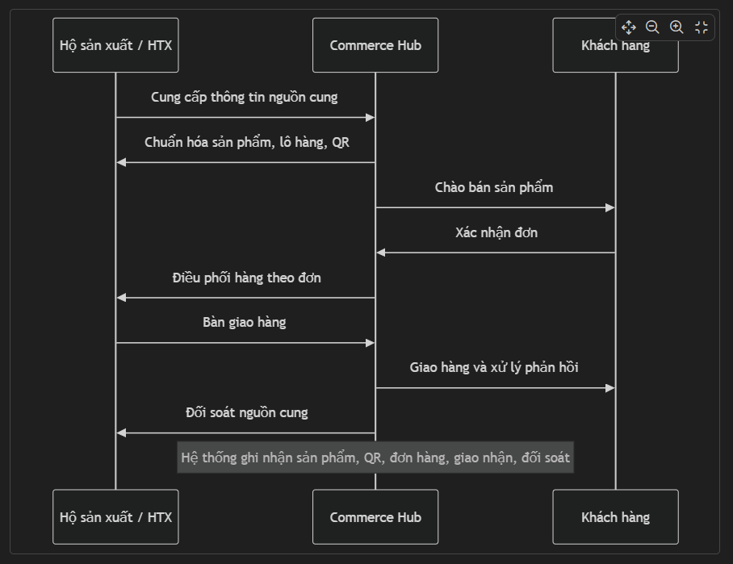
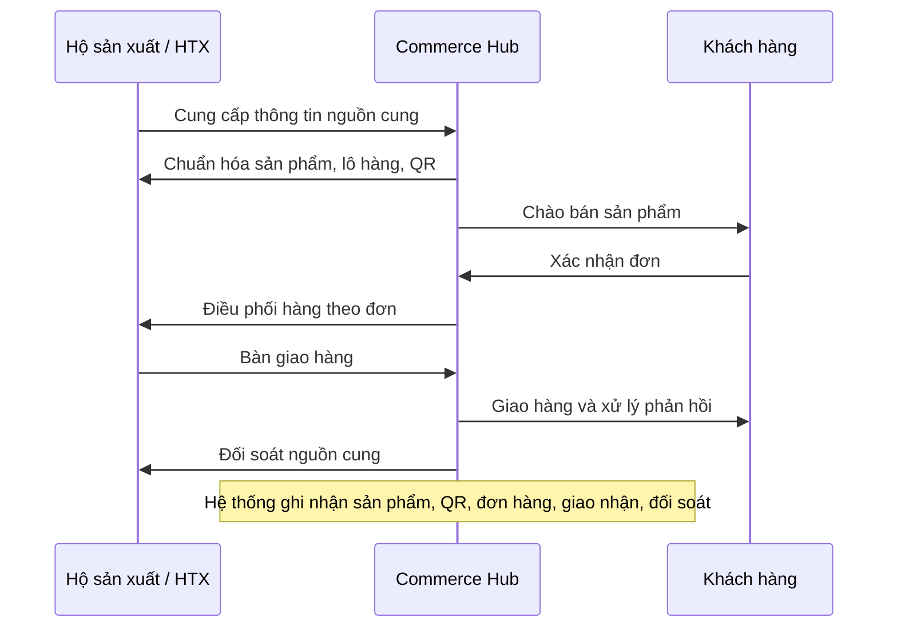

# Thiết kế mô hình Commerce Hub nông - thủy sản địa phương

## 1. Định hướng

Commerce Hub được định hướng là **đầu mối điều phối tiêu thụ nông - thủy sản địa phương có truy xuất**, phục vụ các kênh mua có tổ chức như bếp ăn tập thể, nhà hàng, khách sạn, trường học và các đơn vị tiêu thụ thường xuyên.

Mô hình tập trung vào ba năng lực chính: tổ chức nguồn cung, chuẩn hóa dữ liệu sản phẩm và vận hành giao dịch có theo dõi.

Nguyên tắc triển khai:

- Commerce Hub chịu trách nhiệm vận hành thương mại.
- Địa phương bảo trợ, xác thực và kết nối.
- Link Strategy thiết kế mô hình, hệ thống, quy trình và chuyển giao.

Tài liệu này xác lập mô hình tổ chức, phạm vi hệ thống và lộ trình triển khai 3 năm cho Commerce Hub.

## 2. Vấn đề cần giải quyết

Nguồn cung địa phương đa dạng, nhưng chưa được tổ chức thành hệ thống tiêu thụ ổn định.

Một số dữ liệu từ báo cáo nghiên cứu:

| Dữ liệu thực tế | Vấn đề | Nguồn |
|---|---|---|
| 647 sản phẩm OCOP, 363 chủ thể; 106/114 xã, phường, đặc khu có OCOP | Nguồn hàng rộng, nhưng phân tán theo chủ thể và địa bàn | [Đổi mới sáng tạo Hải Phòng](https://doimoisangtao.haiphong.gov.vn/Article/UuRNJmU3BQY%40/10313.html) |
| Hơn 15.500 ha rau, quả an toàn; khoảng 1.500 ha có VietGAP/GlobalGAP | Cần phân hạng hồ sơ, chứng nhận và mức độ sẵn sàng | [Báo Hải Phòng](https://baohaiphong.vn/hai-phong-co-15-500-ha-rau-qua-san-xuat-theo-quy-trinh-an-toan-519953.html) |
| Rau màu vụ đông 2025-2026 đạt gần 670.000 tấn; hơn 70% tiêu thụ ngoài thành phố và xuất khẩu | Cần năng lực gom đơn, dự báo và điều phối mùa vụ | [Khuyến nông Hải Phòng](https://khuyennonghaiphong.gov.vn/hai-phong-to-chuc-thanh-cong-dien-dan-khuyen-nong-ket-noi-nong-san-vu-dong-nam-2025-vung-dong-bang-song-hong-tt15706.html) |
| Kế hoạch thương mại điện tử 2026 đặt mục tiêu đào tạo 6.000-8.000 lượt | Hệ thống cần dễ vận hành và dễ chuyển giao | [Cổng thông tin địa phương](https://haiduong.haiphong.gov.vn/tin-tuc-su-kien/nam-2026-thanh-pho-phan-dau-ty-le-dan-so-truong-thanh-tham-gia-mua-sam-truc-tuyen-dat-tu-65-68-881020) |

Điểm nghẽn chính:

- **Nguồn cung phân tán**: khó gom hàng ổn định và khó kiểm soát năng lực cung ứng.
- **Sản phẩm thiếu chuẩn dữ liệu**: thiếu quy cách, ảnh, đơn vị đóng gói, hồ sơ và trạng thái khả dụng.
- **Truy xuất chưa liền mạch**: thông tin nguồn gốc, lô hàng và hồ sơ chứng nhận chưa được liên kết rõ.
- **Khó bán lặp lại cho khách hàng tổ chức**: chưa có dữ liệu khách hàng, lịch sử mua và nhu cầu định kỳ.
- **Kiểm hàng và giao nhận chưa được theo dõi tốt**: khó kiểm soát lỗi chất lượng, giao thiếu, giao sai quy cách.
- **Thiếu dữ liệu để vận hành và mở rộng**: thiếu bảng điều hành, chỉ tiêu và báo cáo để ra quyết định.

Trọng tâm thiết kế là xây dựng năng lực vận hành dựa trên dữ liệu.

Việc phát triển thành nền tảng giao dịch chỉ thực hiện sau khi nguồn cung, sản phẩm, kiểm hàng, giao nhận và đối soát đã được chuẩn hóa.

## 3. Mục tiêu của Commerce Hub

Commerce Hub có 5 mục tiêu:

- Tổ chức nguồn cung thành danh mục sẵn sàng thương mại.
- Chuẩn hóa sản phẩm thành mã hàng thương mại.
- Thiết lập QR truy xuất và kiểm soát chất lượng cơ bản.
- Phát triển kênh tiêu thụ có tổ chức.
- Tạo dữ liệu phục vụ vận hành, báo cáo và mở rộng.

## 4. Chiến lược thị trường

> **Đầu mối cung ứng nông - thủy sản địa phương có truy xuất cho bếp ăn tập thể, nhà hàng, khách sạn và kênh tiêu thụ có tổ chức.**

| Thứ tự | Nhóm khách hàng | Vai trò thị trường | Điều kiện triển khai |
|---:|---|---|---|
| 1 | Bếp ăn công nghiệp | Tạo sản lượng nền và đơn hàng lặp lại | Ưu tiên danh mục ổn định, dễ giao đều |
| 2 | Nhà hàng / khách sạn / khu nghỉ dưỡng | Tạo biên lợi nhuận, uy tín và hồ sơ tham chiếu | Ưu tiên sản phẩm chất lượng, câu chuyện nguồn gốc rõ |
| 3 | Bếp ăn học sinh | Mở rộng sản lượng có kiểm soát | Triển khai sau khi quy trình an toàn thực phẩm ổn định |
| 4 | Quà biếu / combo OCOP | Hỗ trợ thương hiệu và mùa vụ | Chọn sản phẩm đóng gói tốt, phù hợp dịp cao điểm |
| 5 | Kênh bán lẻ trực tuyến | Kênh phụ, hỗ trợ truyền thông | Dùng cho sản phẩm dễ đóng gói và giao nhỏ lẻ |

| Tiêu chí sản phẩm | Yêu cầu |
|---|---|
| Nguồn cung | Ổn định theo mùa vụ |
| Quy cách | Chuẩn hóa được |
| Hồ sơ | Có thông tin nguồn gốc tối thiểu |
| Khách hàng | Phù hợp kênh tiêu thụ có tổ chức |
| Vận hành | Bảo quản và giao nhận kiểm soát được |
| Nhu cầu | Phù hợp nhu cầu mua lặp lại |

## 5. Mô hình tổ chức

| Bên tham gia | Vai trò chính |
|---|---|
| Commerce Hub | Tổ chức nguồn cung, bán hàng, xử lý đơn, kiểm hàng, giao nhận, đối soát, đổi trả |
| Địa phương | Bảo trợ chương trình, xác thực nguồn cung, kết nối các bên, theo dõi kết quả |
| Link Strategy | Tư vấn mô hình, xây hệ thống, quy trình, bảng điều hành, đào tạo, chuyển giao |

Ranh giới trách nhiệm:

- Commerce Hub chịu trách nhiệm thương mại.
- Địa phương bảo trợ, xác thực và kết nối.
- Link Strategy tư vấn, xây dựng hệ thống và chuyển giao.

## 6. Mô hình nghiệp vụ

Luồng vận hành cốt lõi:

Hệ thống tập trung vào vận hành lõi:

- Hồ sơ nguồn cung.
- Danh mục sản phẩm.
- Lô hàng.
- QR truy xuất.
- Kiểm hàng và đóng gói.
- Yêu cầu mua / đơn hàng.
- Giao nhận / đổi trả.
- Bảng điều hành và báo cáo.
- Phân quyền người dùng.

## 7. Lộ trình triển khai 3 năm

| Giai đoạn | Trọng tâm | Phạm vi chính | Kết quả cần đạt | KPI chính |
|---|---|---|---|---|
| Năm 1 | Xây nền vận hành | Hồ sơ nguồn cung, danh mục sản phẩm, lô hàng, QR, yêu cầu mua, đơn hàng, kiểm hàng, giao nhận, bảng điều hành, quy trình đào tạo | Nguồn cung được số hóa; sản phẩm có dữ liệu chuẩn; đơn hàng, giao nhận và phản hồi được ghi nhận | Số nguồn cung, số mã sản phẩm, số lô có QR, số đơn, tỷ lệ giao đúng giờ, tỷ lệ lỗi chất lượng |
| Năm 2 | Chuẩn hóa và mở rộng | Phân hạng nhà cung cấp, tồn theo lô, quy trình kiểm hàng theo nhóm sản phẩm, đối soát, hiệu suất giao nhận, báo cáo chất lượng | Danh mục mở rộng nhưng vẫn kiểm soát được; khách hàng có lịch sử mua lại; quy trình đổi trả và đối soát rõ ràng | Tỷ lệ khách hàng mua lại, số nhà cung cấp được phân hạng, số nhóm hàng có quy trình kiểm hàng, tỷ lệ khiếu nại |
| Năm 3 | Nền tảng giao dịch có kiểm soát | Cổng nhà cung cấp, cổng khách hàng đặt lại, phê duyệt sản phẩm/lô hàng, quản lý hợp đồng/bảng giá, báo cáo đa cụm | Nhà cung cấp và khách hàng thao tác trong phạm vi được phân quyền; khách hàng đặt lại theo lịch sử mua; mô hình đủ điều kiện nhân rộng | Số khách hàng đặt lại qua cổng, số nhà cung cấp cập nhật dữ liệu, số cụm đủ điều kiện nhân rộng, chất lượng dữ liệu |

## 8. Ngân sách tham chiếu

Ngân sách chỉ gồm tư vấn, phần mềm, quy trình, đào tạo và hỗ trợ hệ thống.

Không gồm logistics, marketing, bao bì, kho lạnh, chứng nhận, vốn mua hàng hoặc vận hành bán hàng.

| Phương án | Thời lượng | Ngân sách | Feature chính |
|---|---:|---:|---|
| Khởi điểm | 6 tháng | 150-200 triệu | Hồ sơ nguồn cung: hộ/HTX, liên hệ, sản lượng, mùa vụ Danh mục sản phẩm: tên hàng, quy cách, đóng gói, ảnh, giá QR cơ bản: sản phẩm, lô hàng, nguồn cung, hồ sơ Báo cáo cơ bản: nguồn cung, sản phẩm, QR, trạng thái |
| Chuẩn năm 1 | 12 tháng | 250-300 triệu | Hồ sơ nguồn cung: phân nhóm, năng lực, chứng nhận Danh mục sản phẩm: quy cách, mùa vụ, bảo quản, trạng thái Hồ sơ khách hàng: nhóm khách, nhu cầu, lịch sử mua Yêu cầu mua / đơn hàng: báo giá, xử lý, kết quả Quản lý lô hàng: mã lô, số lượng, ngày, nhà cung cấp QR theo lô: sản phẩm, nguồn cung, hồ sơ, trạng thái Bảng điều hành: nguồn cung, sản phẩm, đơn hàng, QR Chuyển giao: hướng dẫn, quy trình, kiểm tra nghiệm thu |
| Mở rộng | 12 tháng | 400-500 triệu | Cổng nhà cung cấp: sản lượng, lô hàng, hồ sơ duyệt Cổng khách hàng: xem danh mục, gửi yêu cầu, đặt lại Báo cáo mở rộng: chất lượng, khiếu nại, giao nhận, mua lại Phân quyền nâng cao: Hub, địa phương, NCC, KH Tích hợp triển khai: truy xuất, website, logistics, báo cáo ngoài |

Phí duy trì sau năm đầu: **8-15 triệu đồng/tháng/cụm triển khai**.
