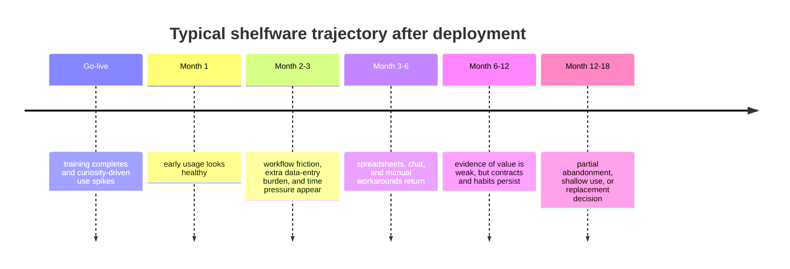
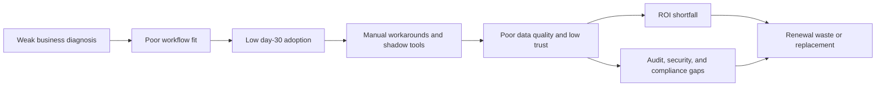
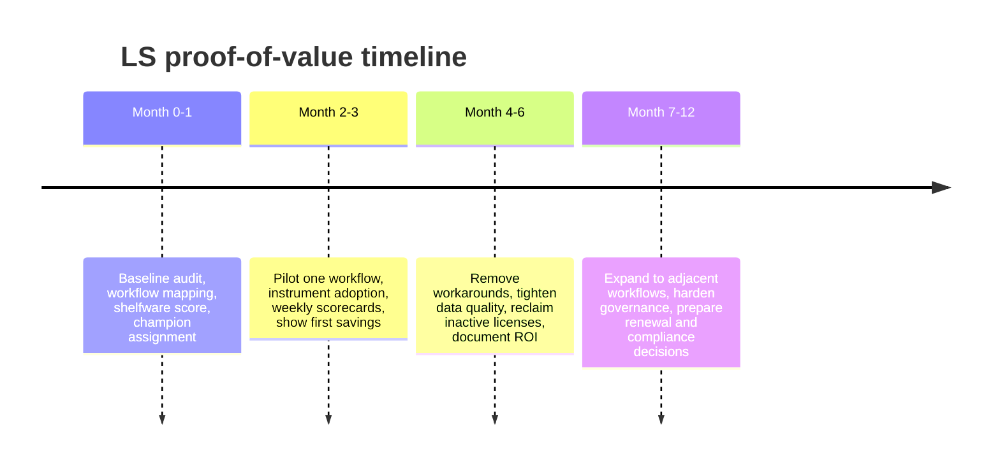

# Shelfware and the Software Graveyard

## Executive summary

This report prioritizes primary and official material from entity["organization","World Bank","development bank"], entity["organization","Gartner","technology research"], the entity["organization","ASEAN","regional bloc"] policy ecosystem and entity["organization","ERIA","regional think tank"], plus benchmark data published by entity["company","Pendo","software analytics"], entity["company","WalkMe","digital adoption platform"], entity["company","Zylo","saas management"], entity["company","Productiv","saas management"], entity["company","Freshworks","crm software"], and entity["company","Panorama Consulting Group","erp consultancy"]. The core conclusion is that “shelfware” is real, measurable, and strategically important—but it is not captured by one universal statistic. It shows up as low feature adoption, low seat utilization, workflow bypass, shadow IT, license waste, weak change management, and ultimately replacement or abandonment. Across the strongest sources, the pattern is consistent: most software value is concentrated in a small portion of features, many paid assets are shallowly used or not used at all, and poor adoption destroys ROI long before the software contract ends. citeturn35view0turn35view1turn36view0turn36view1turn24view1turn24view2turn24view3

The most useful global benchmarks are stark. Pendo’s 2024 benchmark says the median product has only 6.4% of features generating 80% of click volume, and “almost 94%” of features are untouched or ignored. WalkMe’s 2024 report says 38% of digital-transformation efforts failed to meet objectives because of poor end-user adoption and that 70% of enterprises lack full visibility into application adoption; it also estimates lost productivity at $1.14 million per week. WalkMe’s 2025 report adds that the average large enterprise lost $104 million in 2024 from poor visibility, application underutilization, failed IT projects, and productivity loss; employees used as many as 10 applications to complete primary tasks and lost 36 working days per year to technology frustration. On the SaaS-management side, Productiv found only 45% of company SaaS applications were regularly used and 56% of apps were shadow IT, while Zylo reports that organizations used only 49% of provisioned licenses in 2024, left roughly $18 million in wasted license spend on the table in 2024, and wasted $21 million in 2025. citeturn35view0turn35view1turn36view0turn36view1turn24view1turn24view2turn24view3

For entity["country","Viet Nam","country"], the most concrete high-confidence shelfware case is the World Bank’s SME ERP pilot. Usage was close to 80% immediately after training, then dropped to about 40%, and only 35% of firms were still using the ERP platform about 18 months later. The reported reasons were not mainly software defects; they were time constraints, lack of a stable internal champion, and insufficient management-backed ownership. At the broader policy level, Vietnam’s government has now approved a 2026–2030 SME digital-transformation program targeting 500,000 SMEs for support, 300,000 for digital-platform/AI adoption, and a 500-member consultant network—clear proof that the market need is now institutional, not optional. citeturn33view0turn10view2

For LS, the strategic implication is that the real market gap is not “more implementation.” It is **absorption**: getting already-purchased software to fit the workflow, earn habitual use, reduce manual workarounds, and produce auditable business value. That points directly to a business-auditor-led model: diagnose the operating failure first, instrument usage and workflow completion second, and only then recommend software, process, or governance changes. The niche is especially strong where ESG, compliance, traceability, transparency, and supplier-readiness pressures force SMEs to prove that systems are not just installed, but actually used. citeturn14view1turn29view0turn29view1turn10view2

A confidence note is important. I assign **high confidence** to official/public-institution findings with explicit metrics and visible methodology; **medium confidence** to vendor or consultancy benchmarks with disclosed samples, telemetry, or proprietary datasets; and **lower confidence** to older or indirectly reported sector figures. I avoided weak secondary numbers unless they added important context and were clearly labeled as such.

## Evidence and key metrics

There is no single, authoritative “shelfware rate” that spans ERP, CRM, SaaS, and regional SME digitalization. The evidence is fragmented because each source measures a different layer of the problem: feature usage, product adoption, workflow completion, license utilization, shadow IT, change management, or business-case realization. That fragmentation is itself meaningful: organizations often think software is “deployed” when only login data exists, even though critical workflows are still being bypassed through spreadsheets, email, chat, or manual paperwork. citeturn35view0turn35view1turn8view4turn24view3

| Category | Metric | What it indicates | Source | Confidence |
|---|---|---|---|---|
| Feature adoption | 6.4% of features drive 80% of clicks; almost 94% are untouched/ignored | Most built functionality never becomes core behavior | Pendo 2024 benchmark citeturn35view0turn35view1 | Medium-high |
| Feature waste | 80% of features are rarely or never used | Historic global benchmark for software feature waste | Pendo 2019 feature report citeturn35view2 | Medium |
| Digital-transformation failure | 38% of digital-transformation efforts failed to meet objectives due to poor end-user adoption | Adoption failure is a first-order ROI problem, not a side issue | WalkMe 2024 citeturn36view0 | Medium-high |
| Visibility gap | 70% of enterprises lack full visibility into app adoption | Firms cannot manage software value if they cannot see usage | WalkMe 2024 citeturn0search1turn36view0 | Medium |
| Productivity loss | $1.14M per week in lost productivity | The cost of low adoption is operational, not just licensing | WalkMe 2024 citeturn21view5turn36view0 | Medium |
| Large-enterprise loss | $104M lost in 2024 from underused apps, poor visibility, failed IT projects, and productivity loss | Shelfware is expensive even before formal abandonment | WalkMe 2025 citeturn22view0turn36view1 | Medium-high |
| Workflow friction | 10 apps for one task; 36 working days/year lost to tech frustration | Usage may exist, but workflow absorption is still failing | WalkMe 2025 citeturn22view1turn36view1 | Medium-high |
| ERP business-case risk | More than 70% of recently implemented ERP initiatives will fail to fully meet original business-case goals by 2027; 25% will fail catastrophically | ERP shelfware often appears as partial value realization, not total collapse | Gartner press release citeturn0search3 | High for source, predictive rather than observed |
| ERP delivery risk | 30.0% over budget and 22.3% over schedule, by summing Panorama’s reported budget and timeline overrun slices; fewer than a quarter reported intense OCM focus | Weak change management and delivery control predict low realized value | Panorama 2026 charts and text citeturn21view1turn21view2turn20view0 | Medium |
| CRM replacement risk | More than half of SME CRM buyers planned to replace their CRM within three years; many users were disillusioned after two years | CRM shelfware often appears as short replacement cycles, not “go-live failure” | Freshworks / Forrester Consulting study citeturn8view0 | Medium |
| CRM adoption friction | Training/adoption by users was the biggest implementation challenge at 25%; integration was 19% | User enablement and workflow fit remain leading CRM barriers | Freshworks 2024 CRM survey citeturn27view0 | Medium |
| SaaS portfolio underuse | Only 45% of company SaaS apps were regularly used; 56% of apps were shadow IT; average company had 254 apps | Portfolio sprawl and underuse are structural, not accidental | Productiv 2021 citeturn24view1 | Medium-low because older |
| License waste | 49% of provisioned licenses were used; average wasted spend was $18M in 2024 and $21M in 2025 | Seat-based shelfware is measurable and financially large | Zylo 2024 and 2025 citeturn24view2turn24view3 | Medium-high |

One more CRM point matters for lost upside. Freshworks’ 2024 survey found that when CRM adoption does work, 43% of businesses save 5–10 employee-hours per week, 34% shorten the sales cycle by 8–14 days, and nearly half lower customer-acquisition costs by 11–20%. In other words, poor CRM adoption does not merely waste software spend; it also destroys the operational gains that justified the purchase in the first place. citeturn27view0

## Regional focus in Viet Nam and Southeast Asia

Vietnam’s 2026–2030 SME digital-transformation program sharply reduces the question of whether there is market demand. The government’s plan is to support at least 500,000 SMEs through readiness assessments, pilot testing, consulting, training, and capability-building; at least 300,000 are to be assisted in applying digital products, platforms, and AI, and at least 500 organizations or individuals are expected to join the consultant network. The target sectors include science and technology, processing and manufacturing, agriculture, healthcare, trade, logistics, finance, education, and tourism. That is a public signal that adoption support, not just software funding, is now a national SME capability agenda. citeturn10view2

Vietnam also has unusually strong local evidence for post-deployment drop-off. In the World Bank’s Digital SME program, firms received free access to three ERP modules for one year, roughly equivalent to a monthly subscription cost of about US$84. Nearly 80% used the platform after initial training, but the rate later fell to around 40%, and only 35% were still using it after about 18 months. The top reasons were time constraints and staff issues, especially the lack of a stable internal point person with enough autonomy and top-management support to push adoption through the organization. citeturn33view0

This is corroborated by Vietnamese policy reporting. A survey cited by the entity["organization","Ministry of Planning and Investment","vietnam ministry"] found that 60.1% of enterprises identified high technology cost as a major obstacle and 52.3% pointed to inadequate labor for digital technology application. The policy message is clear: software adoption in Vietnam fails less because owners reject digitization in principle and more because the economics, skills, and change capacity are misaligned with day-to-day operating reality. citeturn16view0

At the wider regional level in entity["place","Southeast Asia","region"], ERIA’s large ASEAN MSME study found a strong firm-size digital divide. In the phone-survey countries—Indonesia, Malaysia, and Vietnam—large firms were near-universal adopters of intra-company management tools and over 90% used e-payments and social networking services, while medium firms were materially lower on tools that improve internal operational efficiency, and small and micro firms lagged the most. Vietnam also generally exhibited lower digital-tool implementation rates than Indonesia and Malaysia in the same phone-survey analysis. citeturn14view2turn14view3turn32view3

The regional reasons for stalled implementation are also highly relevant to LS. In ERIA’s web survey of firms that still could not proceed to digital-tool implementation even after receiving private-sector support, 73.7% cited lack of budget and 72.5% said the adoption benefit was unclear. In the country breakdown, more than 90% of respondents in Vietnam, Brunei, and Lao PDR cited lack of budget, and around or above 90% in those same contexts said the adoption benefit was unclear; ERIA notes the country sample sizes were limited, so the directional rather than absolute reading is more appropriate. citeturn14view0turn14view1turn32view2

The positive side of the regional evidence is equally important. In Malaysia, the World Bank reports that firms that invested in new digital solutions to cope with the pandemic experienced a 12-percentage-point smaller decline in sales than those that did not, but SMEs were less able than larger firms to leverage digital investments into higher sales and tended to use simpler, customer-facing modalities rather than deeper operational tools. That is the clearest regional sign that the problem is not “digitalization doesn’t work,” but “SMEs often do not absorb and operationalize digital investments deeply enough.” citeturn10view3turn32view0turn32view1

The following timeline abstracts the regional evidence into a typical SME shelfware curve.

The high-confidence version of that timeline for Vietnam is the World Bank ERP pilot itself: ~80% use immediately after training, ~40% later, and 35% after 18 months. citeturn33view0

## Root causes of shelfware

The first root cause is **diagnosis error**: organizations buy software before they define the exact operating problem, the critical workflow, the target behavior, and the measurable success condition. Regional ASEAN evidence shows that even after support, 72.5% of firms that still did not proceed said the adoption benefit was unclear. Salesforce’s own adoption guidance says low adoption wastes resources and slows innovation when process misalignment, data migration issues, weak buy-in, and poor training are not addressed. In practice, this means the business case is too generic, the buyer is too far from the workflow, and the “pain” is never translated into one or two non-negotiable behaviors that the software must replace. citeturn14view1turn8view4

The second root cause is **poor fit to real workflows**. Freshworks’ 2024 CRM survey found training/adoption to be the biggest implementation challenge at 25%, with integration next at 19%. SugarCRM’s 2024 survey found 41% reporting technology integration issues, 41% platform feature limitations, 37% internal skills gaps, and 34% technology-adoption difficulty. WalkMe’s 2025 report then shows the lived consequence: employees use up to 10 applications for one task and lose 36 working days per year to technology frustration. In other words, software becomes “used” on paper but is still not embedded as the natural path through work. citeturn27view0turn8view1turn22view1turn36view1

The third root cause is **absence of internal champions and change-management muscle**. The World Bank’s Vietnam ERP case is explicit: successful firms assigned a point person who championed change internally, had management backing, and could persuade other staff; failed firms did not, or lost that person. Panorama’s 2026 ERP report found that fewer than a quarter of respondent organizations had an intense focus on organizational change management, and it directly links timeline overruns to governance, resistance to change, and process-redesign friction. LS should treat “who owns behavior change?” as a mandatory audit question, not a soft afterthought. citeturn33view0turn20view0

The fourth root cause is **training and onboarding gaps that never become behavior change**. Freshworks notes that insufficient onboarding and training lead to resistance, while Salesforce stresses that post-onboarding investment is essential because adoption is the transition from implementation to daily-workflow integration. Pendo’s taxonomy is useful here: breadth, depth, time to adopt, and duration of adoption all matter. A company can have 100% completion of a launch webinar and still have shelfware if staff do not execute the target task inside the system within the next one to two weeks. citeturn8view3turn8view4turn35view0

The fifth root cause is **cost structure and portfolio sprawl**. ASEAN evidence shows budget is the top implementation blocker; Freshworks/Forrester found that changing existing business processes was the top SaaS-CRM barrier at 46%, followed by high total cost of ownership at 39% and long-term contracts at 31%. Zylo then shows what happens at portfolio scale: millions in license waste, unexpected charges from usage-based and AI pricing, and more decentralized buying that weakens visibility and control. This is one reason shelfware often survives for years: the renewal mechanism is financial, while the failure mechanism is operational. citeturn14view1turn8view0turn24view2turn24view3

The sixth root cause is **governance and compliance blindness**. Productiv found 56% of apps were shadow IT; Zylo found more than one-third of applications were shadow IT and 67% of IT leaders saw rogue purchases as a top challenge. Gartner reports that 69% of organizations suspect or have evidence that employees are using prohibited public GenAI, and predicts that by 2030 more than 40% of enterprises will suffer security or compliance incidents linked to unauthorized shadow AI. Gartner also predicts that by 2027 more than 40% of AI-related data breaches will come from improper cross-border GenAI misuse. For LS, this matters because compliance failures are one of the few ways shelfware pain becomes urgent enough for SMEs to buy help. citeturn24view1turn24view2turn24view3turn29view0turn29view1

The causal chain below summarizes the evidence.

## Illustrative cases and quantified impacts

**ERP case in Vietnam.** The World Bank’s ERP pilot is valuable because it is local, longitudinal, and behavior-based. These were not firms that rejected digitalization; they signed up, were trained, and received a free year of software. Yet adoption still decayed from nearly 80% to 35% over roughly 18 months. The mechanism was not mostly technical failure. It was inability to find time, inability to absorb operational change during stress, and inability to assign a credible internal owner. For LS, this is the single strongest evidence that deployment without internal execution design becomes shelfware quickly even when price barriers are removed. citeturn33view0

**CRM case.** Freshworks and Forrester Consulting showed that more than half of SME CRM buyers were planning replacement within three years because they had bought systems that were too complicated and had poor user adoption. The 2020 follow-up study said many SaaS-CRM users were already disillusioned after two years. More recent CRM evidence shows the problem is still alive: training/adoption remains the top challenge, while integration and feature limitations stay high. The lost value is substantial because, when CRM adoption succeeds, many businesses report 5–10 hours saved per employee per week, 8–14 days shorter sales cycles, lower CAC, and stronger revenue growth. In other words, underused CRM is not just shelfware spend; it is foregone productivity and sales capacity. citeturn8view0turn27view0turn8view1

**SaaS-sprawl case.** Productiv, Zylo, and WalkMe together form a robust “software graveyard” picture. Productiv reports that only 45% of SaaS apps are regularly used and that 56% of apps are shadow IT. Zylo reports large annual waste from unused licenses and ongoing hidden cost due to duplicate apps and decentralized purchasing. WalkMe adds the operational consequence: the average large enterprise lost $104 million in 2024, and the average employee spent 36 working days per year wrestling with fragmented technology. The practical meaning is important for LS: the most dangerous shelfware is often not software sitting fully idle on a shelf, but software that coexists with manual workarounds and duplicate systems, silently draining money and trust. citeturn24view1turn24view2turn24view3turn22view0turn22view1turn36view1

## KPI system and pilot design for LS

LS should measure shelfware at the **workflow** level, not only at the license or login level. Login counts are too weak. A better operating view is: Did the intended users complete the intended task inside the intended system, at the intended level of data quality, with enough repetition to become habit, and with enough traceability to satisfy audit, customer, or regulator demands?

A practical LS composite is a **Shelfware Risk Score** from 0 to 100, built from seven weighted components: seat utilization, critical-workflow completion in-system, time to first value, champion coverage, manual-workaround rate, data completeness, and audit-evidence retrieval time. The score should be app-specific and workflow-specific, not organization-wide. A payroll module can be healthy while a customer-service or quality-traceability module is functionally dead.

The table below summarizes the pilot KPIs I recommend for LS. These are **LS recommendations**, not industry-standard thresholds.

| KPI | Baseline red flag | 90-day success threshold | 12-month success threshold | Why it matters |
|---|---|---|---|---|
| Provisioned-seat utilization | <50% of licensed users active in 30 days | >70% active in 30 days | >80% sustained | Detects classic paid-but-unused shelfware |
| Critical workflow completion in-system | <60% of target transactions completed inside system | >80% | >90% | Best indicator that the tool has replaced the old method |
| Time to first value | >21 days from access to first live completed task | <14 days | <7–10 days for new cohorts | Long delay predicts abandonment |
| Training-to-behavior conversion | <50% of trained users perform target task within 14 days | >75% | >85% | Distinguishes training attendance from real adoption |
| Manual workaround ratio | >20% of target workflow still done in spreadsheets/chat/email | <10% | <5% | Exposes “used system, but not trusted system” behavior |
| Mandatory data completeness | <85% on required fields | >95% | >97% | Low completeness destroys reporting, automation, and compliance |
| Champion coverage | No named champion per function/site | 1 accountable champion per workflow, weekly review attendance >80% | Multi-layer ownership embedded in BAU | The World Bank case makes this non-negotiable |
| Renewal waste ratio | >15% of spend tied to inactive seats or duplicative tools | Identify and act on >10% within pilot scope | Reduce waste by 15–25% | Converts adoption work into measurable money |
| Audit-evidence retrieval time | >30 minutes to produce evidence for one transaction/control | <10 minutes | <5 minutes | Especially valuable in ESG/compliance/transparency sales |
| Exception-to-resolution lead time | >72 hours for key process exceptions | <24–48 hours | <24 hours | Shows whether the system is truly governing operations |
| Unsanctioned-tool incidence | Critical workflow still depends on unapproved apps | Remove or formalize top 1–2 unapproved dependencies | Near-zero in target workflow | Direct governance/compliance benefit |

For dashboards and board packs, LS should standardize five visual artifacts. A **vendor comparison table** should show app/vendor, annual spend, active seats, critical workflow served, renewal date, duplicative overlap, and compliance criticality. A **workflow funnel** should show how many target transactions enter the workflow, are completed in-system, fail data-quality checks, and exit with audit-ready evidence. A **license-utilization heatmap** should compare teams/sites against seat use. A **feature Pareto chart** should show which features drive most activity. And an **abandonment curve / survival chart** should show usage retention from day 0 to month 18 for each rollout cohort. These visuals do not just report usage; they make renewal, replacement, and governance decisions easier.

## Go-to-market strategy for LS

The strongest wedge for LS is not first-time digital transformation. It is **adoption recovery and value realization for software that already exists**. In market terms, LS should sell a “software graveyard audit” or “adoption recovery audit,” not a generic transformation project. The buyer pain is sharper there, the sunk cost is visible, and the proof path is shorter. This aligns with the evidence: the hardest problems are not software selection alone, but budget waste, unclear benefits, weak ownership, and shallow workflow absorption. citeturn14view1turn24view2turn24view3turn33view0

The ideal initial customer profile is a 50–500 employee SME in sectors already highlighted by Vietnam’s national support agenda: processing/manufacturing, agriculture, healthcare, trade, logistics, finance, education, and tourism. The best target accounts have already bought ERP, CRM, HRM, or workflow SaaS; still rely heavily on spreadsheets or chat for critical processes; and feel rising pressure around compliance, traceability, customer audits, ESG disclosures, or multi-party transparency. That is where “software installed but not operationalized” becomes a survival issue rather than an IT annoyance. citeturn10view2turn29view0turn29view1

LS should aim at the **COO, CFO, Quality/Compliance lead, or business owner**, not only IT. The evidence shows the blocking issues are operating-model change, internal champions, process fit, training-to-behavior conversion, and governance—not merely technical deployment. This is especially favorable for a business-auditor-led model, because the entry question becomes: *Where is business value leaking out between software purchase and daily execution?* citeturn33view0turn20view0turn8view4

A practical commercial stack for LS is three-layered. First, a **fixed-fee diagnostic** lasting two to four weeks: inventory systems, licenses, workflows, shadow processes, champions, mandatory evidence requirements, and renewal deadlines; produce a shelfware scorecard and a ranked intervention map. Second, a **proof-of-value pilot** lasting six to twelve weeks: choose one workflow, one team or site, and one system; redesign the process, define behavior thresholds, instrument reporting, deploy in-line guidance or SOP reinforcement, and run weekly scorecards. Third, a **hardening/governance retainer** over three to nine months: remove duplicate tools, monitor adoption decay, enforce data-quality rules, and institutionalize audit-ready evidence. This sequencing keeps LS focused on business absorption, not endless implementation.

For pricing, the most sensible model is a hybrid of fixed fees and milestone-based outcome fees. An indicative SME structure in Vietnam or comparable SEA markets would be: **US$3k–10k** for the diagnostic sprint, **US$10k–35k** for the pilot depending on site count and workflow complexity, and **US$2k–8k per month** for governance and hardening. Those ranges are recommendations, not benchmarked market facts; the principle matters more than the number. The pilot should almost always be priced below the cost of one avoidable annual renewal cycle, one moderate audit failure, or a few months of manual-work time in the target function.

The proof-of-value timeline should be explicit.

The pilot should prove ROI through four measurable levers: reclaimed licenses, reduced manual work time, fewer errors/rework events, and faster/easier evidence retrieval for audits or customer requests. In many SMEs, the 90-day win will not be headline revenue growth; it will be evidence that one painful workflow is now reliably completed inside the system with higher data integrity and less manual effort. That is exactly the kind of proof that can fund the next phase.

LS’s messaging should therefore be blunt and differentiated:

- **We do not start by recommending more software.**
- **We start by explaining why the software you already bought did not stick.**
- **We prove recovery on one workflow before asking you to scale anything.**

That message fits the “software graveyard” evidence better than a conventional implementation pitch, and it keeps LS away from head-on competition with large system integrators or full-suite vendors.

## Open questions and limitations

The largest limitation in the evidence base is the absence of a single, official, cross-category shelfware metric for Vietnam or Southeast Asia. What exists instead are strong proxies: feature adoption, usage retention, shadow IT, license utilization, business-case realization, and workflow-friction indicators.

Several global benchmarks are enterprise-heavy. WalkMe, Zylo, Productiv, and Gartner are excellent for direction, economics, and patterns, but many of their dollar figures describe mid-market or large-enterprise contexts rather than SMEs. For LS, the proportions and mechanisms are more transferable than the absolute dollar magnitudes.

Some CRM evidence is commissioned and partly older than the ERP and SaaS benchmarks. I used it because the pattern is consistent across newer CRM adoption surveys: user adoption, integration, internal skills, and ease-of-use remain the dominant obstacles.

Finally, feature-level adoption data from Pendo is not the same thing as process-level absorption inside SMEs. It is still highly useful, because it shows how often software teams ship functionality that never becomes core behavior—but LS should treat workflow completion and evidence readiness as the more important field KPIs.