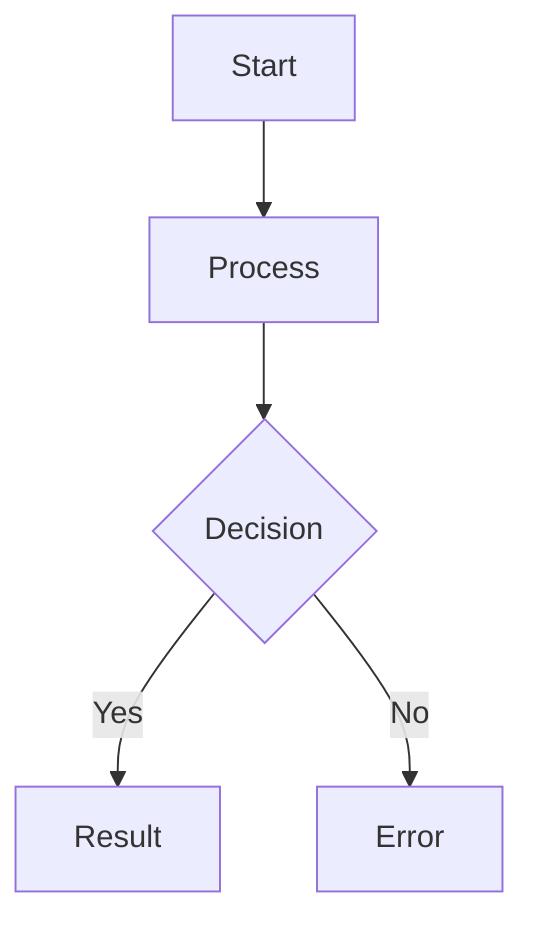

# 01_TASK_SPEC: [Tên Module/Task]

## I. STRATEGIC CONTEXT (Trụ cột 1)
- **Mục tiêu:** [Mô tả tại sao làm tính năng này và giá trị kinh doanh].
- **User Story:** [Người dùng có thể... để làm...].

## II. LOGIC VISUALIZATION (Trụ cột 2)

## III. INTERNAL DATA SCHEMA (Trụ cột 3)
- **Collection/Table Name:** `name`
- **Fields:**
    - `id`: UUID
    - `data`: Object
    - `status`: String

## IV. SERVICE INTERFACE CONTRACT (Trụ cột 4)
- **Endpoint:** `GET /v1/api/module`
- **Input:** `{}`
- **Output:** `{ success: boolean }`

## V. INTER-SERVICE PLAYBOOK (Trụ cột 5) - *Chỉ cho Microservice*
- **Upstream:** [Giao thức]
- **Downstream:** [Giao thức]
- **Event/Topic:** [Tên Topic]

## VI. LOCAL SANDBOX SPEC (Trụ cột 6)
- **Docker Compose:** [Link file]
- **Mock Endpoints:** [Danh sách]
- **Seed Data:** [Link file]

## VII. ACCEPTANCE SCENARIOS & UAT (Trụ cột 7)
- **Scenario 1:** [Hành động] -> [Kết quả mong đợi]
- **Scenario 2:** [Edge case] -> [Xử lý lỗi]

## VIII. HARDENED ASSET RULES (Trụ cột 8)
- **UI Kit:** Bắt buộc dùng `ls-skill-ui-kit`.
- **Security:** Tuân thủ `.agents/rules/ls-rule-security`.
- **Hardening Proposal:** [Đề xuất đoạn code sẽ bóc tách sau task này].

---
## DEFINITION OF DONE (DoD Checklist)
- [ ] Unit Test > 80% coverage.
- [ ] Integration Test pass with Mock.
- [ ] No Tech Debt High.
- [ ] Video Demo & Documentation updated.
