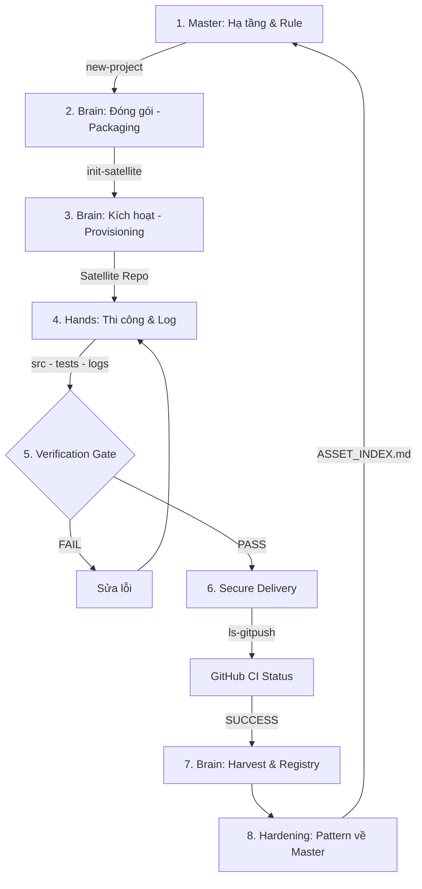

# NHẬT KÝ CÔNG VIỆC & LỘ TRÌNH PHÁT TRIỂN (BACKLOG)

Tài liệu này chuyển hóa các yêu cầu từ bộ Blueprint hiện hành thành danh sách hành động cụ thể để triển khai Cỗ máy sản xuất phần mềm Link Strategy.

## Mục Tiêu Vận Hành

Xây dựng một hệ thống có thể:

- Sinh dự án và module mới nhất quán theo chuẩn Master-Brain.
- Cấp phát gói thi công đầy đủ cho Hands từ trạm điều hành Brain.
- Nghiệm thu dựa trên kết quả thực tế qua các chốt chặn kỹ thuật CI-Gated.
- Tích lũy tài sản tri thức (Hardening) từ Brain quay ngược về Master.
- Duy trì tính liên tục của tri thức thông qua registries và logs 3 tầng.
- Bảo vệ chủ quyền của Master đối với kiến trúc và tri thức nền tảng.

## Nguyên Tắc Ưu Tiên

1. Chủ quyền hệ thống ưu tiên hơn tốc độ bàn giao.
2. Kiểm chứng thực tế ưu tiên hơn báo cáo miệng.
3. Khả năng đóng gói tài sản ưu tiên hơn triển khai rời rạc.
4. Khả năng đối soát ưu tiên hơn sự tiện lợi nhất thời.
5. Tự động hóa lộ trình thực thi ngay từ đầu.

## LỘ TRÌNH PHÁT TRIỂN

Hệ thống Link Strategy phát triển theo 3 giai đoạn hội tụ để chuyển dịch từ "Dịch vụ" sang "Cỗ máy":

### Giai đoạn 1: Hardening & Enforcement (0 - 6 tháng) - [TRẠNG THÁI: 100% HOÀN THÀNH]
*   **Mục tiêu:** Xây dựng "Bộ khung thép" ở cấp cơ chế nền: khởi tạo repo/project, đồng bộ Master-Satellite, cưỡng chế luật và Verification Gate.
*   **Trọng tâm:** Master-Satellite Sync, Governance Enforcement, GitHub Actions Automation, `ls-gitpush` Integrity, Asset Registry.
*   **Key Milestone:** Hệ thống hạ tầng, đồng bộ luật và gate kỹ thuật đã được "Bọc thép" và tự động hóa qua GitHub Verification Gate.
*   **Ngoài phạm vi Phase 1:** Nghiệm thu bởi Brain, giải ngân, review checklist chuyên sâu, onboarding/offboarding Hands, SAST/dependency scan đầy đủ và kho audit dài hạn thuộc Phase 2+.

### Giai đoạn 2: Scale & Production (6 - 18 tháng) - [TRẠNG THÁI: ĐANG TRIỂN KHAI]
*   **Mục tiêu:** Vận hành thực địa diện rộng. Auditor chẩn đoán và Dev thi công module hàng loạt.
*   **Trọng tâm:** Auditor Capability Engine, UI Component Library, Automated Gate Scorecard.
*   **Key Milestone:** 10 dự án SME chạy trên cùng một quy trình chuẩn.

### Giai đoạn 3: Ecosystem & SaaS (18 tháng+)
*   **Mục tiêu:** Thương mại hóa tài sản thành SaaS đại trà.
*   **Trọng tâm:** Productization Engine, Subscription Management, Multi-tenant Architecture.
*   **Key Milestone:** Ra mắt sản phẩm SaaS đầu tiên được thị trường hấp thụ.

## Phase 1: Hardening & Enforcement
*Thiết lập hạ tầng cốt lõi, luật pháp và các chốt chặn kỹ thuật tự động trước khi mở repo.*

> [!SCOPE]
> **Phạm vi Phase 1:** chỉ harden cơ chế thiết lập, đồng bộ và verify gate: project factory, satellite contract, rule sync, `.agents/tools/ls-engine`, GitHub Actions gate, `ls-gitpush`, integrity hash và branch-protection checklist. Phase 1 không chịu trách nhiệm hoàn thiện thủ tục nghiệm thu Brain, giải ngân, clean-code checklist, security automation đầy đủ, evidence archive dài hạn hoặc công cụ hỗ trợ vận hành hàng loạt cho Hands.

### Sơ đồ Vòng đời Sản xuất 3 Tầng (3-Tier Production Life Cycle)

Dựa trên hệ thống "Bộ khung thép" 3 tầng, vòng đời sản xuất của Link Strategy được vận hành như sau:

### 1. Master: Thiết lập nền tảng (Infrastructure)
*   **Người thực hiện:** Master Agent.
*   **Hành động:** Thiết kế bộ khung, engine và bộ quy tắc chuẩn.
*   **Kết quả:** Sẵn sàng các "phôi" dự án đạt chuẩn.

### 2. Brain: Đóng gói & Đặc tả (Packaging)
*   **Người thực hiện:** Brain Agent.
*   **Hành động:** Chạy `npm run new-hand-folder` để tạo trạm điều phối tại local. Biên soạn Spec và Profile.
*   **Kết quả:** Một "Gói bàn giao" hoàn chỉnh sẵn sàng kích hoạt.

### 3. Brain: Kích hoạt & Cấp phát (Provisioning)
*   **Người thực hiện:** Brain Agent.
*   **Hành động:** Chạy `npm run init-satellite` để đẩy lát cắt feature lên GitHub.
*   **Kết quả:** Hands nhận Satellite Repo biệt lập và sạch sẽ.

### 4. Hands: Thi công & Bằng chứng (Execution & Evidence)
*   **Người thực hiện:** Hands Agent (Freelancer).
*   **Hành động:** Kế thừa Skills/UI Kit từ Brain để viết code và test. Ghi nhật ký thực thi liên tục vào `03_LOGS.md`.
*   **Kết quả:** Module hoàn thiện kèm theo đầy đủ bằng chứng thực tế.

### 5. Kiểm định (Verification Gate)
*   **Người thực hiện:** Hệ thống tự động.
*   **Hành động:** `verify-gate` chấm điểm tại local và GitHub Actions kiểm định lại lần cuối.
*   **Kết quả:** Code đạt chuẩn "nguyên đai nguyên kiện" với Integrity Hash.

### 6. Nộp bài (Secure Delivery)
*   **Người thực hiện:** Hands Agent qua `ls-gitpush`.
*   **Hành động:** Nộp bài lên GitHub sau khi pass local gate.
*   **Kết quả:** Commit sẵn sàng để Brain thu hoạch.

### 7. Thu hoạch (Harvesting)
*   **Người thực hiện:** Brain Agent qua `pull-code`.
*   **Hành động:** Thu hoạch code dựa trên profile sau khi CI Status báo SUCCESS.
*   **Kết quả:** Code vệ tinh được tích hợp an toàn vào Monolith.

### 8. Hóa thạch (Hardening)
*   **Người thực hiện:** Brain + Master Agents.
*   **Hành động:** Lọc các pattern tốt đề xuất nộp về Master.
*   **Kết quả:** Dự án về đích, tri thức mới được cập nhật vào kho tàng Master.

---

**Sơ đồ tóm lược:**
`Brain (Yêu cầu) -> Agent (Khởi tạo) -> Hands (Thi công + Log) -> Gate (Kiểm định) -> PR (Bằng chứng) -> Brain (Duyệt) -> Asset (Hóa thạch tri thức)`

Đây là một vòng lặp **Evidence-based (Dựa trên bằng chứng)**. Bạn không cần tin vào lời nói của freelancer, bạn chỉ tin vào kết quả đã được Gate và Agent xác nhận qua mã Hash và Báo cáo Quyết định (Decision Logs).

### 1.0.0 - Chuẩn hóa Nguồn chân lý Blueprint

- [x] Hành động: Xác lập bộ Blueprint hiện hành (`00, 01, 02, 03`) làm nguồn SSOT duy nhất.
- [x] Hành động: Đảm bảo toàn bộ tham chiếu nội bộ trỏ đúng về bộ tài liệu Blueprint hiện hành.
- [x] Hành động: Duy trì chính sách phiên bản Blueprint tập trung tại thư mục `.LinkStrategy/`.
- [x] Hành động: Chuyển các tài liệu dự án cũ vào khu vực lưu trữ riêng biệt.
- **Tiêu chuẩn đạt chuẩn:** Hệ thống tài liệu nhất quán, không có liên kết hỏng hoặc sai phiên bản.

### 1.0.1 - Thiết lập Repository Baseline (Thư mục, Gitignore, README)

- [x] Hành động: Chuẩn hóa cấu trúc thư mục lõi (`.agents/`, `.LinkStrategy/`, `components/`, `projects/`, `scripts/`, `docs/`).
- [x] Hành động: Cấu hình `.gitignore` bảo mật, chặn secret và build artifacts nhưng cho phép `.env.example`.
- [x] Hành động: Hoàn thiện `README.md` tại root mô tả 4-plane architecture và liên kết SSOT đến các tài liệu Blueprint.
- **Tiêu chuẩn đạt chuẩn:** Root repo sạch, an toàn và có đầy đủ chỉ dẫn vận hành cho Brain & Agent.

### 1.1.0 - Thiết lập Khung Quản trị Master (Index, Rules, Workflows)

- [x] Hành động: Tích hợp Chiến lược kinh doanh (`00_BLUEPRINT`) vào `ASSET_INDEX.md` và `GEMINI.md`.
- [x] Hành động: Chuẩn hóa `ASSET_INDEX.md` thành registry quản trị tài sản (Rules, Skills, Tools...).
- [x] Hành động: Hoàn thiện `GEMINI.md` với Bootstrap Order và các quy tắc thực thi dứt khoát.
- [x] Hành động: Thiết lập Luật quản trị Master (`ls-rule-master-governance.md`) và Quy trình bàn giao Master (`ls-workflow-delivery-loop.md`).
- **Tiêu chuẩn đạt chuẩn:** Bộ khung quản trị sẵn sàng, đảm bảo tính nhất quán giữa Chiến lược - Tài sản - Quy trình.

### 1.2.3 - Phân tầng tri thức toàn diện (Rules, Workflows, Skills - Industrial Hardened)

- [x] Hành động: Phân tách Rules, Workflows, và Skills thành 3 thư mục: `master/`, `brain/`, `hands/`.
- [x] Hành động: Chuyển đổi linh hoạt `trigger: always_on` tại tầng thực thi (Active activation).
- [x] Hành động: Cập nhật `ls-engine` để tự động lọc và phẳng hóa (Flattening) tri thức theo đúng phân tầng.
- [x] Hành động: Phân lập tuyệt đối tri thức vận hành cấp cao khỏi tầng thực thi của Freelancer (Hands).
- Đầu ra: Hệ thống tri thức phân tầng, cô lập hoàn toàn và tự vận hành theo bối cảnh.
- DoD: Hands Agent chỉ thấy tài sản Hands; Brain chỉ thấy tài sản Brain/Hands; Master sở hữu toàn bộ.
- Ưu tiên: P0. [HOÀN THÀNH - CẤP ĐỘ CÔNG NGHIỆP]

### 1.3.1 - Tạo script sinh Brain Project Workspace (Hardened)

- [x] Hành động: Tạo `npm run new-project`.
- [x] Hành động: Tự động hóa Preflight, Isolation Guard và DNA Transmission.
- [x] Hành động: Tự động hóa GitHub Remote (Create/Link/Push) và Registry.
- [x] Hành động: Triển khai Industrial Hardening (Backup Registry, Fail Cleanup).
- [x] Hành động: Xuất Verification Report (DoD) tự động.
- Đầu ra: Một trạm điều hành Brain độc lập sẵn sàng quản lý dự án.
- DoD: Chạy một lệnh tạo được Brain Project "nguyên đai nguyên kiện" trên GitHub.
- Ưu tiên: P0. [HOÀN THÀNH - BỌC THÉP]

### 1.3.3 - Thiết lập cấu hình môi trường Engine (.env)

- [x] Hành động: Tích hợp `.env` loader vào `ls-engine` core.
- [x] Hành động: Tách biệt cấu hình (Org, Visibility, Base Path) khỏi mã nguồn.
- [x] Hành động: Tạo template `.agents/templates/ENV_EXAMPLE_TEMPLATE`.
- [x] Hành động: Script project factory copy thành `.env.example`.
- Đầu ra: Hệ thống cấu hình linh hoạt không cần sửa code.
- DoD: Engine tự động nạp cấu hình từ `.env` tại Master root.
- Ưu tiên: P1. [HOÀN THÀNH]

### 1.3.4 - Tạo project mẫu

- [x] Hành động: Dùng project factory để tạo `projects/DEMO-BASE-PLATFORM`.
- [x] Hành động: Điền spec mẫu tối thiểu.
- [x] Hành động: Dùng project mẫu để kiểm tra template, logs và gate.
- Đầu ra: Reference implementation cho workflow.
- DoD: Người mới có thể học quy trình bằng cách đọc project mẫu.
- Ưu tiên: P1.

### 1.4.1 - Tạo `npm run verify-gate`

- [x] Hành động: Tạo script chấm gate kỹ thuật PASS/FAIL.
- [x] Hành động: Kiểm tra tồn tại 01_TASK_SPEC.md, 02_DECISION_LOGS.md, 03_LOGS.md, README.md, tests folder.
- [x] Hành động: Kiểm tra tính nguyên vẹn của Rules và Engine (Integrity Check).
- [x] Hành động: Chặn nộp bài nếu phát hiện Brain-only scripts trong Satellite.
- [x] Hành động: Xuất báo cáo `GATE_REPORT.md` kèm SHA256 Integrity Hash.
- Đầu ra: Chốt chặn KCS tự động cho mọi Satellite.
- DoD: Module chỉ có thể nộp nếu vượt qua kiểm định local và CI.
- Ưu tiên: P0.

### 1.4.2 - Nghiệm thu dựa trên Bằng chứng thực thi (Evidence-based)

- [x] Hành động: Xác lập cơ chế nghiệm thu dựa trên bằng chứng thực tế ghi nhận trong `03_LOGS.md`.
- [x] Hành động: Duy trì các tiêu chuẩn bắt buộc: Kiểm thử (Tests) vượt qua 100%, Mã nguồn sạch, Bảo mật được đảm bảo.
- [x] Hành động: Tích hợp việc giải ngân vào dấu xác nhận Hash trực tiếp trong Log dự án sau khi vượt qua Verification Gate.
- **Tiêu chuẩn đạt chuẩn:** Mọi quyết định nghiệm thu đều dựa trên bằng chứng thực tế và có đối soát trong `03_LOGS.md`.

### 1.4.4 - Triển khai CI/CD gate (GitHub Actions)
- [x] Hành động: Thiết lập file workflow thực thi cho GitHub Actions (`.github/workflows/verify-gate.yml`).
- [x] Hành động: Tích hợp cơ chế đối soát Integrity Hash tự động trên Cloud để chặn PR lỗi.
- [x] Hành động: Chuẩn hóa output gate report: test result, coverage, lint, security scan.
- Đầu ra: Hệ thống tự động chặn PR nếu không vượt qua kiểm định hoặc bị sửa đổi trái phép.
- DoD: PR không thể merge nếu dấu X đỏ xuất hiện tại GitHub Verification Gate.
- Ưu tiên: P0 (Hardened & Automated).

### 1.4.5 - Tạo Git enforcement checklist

- [x] Hành động: Tạo `.agents/templates/BRANCH_PROTECTION_CHECKLIST.md`.
- [x] Hành động: Tạo `CODEOWNERS` hoặc `.github/CODEOWNERS` để thể hiện Brain ownership.
- [x] Hành động: Tạo PR template bắt buộc tick spec, tests, docs, security, hardening proposal.
- [x] Hành động: Thiết lập cơ chế kiểm tra Commit (Rule-based).
- [x] Hành động: Ghi rõ no-force-push, required review, required status checks, protected main branch.
- Đầu ra: Brain sovereignty được enforce ở Git workflow, không chỉ trong tài liệu.
- DoD: Main branch có checklist bảo vệ merge và review trước khi Hands code thật.
- Ưu tiên: P0.

### 1.5.1 - Thiết lập Permission Matrix (Action vs Inquiry)

- [x] Hành động: Tạo `.agents/rules/ls-rule-master-governance.md` (Enforced No-Manual-Push).
- [x] Hành động: Tạo script `npm run ls-gitpush` làm cổng kiểm soát duy nhất cho Hands.
- [x] Hành động: Thiết lập cơ chế **Integrity Hash** chống sửa code lén.
- [x] Hành động: Thực thi mô hình **CI-Gated Harvest**: Brain chỉ kéo code khi CI PASS.
- [x] Hành động: Tích hợp registry-based tracking cho mọi lần pull code.
- Đầu ra: Cơ chế bảo vệ hệ thống tuyệt đối, Brain giữ quyền sở hữu tri thức.
- DoD: Code thi công chỉ vào Brain Project khi đã sạch và được đăng ký SHA.
- Ưu tiên: P0.

### 1.7.1 - Thiết lập satellite repo contract
- [x] Hành động: Tạo `docs/satellite-repo-contract.md`. (Đã tích hợp vào Sync Linkage).
- [x] Hành động: Mô tả cấu trúc satellite: `src/`, `tests/`, `01_TASK_SPEC.md`, `02_DECISION_LOGS.md`, `03_LOGS.md`, `GEMINI.md`, `README.md`. (Đã tích hợp vào Sync Linkage).
- [x] Hành động: Mô tả file nào read-only từ Brain.
- Đầu ra: Contract rõ cho repo giao freelancer.
- DoD: Có thể tạo satellite thủ công hoặc tự động theo contract.
- Ưu tiên: P0 (Hardened).

### 1.7.2 - Thiết thiết kế sync linkage & Safe Push
- [x] Hành động: Tạo `docs/sync-linkage.md`.
- [x] Hành động: Mô tả Push-to-Satellite và Pull-to-Master.
- [x] Hành động: Chỉ rõ conflict handling và quyền merge.
- [x] Hành động: Triển khai `--force-with-lease` và `rebase` để bảo vệ code Hands.
- Đầu ra: Cơ chế đồng bộ có thiết kế và an toàn dữ liệu.
- DoD: Brain biết dữ liệu đi chiều nào, lúc nào, ai duyệt.
- Ưu tiên: P0 (Hardened).

### 1.7.3 - Tạo `GEMINI.md` và Cơ chế đồng bộ 3 tầng (Master-Brain-Hands)

- [x] Hành động: Tạo `GEMINI_BRAIN_TEMPLATE.md` và `GEMINI_SATELLITE_TEMPLATE.md`.
- [x] Hành động: Triển khai `npm run new-hands -- --project-path <ARCHITECTURE_PATH> --repo-name <REPO>` chạy từ Brain Project để onboarding Hands, tự tạo folder path nếu chưa có.
- [x] Hành động: Tạo script đồng bộ tự động `npm run push-rules` (Sync Rules, Engine, Skills, UI Kit).
- [x] Hành động: Nâng cấp `push-rules` hỗ trợ `--all` (Batch update) từ `active-hands.json`, đồng bộ cả Assets và Spec/Logs.
- [x] Hành động: Triển khai cơ chế auto-registry vào `active-projects.json` (Master) và `active-hands.json` (Brain).
- [x] Hành động: Chốt chặn thu hoạch bằng `npm run pull-code` tích hợp kiểm tra CI Status.
- Đầu ra: Quy trình đồng bộ và thu hoạch khép kín, an toàn và tự động.
- DoD: Satellite được khởi tạo, đăng ký và thu hoạch dựa trên bằng chứng CI.
- Ưu tiên: P0. (HOÀN THÀNH VỚI BATCH MODE).

### 1.10.1 - Thiết lập GitHub repository controls

- [x] Hành động: Tạo `CODEOWNERS` để thể hiện Brain ownership.
- [x] Hành động: Tạo checklist cấu hình branch protection cho `main`.
- [x] Hành động: Yêu cầu PR review trước merge.
- [x] Hành động: Yêu cầu status checks cho gate khi CI sẵn sàng.
- [x] Hành động: Cấm force push vào branch chính.
- [x] Hành động: Ghi rõ quyền merge chỉ thuộc Brain hoặc Brain Delegate.
- Đầu ra: Repository policy phản ánh Brain sovereignty.
- DoD: Có tài liệu hoặc checklist cấu hình GitHub để áp dụng trước khi mở repo cho Hands.
- Ưu tiên: P0.

### 1.10.2 - Thiết lập PR-based delivery workflow

- [x] Hành động: Tạo `.github/pull_request_template.md`.
- [x] Hành động: Tạo `.github/ISSUE_TEMPLATE/task_spec.yml` (Task specification issue template).
- [x] Hành động: Thiết lập rule mỗi PR phải link bằng chứng thực thi và hardening proposal.
- Đầu ra: Delivery luôn đi qua PR có bằng chứng.
- DoD: Không có code vào main nếu thiếu spec/test/docs/security/hardening evidence.
- Ưu tiên: P0.

### 1.10.3 - Thiết lập conventional commit enforcement

- [x] Hành động: Tạo `.agents/rules/ls-rule-conventional-commits.md`.
- [x] Hành động: Định nghĩa commit types: `feat`, `fix`, `docs`, `test`, `refactor`, `chore`, `harden`.
- [x] Hành động: Thiết lập cơ chế kiểm tra commit history (Rule-based via Agent Review).
- Đầu ra: Git history đọc được để thay thế Hands trong 24h.
- DoD: PR có commit history đủ rõ cho AI/Brain hiểu tiến độ mà không cần họp.
- Ưu tiên: P1.

---

## Phase 2: Standardization & Support
*Hoàn thiện tài liệu mẫu, hỗ trợ phát triển và quản trị tri thức.*

### 2.1.0 - Hardening Security & Enforcement (Strategic Deferral from Phase 1)

#### 2.1.1 - Thiết lập Security Automation Baseline
- [ ] Hành động: Tạo `.agents/templates/THREAT_MODEL_TEMPLATE.md`.
- [ ] Hành động: Tích hợp Dependency Scan và SAST baseline vào workflow.
- Đầu ra: Quy trình rà quét rủi ro tự động.
- DoD: Module rủi ro cao phải có bằng chứng quét bảo mật trước khi vào Gate.
- Ưu tiên: P1.

#### 2.1.2 - Thực thi Secret Management Protocol
- [x] Hành động: Tạo `.agents/rules/ls-rule-secret-management.md`.
- [ ] Hành động: Đảm bảo mọi Hands (Freelancer) đều tuân thủ việc không bao giờ chạm vào Secret thật thông qua các buổi In-boarding.
- [ ] Hành động: Quy định `.env.example`, secret manager và key revocation trong môi trường satellite.
- Đầu ra: Secret protocol được thực thi triệt để.

### 2.1.2 - Quality & Audit Standardization (Strategic Deferral from Phase 1)

#### 2.1.3 - Tạo clean-code checklist
- [ ] Hành động: Tạo `.agents/templates/CLEAN_CODE_CHECKLIST_TEMPLATE.md`.
- [ ] Hành động: Bao gồm modularity, naming, duplication, error handling, tests, dependency usage.
- Đầu ra: Review kỹ thuật có checklist thống nhất.

#### 2.1.4 - Thiết lập delivery evidence archive
- [x] Hành động: Tạo cấu trúc `docs/audit/gate-reports/` khi Brain harvest và tải `GATE_REPORT.md` artifact từ GitHub Actions.
- [ ] Hành động: Tạo cấu trúc `docs/audit/review-reports/`.
- [ ] Hành động: Tạo cấu trúc `docs/audit/security-reports/`.
- [ ] Hành động: Quy định naming for evidence theo project/module/date.

#### 2.1.5 - Quy trình Phê duyệt và Giải ngân dựa trên Log
- [ ] Hành động: Thiết lập cơ chế ghi nhận quyết định phê duyệt trong tài liệu dự án tại `docs/`, có liên kết đến `03_LOGS.md` của Hands/Satellite.
- [ ] Hành động: Sử dụng bằng chứng trong `03_LOGS.md` của Hands/Satellite để làm căn cứ giải ngân thay vì các biểu mẫu rời rạc.
- [ ] Hành động: Ghi nhận mã Hash phê duyệt cuối cùng để đảm bảo tính đối soát.

### 2.1.6 - Skill Activation & Integration (NEW)
*Kích hoạt các bộ kỹ năng đã có sẵn trong .agents/skills/ vào quy trình sản xuất hàng loạt.*

- [ ] Hành động: Tích hợp `prompt-engineering-patterns` vào quy trình Review của AI Agent để tối ưu hóa câu lệnh.
- [ ] Hành động: Thiết lập kịch bản mẫu sử dụng `nodejs-backend-patterns` cho các module API.
- [ ] Hành động: Áp dụng `python-design-patterns` vào các task xử lý dữ liệu/AI.
- [ ] Hành động: Đồng bộ `react-state-management` và `tailwind-design-system` vào `ls-skill-ui-kit`.
- Đầu ra: Tăng 200% năng suất nhờ tái sử dụng tài sản kỹ năng có sẵn.
- DoD: Mỗi skill có ít nhất 1 dự án mẫu (Demo) áp dụng thành công.

#### 2.1.7 - Brain Review Support (Moved from Phase 1)
- [ ] Hành động: Tạo Review Checklist chuẩn cho Brain để tối ưu hóa việc duyệt bài.
- [ ] Hành động: Thiết lập các tiêu chuẩn phản hồi nhanh (Quick feedback loop) cho Hands.

### 2.2.1 - Hoàn thiện bộ Handover & Technical Artefact Templates

- [x] Hành động: Cập nhật `01_TASK_SPEC_TEMPLATE.md` bám sát 5 Pillars và 8 thành phần Handover.
- [x] Hành động: Tích hợp chuẩn OpenAPI, Data Schema và Handover Guide cho Hands.
- [ ] Hành động: Bổ sung templates cho Docker Compose, Mock Server, Seed Data và Event/Observability contracts.
- **Tiêu chuẩn đạt chuẩn:** Gói bàn giao (Handover Package) đầy đủ các cấu phần kỹ thuật để Hands có thể thi công ngay.

### Phase 2.10 - Bộ máy FE Multi-Satellite (Sovereign Slicing) [COMPLETED]

#### 2.10.1 - Kiến trúc Slicing (Packaging & Provisioning)
- [x] Hành động: Thiết lập cơ chế bàn giao 2 giai đoạn (Local Packaging -> Cloud Provisioning).
- [x] Hành động: Xây dựng tài liệu kiến trúc `.LinkStrategy/06_FE_MULTI_SATELLITE_ARCHITECTURE.md`.
- Kết quả: Đã nhất quán hóa quy trình bàn giao "Sạch", biệt lập feature.

#### 2.10.2 - Quy trình Agent (Workflows)
- [x] Hành động: Tạo `ls-workflow-new-hand-folder.md` (Packaging).
- [x] Hành động: Tạo `ls-workflow-init-satellite.md` (Provisioning).
- [x] Hành động: Refactor toàn bộ workflow thành chỉ thị thực thi cho Agent (Agent Instructions).
- Kết quả: Agent có thể tự động hóa việc đóng gói và kích hoạt vệ tinh.

#### 2.10.3 - Profile-Driven Engine (Pure Slicing & Harvest)
- [x] Hành động: Loại bỏ toàn bộ hardcode danh sách file trong `ls-engine`.
- [x] Hành động: Chuyển đổi sang mô hình dùng **Slicing Profile** làm SSOT duy nhất cho cả PUSH và PULL.
- [x] Hành động: Hợp nhất cấu hình vào `SLICING_PROFILE_TEMPLATE.json` (bao gồm mục Harvesting).
- [x] Hành động: Triển khai logic bảo vệ file 02, 03 khỏi bị Brain ghi đè.
- [x] Hành động: Xây dựng chốt chặn chủ quyền (Sovereignty Check) khi Harvest để bảo vệ Monolith.
- Kết quả: Hệ thống linh hoạt 100%, bảo mật dữ liệu tuyệt đối cho cả Brain và Hands.

#### 2.10.4 - Hoàn thiện Tooling CLI
- [x] Hành động: Triển khai lệnh `new-hand-folder`.
- [x] Hành động: Nâng cấp lệnh `init-satellite` và `push-rules`.
- [x] Hành động: Dọn dẹp `package.json` và `ASSET_INDEX.md`.
- Kết quả: Bộ công cụ CLI sẵn sàng cho vận hành thực tế.

### 2.2.2 - Hoàn thiện bộ Communication & Review Plane Templates

- [x] Hành động: Hoàn thiện `02_DECISION_LOGS_TEMPLATE.md` cho việc chốt logic.
- [x] Hành động: Chuẩn hóa `03_LOGS_TEMPLATE.md` (Hành động) và `01_TASK_SPEC_TEMPLATE.md` (Đặc tả).
- [ ] Hành động: Tạo bộ template giao tiếp: Task Ticket, Pull Request, Review Report và Acceptance Report.
- **Tiêu chuẩn đạt chuẩn:** Mọi trao đổi và quyết định đều được văn bản hóa đồng bộ, không phụ thuộc chat rời.

### 2.2.3 - Hoàn thiện bộ Security & Strategic Alignment Templates

- [x] Hành động: Tạo `HARDENING_PROPOSAL_TEMPLATE.md` để đóng gói tài sản tri thức.
- [ ] Hành động: Tạo `SECURITY_CHECKLIST_TEMPLATE.md` và `BLUEPRINT_ALIGNMENT_TEMPLATE.md`.
- **Tiêu chuẩn đạt chuẩn:** Mọi dự án đều được kiểm tra tính bảo mật và mức độ bám sát chiến lược kinh doanh.

### 2.5.1 - Hoàn thiện `components/ui/README.md`

- [x] Hành động: Mô tả vai trò `components/ui` là shared UI asset library.
- [x] Hành động: Thêm rule: frontend project phải ưu tiên dùng UI kit trước khi custom CSS.
- [x] Hành động: Thêm quy trình đề xuất component mới.
- [x] Hành động: Liên kết rule `ls-rule-ui-premium` sử dụng Glob trigger.
- Đầu ra: UI asset library có governance.
- DoD: Tài liệu README đầy đủ và tích hợp các quy tắc thẩm mỹ tự động.
- Ưu tiên: P0.

### 2.5.2 - Xác định cấu trúc UI kit

- [ ] Hành động: Chọn cấu trúc tối thiểu: `components/ui/primitives`, `components/ui/patterns`, `components/ui/docs`, `components/ui/examples`.
- [ ] Hành động: Chưa cần implement nhiều component nếu chưa có stack frontend.
- Đầu ra: Nơi lưu UI asset rõ ràng.
- DoD: Component mới có vị trí lưu và rule phân loại.
- Ưu tiên: P1.

### 2.5.3 - Hoàn thiện `scripts/README.md`

- [x] Hành động: Hoàn thiện `scripts/README.md`.
- [x] Hành động: Liệt kê các script: new-project, new-hands, verify-gate, push-rules, pull-code, ls-gitpush. (Đóng gói trong Skill Engine Ops).

- Đầu ra: Scripts folder có catalog.
- DoD: Người mới biết chạy script nào cho việc gì.
- Ưu tiên: P0.

### 2.5.4 - Tạo hardening register script

- [ ] Hành động: Tạo command `npm run register-asset`.
- [ ] Hành động: Input gồm asset name, type, path, description, owner, status.
- [ ] Hành động: Cập nhật `ASSET_INDEX.md` hoặc tạo entry draft để Brain review.
- Đầu ra: Việc thêm asset không bị quên đăng ký.
- DoD: Asset mới luôn có dấu vết trong index.
- Ưu tiên: P2.

### 2.5.5 - Tạo cấu trúc `.agents/skills`

- [ ] Hành động: Thêm README cho `.agents/skills/`.
- [ ] Hành động: Quy định mỗi skill có `SKILL.md`, examples và acceptance.
- Đầu ra: Skill library có format.
- DoD: Skill mới có chuẩn đóng gói.
- Ưu tiên: P1.

#### 2.10.5 - Chuyên môn hóa Satellite (Packaging Stage)
- [x] Hành động: Tạo lệnh `npm run new-hand-folder -- --path [folder-path]`.
- [x] Hành động: Tự động nạp 4 file "hộ chiếu" (Spec, Decision, Logs, Slicing Profile) vào thư mục.
- Đầu ra: Một "Gói bàn giao" local hoàn chỉnh để Brain biên soạn.
- DoD: Folder được tạo có đầy đủ template và sẵn sàng cho giai đoạn biên soạn.
- Ưu tiên: P0.

#### 2.10.6 - Bộ máy Cắt lát theo Cấu hình (Provisioning Engine)
- [x] Hành động: Nâng cấp `init-satellite` và `push-rules` để đọc `slicing-profile.json`.
- [x] Hành động: Thực hiện **Selective Push** dựa trên Mapping (Source -> Target).
- [x] Hành động: Triển khai logic "Strip" động: Chỉ đẩy các file được whitelist trong profile.
- Đầu ra: Satellite Repo được đúc chính xác theo lát cắt nghiệp vụ.
- DoD: Satellite Repo chỉ chứa Shell Assets và Feature cụ thể, chạy được ngay.
- Ưu tiên: P0.

#### 2.10.7 - Hoàn thiện Workflow FE Multi-Satellite
- [x] Hành động: Đồng bộ `ls-workflow-new-hand-folder.md` với bộ engine mới.
- [x] Hành động: Thực hiện Pilot bàn giao một màn hình FE thực tế bằng quy trình 2 giai đoạn.
- Đầu ra: Quy trình bàn giao FE đạt độ tin cậy công nghiệp.
- DoD: Brain bàn giao task FE chỉ bằng 2 bước: Packaging (Local) -> Provisioning (Cloud).
- Ưu tiên: P0.

### 2.5.6 - Tạo cấu trúc `.agents/tools`

- [ ] Hành động: Thêm README cho `.agents/tools/`.
- [ ] Hành động: Phân loại tool thành Inquiry Lane và Action Lane.
- [ ] Hành động: Tool ghi dữ liệu phải yêu cầu Brain approval hoặc gate rõ ràng.
- Đầu ra: Action vs Inquiry Lane được áp dụng ở cấp thư mục.
- DoD: Tool rủi ro cao không bị lẫn với tool chỉ đọc.
- Ưu tiên: P1.

### 2.6.1 - Tạo audit trail schema

- [ ] Hành động: Tạo `.agents/datasets/audit-trail.schema.json`.
- [ ] Hành động: Schema gồm timestamp, actor, agent_id, intent, action_type, impact_area, files_changed, command, result, hash_verification.
- Đầu ra: Chuẩn dữ liệu cho audit ledger.
- DoD: Mọi audit log sau này có schema thống nhất.
- Ưu tiên: P1.

### 2.6.2 - Tạo local audit log format

- [ ] Hành động: Tạo `docs/audit/README.md`.
- [ ] Hành động: Tạo folder `docs/audit/logs/`.
- [ ] Hành động: Quy định local Markdown/JSON audit trước khi có MCP/Supabase bridge.
- Đầu ra: Audit chạy được bằng file trước.
- DoD: Không bị phụ thuộc hạ tầng ngoài để bắt đầu audit discipline.
- Ưu tiên: P1.

### 2.6.3 - Tạo knowledge piece template

- [ ] Hành động: Tạo `.agents/templates/KNOWLEDGE_PIECE_TEMPLATE.md`.
- [ ] Hành động: Bao gồm problem, context, solution, reusable pattern, anti-pattern, source project, anonymization status.
- [ ] Hành động: Thêm trường strategic mapping: pain category, ICP, module family, SaaS potential.
- Đầu ra: Format để nạp tri thức vào vector KB sau này.
- DoD: Mỗi bài học kỹ thuật có thể chuyển thành knowledge piece.
- Ưu tiên: P2.

### 2.6.4 - Tạo exception log template

- [ ] Hành động: Tạo `.agents/templates/EXCEPTION_LOG_TEMPLATE.md`.
- [ ] Hành động: Ghi reason, scope, approver, expiry, rollback/normalization plan, post-exception audit.
- Đầu ra: Ngoại lệ có kiểm soát.
- DoD: Không có exception nào chỉ tồn tại trong chat.
- Ưu tiên: P1.

### 2.6.5 - Tạo daily harvesting workflow

- [ ] Hành động: Tạo `.agents/workflows/ls-workflow-daily-harvesting.md`.
- [ ] Hành động: Mô tả cách Brain đọc tài liệu trong `docs/`, commit, `03_LOGS.md` và `02_DECISION_LOGS.md` của Hands/Satellite để rút asset, risk và knowledge piece.
- Đầu ra: Knowledge governance thành workflow cụ thể.
- DoD: Cuối ngày biết phải harvest gì và lưu ở đâu.
- Ưu tiên: P2.

### 2.8.5 - Tạo data privacy and anonymization checklist

- [ ] Hành động: Tạo `.agents/templates/DATA_PRIVACY_CHECKLIST_TEMPLATE.md`.
- [ ] Hành động: Bao gồm PII inventory, anonymization status, data retention, customer-specific hardcode, export restrictions.
- [ ] Hành động: Liên kết checklist này với knowledge harvesting và dataset governance.
- Đầu ra: Knowledge pieces và datasets không vô tình chứa dữ liệu nhạy cảm của khách hàng.
- DoD: Asset/knowledge piece chỉ được đưa vào kho chung khi có trạng thái anonymization rõ ràng.
- Ưu tiên: P1.

### 2.7.0 - Auditor Capability Training (Hardening) (COMPLETE)

- [x] Hành động: Khởi tạo cấu trúc đào tạo tại `.LinkStrategy/Training/auditor/`.
- [x] Hành động: Xây dựng 06 Module đào tạo Auditor (Research, Productivity, Forensics, Architecture, Infrastructure, Rainmaking).
- [x] Hành động: Hoàn thiện Handbook Templates cho Auditor (Account Thesis, Pain Map, Problem Classification, Intervention Thesis).
- [x] Hành động: Đăng ký tài sản đào tạo vào `ASSET_INDEX.md`.
- Đầu ra: Hệ thống đào tạo Auditor sẵn sàng thực thi.
- DoD: Có đầy đủ curriculum và templates cho từng module đào tạo.
- Ưu tiên: P0.

### 2.10.0 - Advanced Production Automation (NEW)
*Tự động hóa nâng cao để quản trị quy mô lớn và tối ưu hóa dòng chảy tri thức.*

#### 2.10.1 - Công cụ Tổng quát hóa Tri thức (Knowledge Generalizer)
- [ ] Hành động: Tạo script `npm run generalize-asset`.
- [ ] Hành động: Hỗ trợ Brain tự động tìm và thay thế thông tin nhạy cảm (PII) hoặc logic đặc thù khách hàng bằng các placeholders/config.
- Đầu ra: Tri thức dự án được "làm sạch" sẵn sàng đưa về Master.
- DoD: Asset sau khi generalize không còn chứa dữ liệu khách hàng.
- Ưu tiên: P1.

#### 2.10.2 - Bảng điều khiển Trạng thái Dự án (Project Health Dashboard)
- [ ] Hành động: Tạo lệnh `npm run ls-status`.
- [ ] Hành động: Hiển thị trạng thái tổng hợp từ `active-projects.json` và `active-hands.json` (SHA, CI status, Harvest lag).
- Đầu ra: Tầm nhìn 360 độ về toàn bộ hệ thống vệ tinh.
- DoD: Brain có thể biết dự án nào đang gặp rủi ro (CI Fail) chỉ bằng 1 lệnh.
- Ưu tiên: P1.

#### 2.10.3 - Giao thức Đóng dự án (Satellite Decommissioning)
- [ ] Hành động: Tạo lệnh `npm run close-satellite`.
- [ ] Hành động: Tự động hóa việc đóng Satellite repo, thu hồi quyền truy cập và lưu trữ bản backup cuối cùng.
- Đầu ra: Quy trình kết thúc dự án sạch sẽ và an toàn.
- DoD: Repo vệ tinh được lưu trữ và mọi quyền truy cập được revoke sau khi dự án hoàn thành.
- Ưu tiên: P2.

#### 2.10.4 - Cầu nối Tri thức Vector (Vector KB Bridge)
- [ ] Hành động: Phát triển công cụ `ls-tool-kb-bridge`.
- [ ] Hành động: Tự động nạp các `Knowledge Piece` từ Master vào Vector Database (Pinecone/Chroma).
- Đầu ra: Bộ não của Agent có khả năng tra cứu tri thức thực chiến bằng ngôn ngữ tự nhiên.
- DoD: Agent có thể trả lời câu hỏi dựa trên các tri thức đã được harvest.
- Ưu tiên: P2.

### 2.9.1 - Chạy pilot trên project mẫu

- [x] Hành động: Tạo project mẫu bằng `npm run new-project`.
- [x] Hành động: Điền tài liệu project trong `docs/` và kiểm tra luồng Satellite với `01_TASK_SPEC.md`, `02_DECISION_LOGS.md`, `03_LOGS.md`, README.md.
- [x] Hành động: Điền tài liệu project trong `docs/` và kiểm tra luồng Satellite với `01_TASK_SPEC.md`, `02_DECISION_LOGS.md`, `03_LOGS.md`, README.md.
- [x] Hành động: Chạy `npm run verify-gate`.
- Đầu ra: Một vòng delivery giả lập đầy đủ.
- DoD: Base platform chứng minh được luồng từ Spec đến Gate.
- Ưu tiên: P1.

### 2.9.2 - Hardening sau pilot

- [ ] Hành động: Viết hardening proposal cho phần nào trong pilot có thể tái sử dụng.
- [ ] Hành động: Đăng ký asset vào `ASSET_INDEX.md`.
- [ ] Hành động: Cập nhật rules/templates nếu phát hiện lỗ hổng.
- Đầu ra: Pilot không chỉ demo mà tạo thêm asset.
- DoD: Ít nhất 1 asset hoặc template được cải thiện sau pilot.
- Ưu tiên: P1.

### 2.9.3 - Review constitution alignment

- [ ] Hành động: So sánh base platform với bộ blueprint nguồn `00/01/02/03`.
- [ ] Hành động: Đánh dấu phần đã tuân thủ, phần chưa có, phần cần automate sau.
- Đầu ra: Gap analysis ngắn.
- DoD: Brain biết roadmap tiếp theo dựa trên gap thật.
- Ưu tiên: P2.

