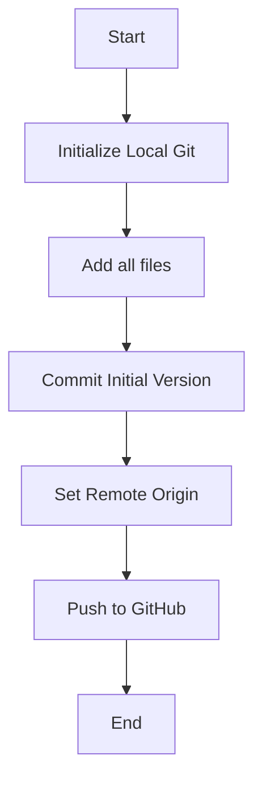

# 01_TASK_SPEC: Push Production Engine to GitHub

## I. STRATEGIC CONTEXT (Trụ cột 1)
- **Mục tiêu:** Thiết lập kho lưu trữ trung tâm cho Link Strategy Production Engine trên GitHub để quản lý phiên bản và cộng tác.
- **User Story:** Brain (USER) muốn đẩy mã nguồn hiện tại lên GitHub repository chính thức để bắt đầu quy trình phát triển chuyên nghiệp.

## II. LOGIC VISUALIZATION (Trụ cột 2)

## III. INTERNAL DATA SCHEMA (Trụ cột 3)
- N/A (Infrastructure Task)

## IV. SERVICE INTERFACE CONTRACT (Trụ cột 4)
- Git CLI Commands

## V. INTER-SERVICE PLAYBOOK (Trụ cột 5)
- GitHub Repository Integration

## VI. LOCAL SANDBOX SPEC (Trụ cột 6)
- Local Windows Environment

## VII. ACCEPTANCE SCENARIOS & UAT (Trụ cột 7)
- **Scenario 1:** Thực hiện chuỗi lệnh Git -> Mã nguồn xuất hiện trên GitHub Link-Strategy.

## VIII. HARDENED ASSET RULES (Trụ cột 8)
- Tuân thủ cấu trúc của `GEMINI.md`.

---
## DEFINITION OF DONE (DoD Checklist)
- [x] Git repository initialized locally.
- [x] Initial commit created with all project files.
- [ ] Remote origin added.
- [ ] Codebase pushed successfully to GitHub.
- [ ] Documentation (LOGS.md) updated.
