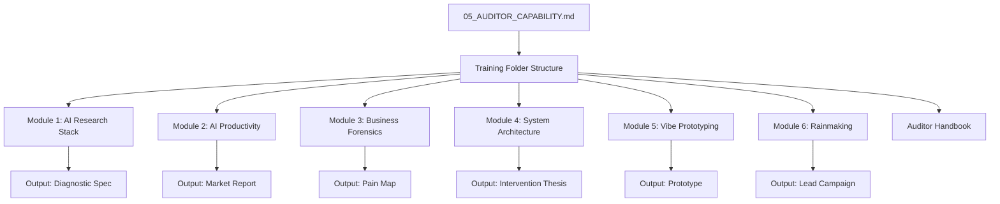

# TASK SPEC: AUDITOR TRAINING FOLDER CONSTRUCTION

## I. STRATEGIC CONTEXT
Building a scalable Auditor team is critical for the Link Strategy Layer 1 (Diagnosis) phase. The knowledge currently locked in `.LinkStrategy/05_AUDITOR_CAPABILITY.md` needs to be operationalized into a structured training folder to facilitate rapid onboarding of new Auditors (Lean Engineers, Accountants, Ops Managers).

## II. LOGIC VISUALIZATION (MODULE FLOW)

## III. DATA SCHEMA & STRUCTURE
Target Path: `.LinkStrategy/Training/auditor/`

- `README.md`: Global curriculum map and philosophy.
- `modules/`:
    - `01-ai-research-stack/curriculum.md`
    - `02-ai-productivity/curriculum.md`
    - `03-business-forensics/curriculum.md`
    - `04-system-architecture/curriculum.md`
    - `05-vibe-prototyping/curriculum.md`
    - `06-rainmaking/curriculum.md`
- `handbook/`:
    - `templates/` (Account Thesis, Pain Map, Problem Classification, Intervention Thesis)
    - `checklists/` (Industry-specific diagnostic checklists)
    - `prompts/` (AI Prompt Pack)
    - `cases/` (Case Library - Before/After)

## IV. TECHNICAL CONTRACT (DoD)
1. [ ] Root `.LinkStrategy/Training/auditor/README.md` created with module links.
2. [ ] All 6 module directories initialized with `curriculum.md`.
3. [ ] Handbook directory structure initialized with placeholders.
4. [ ] `ASSET_INDEX.md` updated to reflect the new training assets.
5. [ ] Hardening: 05_AUDITOR_CAPABILITY.md is referenced as the source of truth.

## V. VERIFICATION GATE
- Run `ls -R .LinkStrategy/Training/auditor` to verify structure.
- Validate links in `README.md`.
- Ensure consistency with `05_AUDITOR_CAPABILITY.md` module descriptions.
