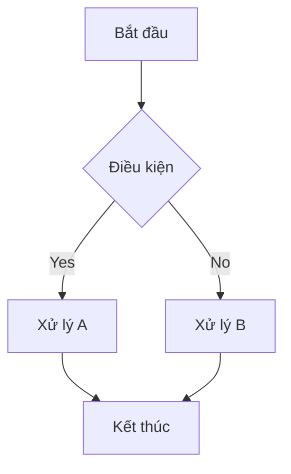

# TASK SPEC: [Tên Module/Task]

- **ID:** TS-[Dự án]-[Số hiệu]
- **Trạng thái:** [Draft/Approved/In Progress]
- **Chủ sở hữu:** Brain
- **Ưu tiên:** [P0/P1/P2]

---

## 1. 🏛️ BỐI CẢNH CHIẾN LƯỢC (Strategic Context)
*Lý giải tại sao task này quan trọng đối với roadmap dự án và giá trị kinh doanh cuối cùng.*

- **Vấn đề cần giải quyết:** [Pain point cụ thể]
- **Đối tượng hưởng lợi:** [ICP / Bộ phận]
- **Giá trị tài sản:** Task này có tạo ra asset tái sử dụng (Skill/Rule/Tool) không?

## 2. 🧩 TRỰC QUAN HÓA LOGIC (Logic Visualization)
*Yêu cầu sử dụng Mermaid diagram để mô tả quy trình.*



## 3. 📊 ĐẶC TẢ DỮ LIỆU (Data Schema)
*Định nghĩa cấu trúc dữ liệu chi tiết (JSON, SQL, v.v.)*

```json
{
  "field_name": "type",
  "comment": "description"
}
```

## 4. 🔗 HỢP ĐỒNG KỸ THUẬT (Technical Contract)
*Định nghĩa Interface, API, hoặc Event Contract.*

- **Input Parameters:**
- **Outputs:**
- **Dependencies:**
- **Error Codes:**

## 5. ✅ CHECKLIST NGHIỆM THU (Definition of Done)
*Bộ tiêu chuẩn cụ thể để vượt qua Verification Gate.*

- [ ] Hoàn thành 100% logic mô tả trong flowchart.
- [ ] Unit Test coverage > 80%.
- [ ] Không có mã màu Hex thủ công (Nếu là UI).
- [ ] Hoàn thiện README và Video Demo.
- [ ] Link hardening proposal được gửi kèm PR.

---

## 🎁 PACKAGE BÀN GIAO (Handover Artefacts)
*Danh sách các tệp tin hỗ trợ thực thi (Hands phải kiểm tra đủ trước khi bắt đầu).*

1. **OpenAPI/Schema Model:** [Link]
2. **Seed Data / Mock Data:** [Link]
3. **Môi trường Sandbox (Docker):** [Link]
4. **Secrets/Env Example:** [Link]
5. **Observability Requirements:** (TraceID, Structured Logs)

---
**Brain Approval Signature:** ____________________ Date: __________
